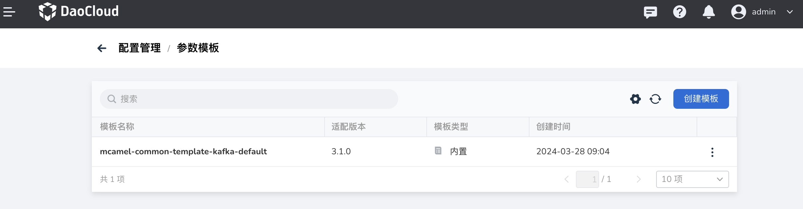

---
hide:
  - toc
---

# 参数模板

DCE 5.0 Kafka 提供了参数模板功能，方便实例的创建。

1. 在 Kafka 消息队列页面，点击右上角的 **配置管理** 。

    

2. 点击 **创建模板** 按钮。

    

3. 输入名称，选择适配的版本，引用某个内置的参数模板后，点击 **确定** 。

    

4. 屏幕提示创建成功，刷新页面，点击右侧的 **⋮** ，可以执行更多操作。

    

下一步：[创建 Kafka 实例](./create.md)
