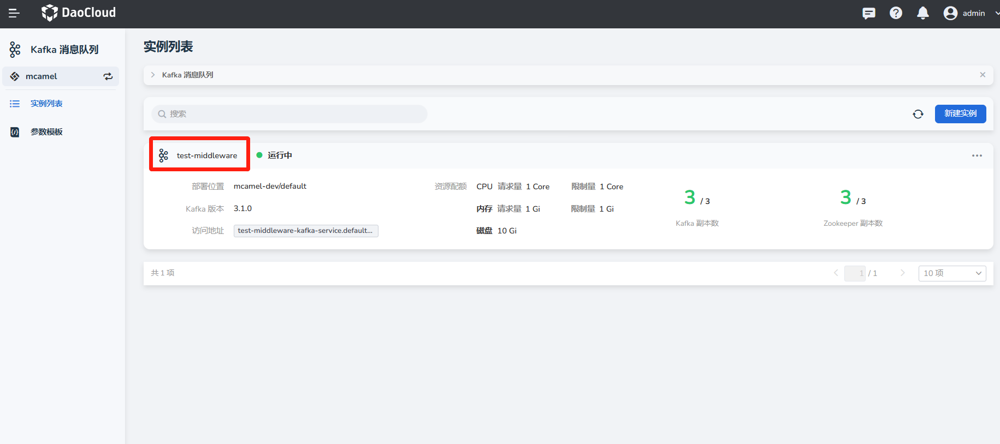
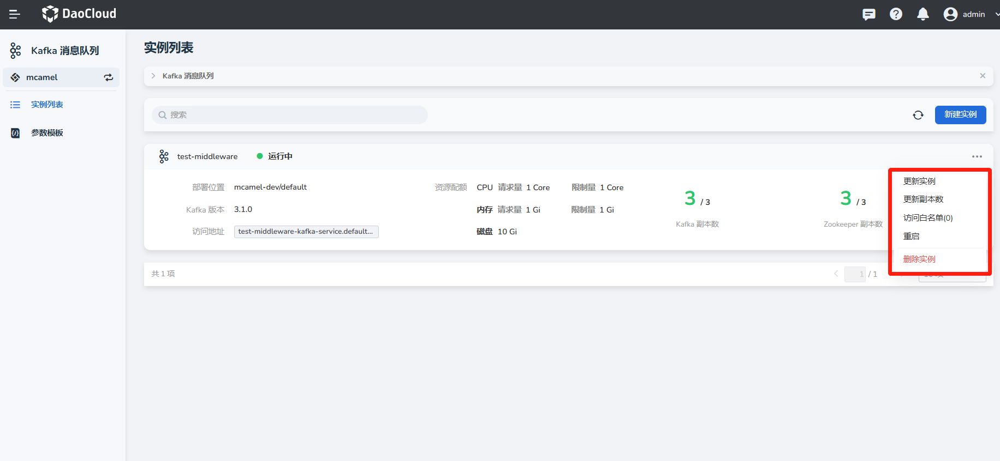

---
hide:
  - toc
---

# 查看、更新和删除 Kafka

本节说明如何查看 Kafka 消息队列，并执行后续的更新及删除操作。

## 查看 Kafka 消息队列

1. 在消息队列页面，点击某个实例名称。

    

2. 进入消息队列概览，查看基本信息、访问设置、资源配额和 Pod 列表等信息。

    

## 更新 Kafka 消息队列

1. 在消息队列中，点击右侧的 __...__ 按钮，在弹出菜单中选择 __更新实例__ 。

    

2. 修改基本信息、规格配置及服务设置后，点击 __确定__ 。

    

3. 返回消息队列，屏幕右上角将显示消息： __更新实例成功__ 。

## 删除 Kafka 消息队列

1. 选择一个消息队列，点击右侧的 __...__ 按钮，在弹出菜单中选择 __删除实例__ 。

    

2. 在弹窗中输入该消息队列的名称，确认无误后，点击 __删除__ 按钮。

    

    !!! warning

        删除实例后，该实例相关的所有消息也会被全部删除，请谨慎操作。
