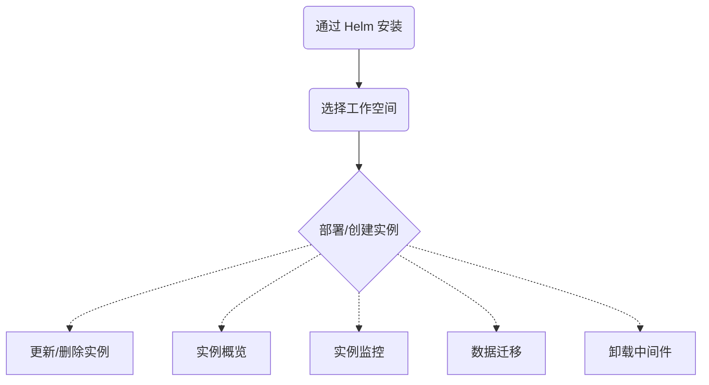

# 数据服务介绍

DCE 5.0 针对实际应用场景，精选了一些经典的数据服务中间件，通过前后端开发，能够满足各类应用场景的开发和维护。

用户可以按需安装/启用以下数据服务中间件，即插即用：

- [Elasticsearch 搜索服务](elastic-search/intro/what.md)：目前首选的全文搜索引擎
- [Kafka 消息队列](./kafka/intro/what.md)：常用于消息传输的数据管道
- [MinIO 对象存储](./minio/intro/what.md)：一款非常热门的轻量对象存储方案
- [MySQL 数据库](mysql/intro/what.md)：最流行的关系型数据库
- [RabbitMQ 消息队列](rabbitmq/intro/what.md)：常用于交易数据的传输管道
- [Redis 缓存服务](./redis/intro/what.md)：一种内存数据库

## 数据服务学习路径

上述几个数据服务中间件的学习路径大致相同，此处以 RabbitMQ 为例，简单说明学习路径。

[申请社区免费体验](../dce/license0.md){ .md-button .md-button--primary }
[安装 DCE 5.0](../videos/install.md){ .md-button .md-button--primary }
