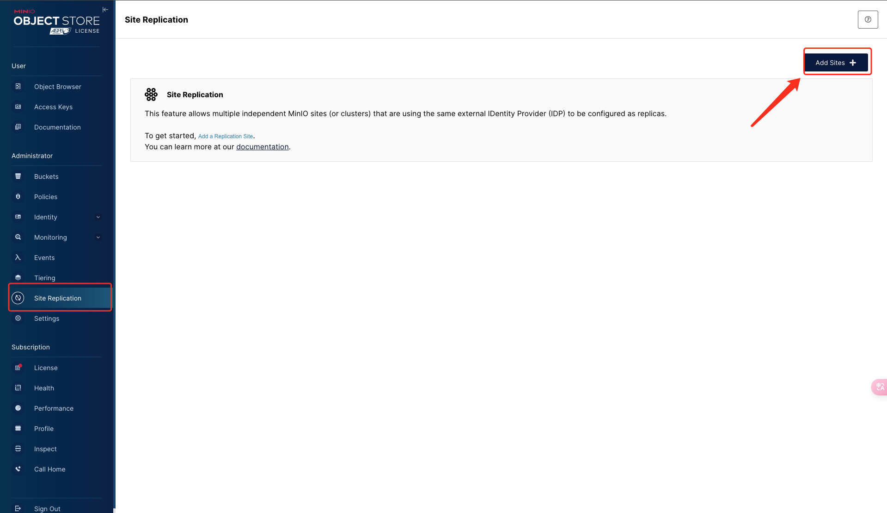

# MinIO 灾备方案

## 功能介绍

MinIO 客户端命令 mc replication 用于配置在 MinIO 服务器之间存储桶的复制。Site Replication（站点复制）是
MinIO 中用于实现跨多个站点的数据复制的功能。这个功能可以用来实现异地灾备，保证数据在多个物理位置的多个 MinIO 集群间实时同步。

Site Replication 功能要求 MinIO 部署在分布式模式下，并且每个站点都有独立的 MinIO 集群。
此外，各个集群之间需要有足够的网络带宽来支持数据复制。

## 使用命令行进行灾备

以下是使用 MinIO 命令行进行异地灾备的步骤：

1. 准备两套 MinIO 集群，执行以下两条命令在 MinIO 客户端中添加需要进行灾备的 MinIO。服务器

    ```shell
    mc alias set minio1 http://host1:9000 user password
    mc alias set minio2 http://host2:9000 user password
    ```
    
    - __minio1__ :  用户为 MinIO 服务端点设置的别名，
    - __http://host1:9000__ : 是 MinIO 服务的 URL
    - __user__ ：这是连接 MinIO 服务所需的用户名。
    - __password__ ：这是连接 MinIO 服务所需的密码。

2. 执行以下命令在 minio1 服务上添加一个复制规则，以便自动将数据复制到别名为 minio2 的目标 MinIO 服务。

    ```shell
    mc admin replicate add minio1 minio2
    ```

## 使用控制台进行灾备

MinIO 的控制台（Console）提供了一个图形化界面，通过它可以管理 MinIO 对象存储服务，以下为执行步骤：

1. 登录待备份集群的页面控制台，进入左侧导航栏的 Site Replication，点击 **Add Sites**

    { width=1000px }

2. 填写当前 MinIO 集群的地址以及目标 MinIO 集群的地址，完成后点击 **Save**

    { width=1000px }
