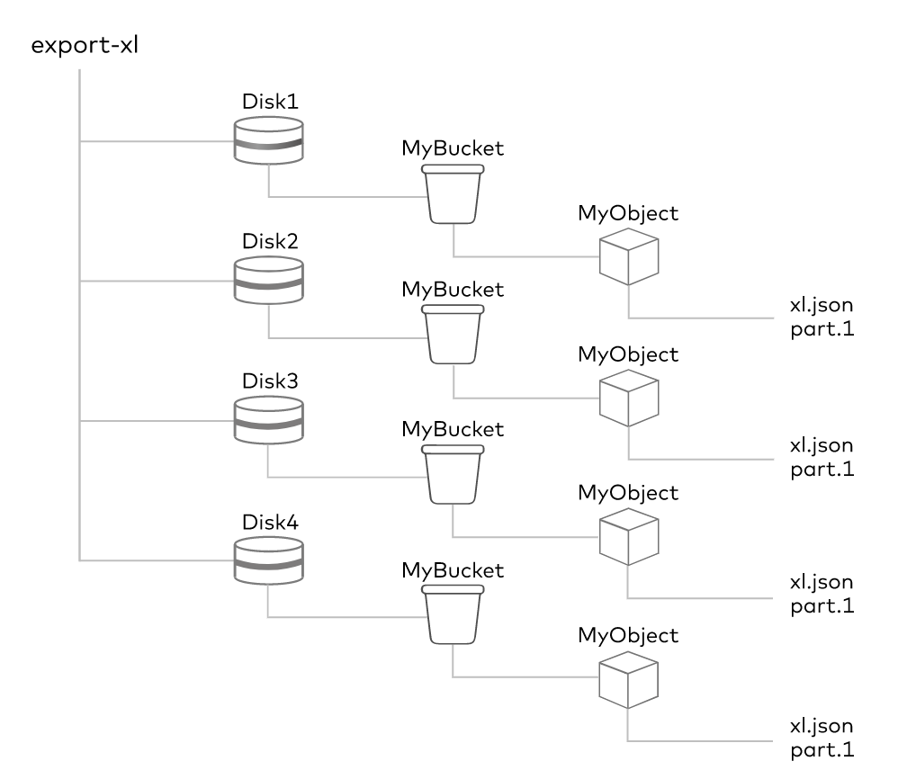
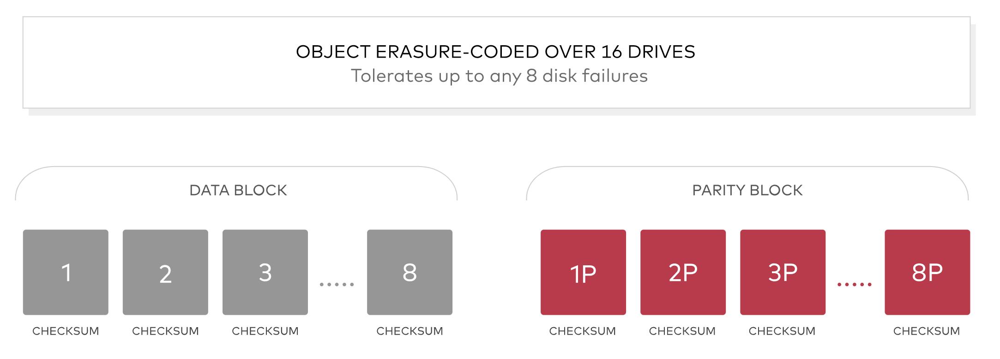
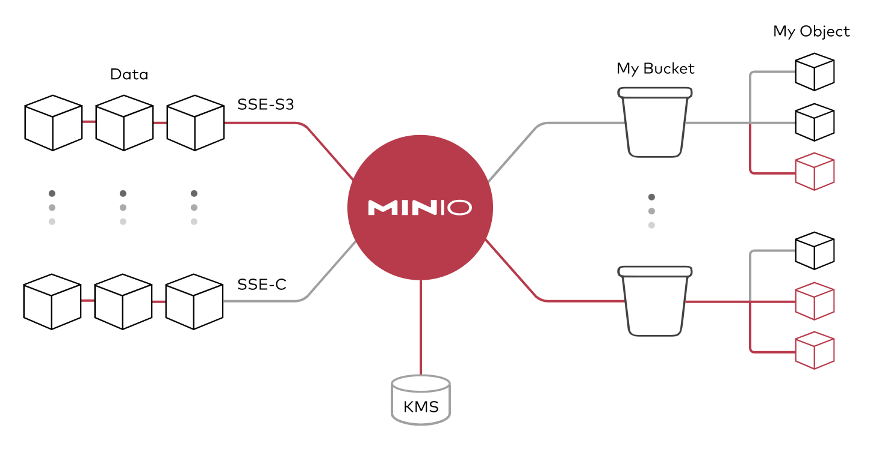
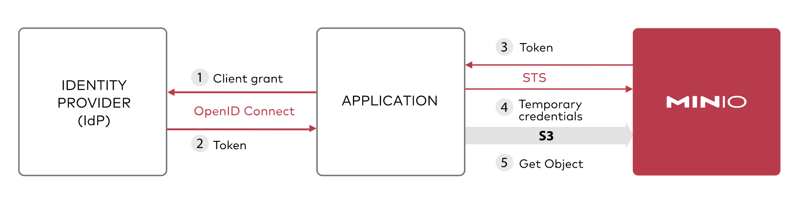
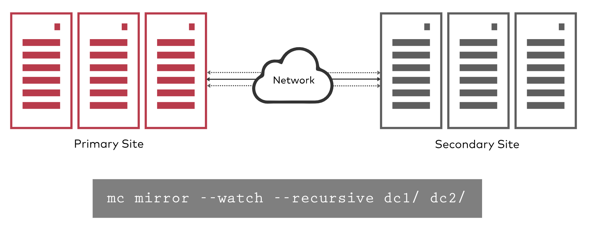
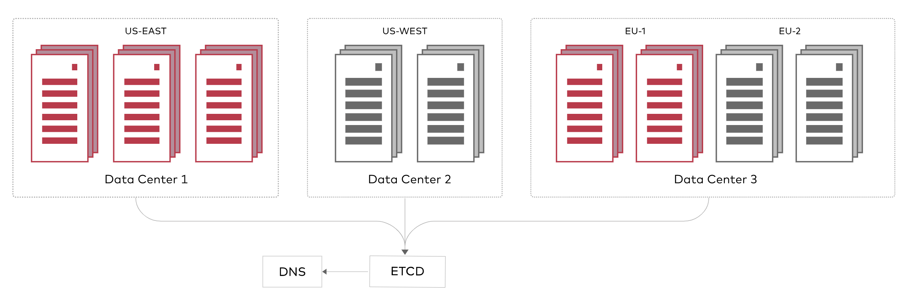
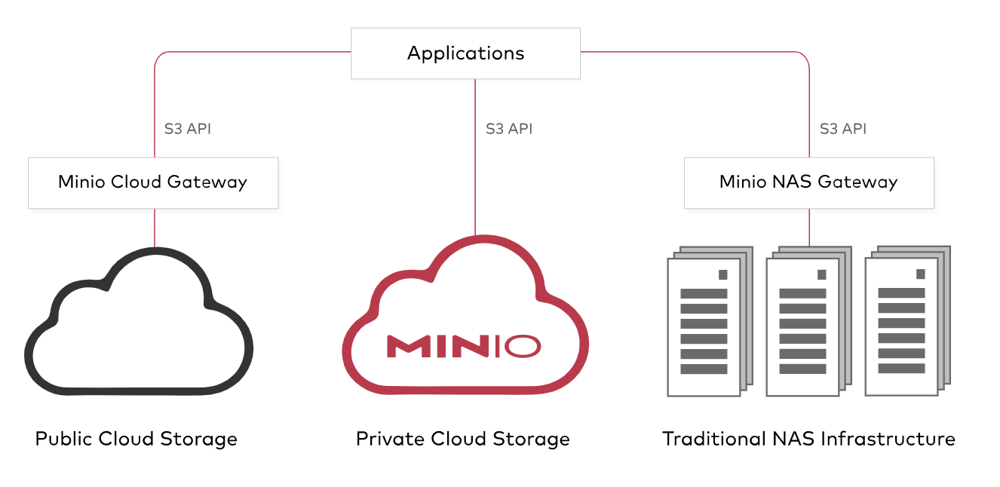

# MinIO 常见术语

本页说明 MinIO 相关概念。

| 概念           | 含义                                                               |
| -------------- | ------------------------------------------------------------------ |
| Object 对象    | 存储的基本对象，例如文件、图片等                                   |
| Bucket 桶      | 用于存储 Object 的逻辑空间，相互之间隔离，类似于系统中的顶层文件夹 |
| Drive 驱动磁盘 | 即存储数据的磁盘，所有的对象数据都存储在 Drive 中                  |
| Set 磁盘集     | 即一组 Drive 的集合，分布式部署根据集群规模自动划分一个或多个 Set  |

- 一个 Object 存储在一个 Set
- 一个集群划分为多个 Set
- 一个 Set 中的 Drive 尽可能分布在不同的节点上
- 一个 Set 包含的 Drive 数量是固定的，默认由系统根据集群规模自动计算

更多概念的阐述如下所述。

## 擦除码 Erasure Code

MinIO 使用按对象的嵌入式擦除编码保护数据，该编码以汇编代码编写，可提供最高的性能。
MinIO 使用 Reed-Solomon 代码将对象划分为 n/2 个数据和 n/2 个奇偶校验块，也可以将对象配置为任何所需的冗余级别。
这意味着在 12 个驱动器设置中，将一个对象分片为 6 个数据和 6 个奇偶校验块。
即使丢失了多达 5 个（（n / 2）–1）个驱动器（无论是奇偶校验还是数据），仍然可以从其余驱动器可靠地重建数据。
MinIO 的实现可确保即使丢失或无法使用多个设备，也可以读取对象或写入新的对象。
最后，MinIO 的擦除代码位于对象级别，并且可以一次修复一个对象。

## Bitrot 保护

无声的数据损坏或 Bitrot 是磁盘驱动器面临的严重问题，导致数据在用户不知情的情况下损坏。
原因多种多样：驱动器老化，电流尖峰，磁盘固件错误，虚假写入，读/写方向错误，驱动程序错误，意外覆盖等。
但结果是一样的：数据泄漏。

MinIO 对高速哈希算法的优化实现可确保它永远不会读取损坏的数据，可以实时捕获和修复损坏的对象。
通过在 READ 上计算哈希值，并在 WRITE 上从应用程序、整个网络以及内存/驱动器的哈希值来确保端到端的完整性。
该实现旨在提高速度，并且可以在 Intel CPU 的单个内核上实现超过每秒 10 GB 的哈希速度。

## 加密

加密活跃数据与保护静态数据不同。
MinIO 支持多种复杂的服务器端加密方案，以保护所有位置的存储数据。
MinIO 的方法可确保机密性、完整性和真实性，而性能开销却可以忽略不计。
使用 AES-256-GCM、ChaCha20-Poly1305 和 AES-CBC 支持服务器端和客户端加密。
加密的对象使用 AEAD 服务器端加密进行了防篡改。
此外，MinIO 与所有常用的密钥管理解决方案（例如 HashiCorp Vault）兼容并经过测试。

MinIO 使用密钥管理系统（KMS）支持 SSE-S3。
如果客户端请求 SSE-S3 或启用了自动加密，则 MinIO 服务器会使用唯一的对象密钥对每个对象进行加密，该对象密钥受 KMS 管理的主密钥保护。
由于开销极低，因此可以为每个应用程序和实例打开自动加密。

启用 WORM 后，MinIO 会禁用所有可能会使对象数据和元数据发生变异的 API。
这意味着一旦写入数据就可以防止篡改。这对于许多不同的法规要求具有实际应用。

## 身份认证和管理

MinIO 支持身份管理中最先进的标准，并与 OpenID connect 兼容提供商以及主要的外部 IDP 供应商集成。
这意味着访问是集中的，密码是临时的和轮换的，而不是存储在配置文件和数据库中。
此外，访问策略是细粒度的且高度可配置的，这意味着支持多租户和多实例部署变得简单。

## 连续复制

传统复制方法的挑战在于它们无法有效扩展到几百 TB。
话虽如此，每个人都需要一种复制策略来支持灾难恢复，并且该策略需要跨越地域、数据中心和云。
MinIO 的连续复制旨在用于大规模的跨数据中心部署。通过利用 Lambda 计算通知和对象元数据，它可以高效、快速地计算增量。

Lambda 通知确保与传统的批处理模式相反，更改可以立即传播。
连续复制意味着即使发生高动态数据集，如果发生故障，数据丢失也将保持在最低水平。
最后，就像 MinIO 所做的一样，连续复制是多厂商的，这意味着您的备份位置可以是从 NAS 到公共云的任何位置。

## 全局一致性

现代企业到处都有数据。MinIO 允许将这些各种实例组合在一起以形成统一的全局命名空间。
具体来说，最多可以将 32 个 MinIO 服务器组合成一个分布式模式集，并且可以将多个分布式模式集组合成一个 MinIO 服务器联合。
每个 MinIO Server Federation 都提供统一的管理员和命名空间。

MinIO Federation Server 支持无限数量的分布式模式集。

这种方法的影响在于，对象存储可以为大型的、地理上分散的企业进行大规模扩展，
同时保留从以下位置容纳各种应用程序（S3 Select、MinSQL、Spark、Hive、Presto、TensorFlow、H20）的能力。具有单一控制台。

## 多云网关

所有企业都在采用多云策略，这也包括私有云。
因此，您的裸机虚拟化容器和公共云服务（包括 Google、Microsoft 和阿里等非 S3 提供商）必须看起来完全相同。
尽管现代应用程序具有高度的可移植性，但为这些应用程序提供支持的数据却并非如此。

MinIO 应对的主要挑战是：无论数据位于何处都都能使数据可用。
MinIO 在裸机、网络连接存储和每个公共云上运行。
更重要的是，MinIO 通过 Amazon S3 API 从应用程序和管理角度确保您对数据的看法完全相同。

MinIO 可以走得更远，使您现有的存储基础架构与 Amazon S3 兼容。
其影响是深远的。现在，组织可以从文件到块真正统一其数据基础架构，所有这些都显示为可通过 Amazon S3 API 访问的对象，而无需迁移。

