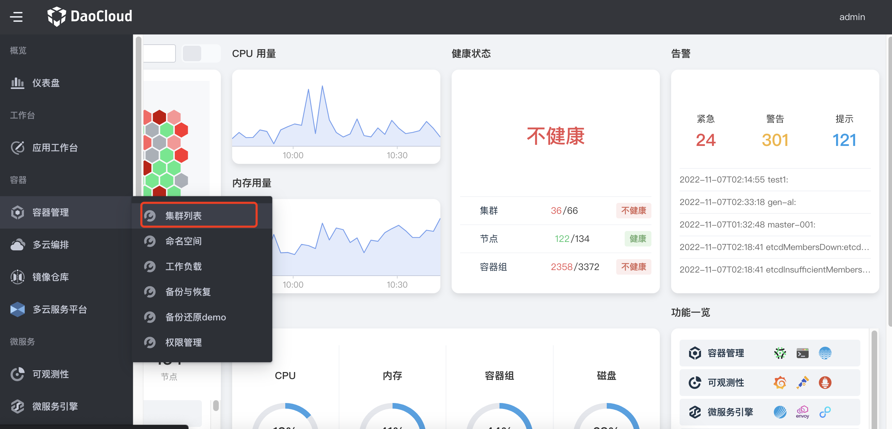
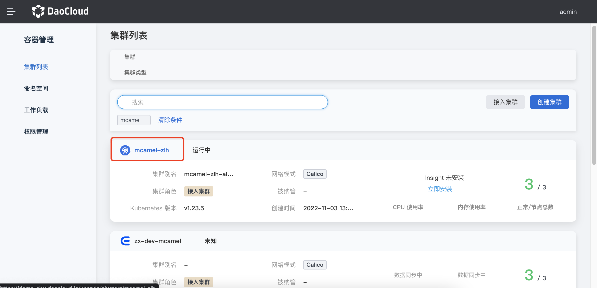
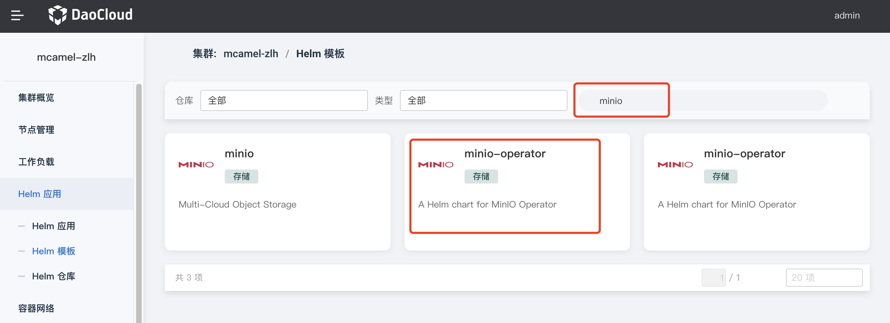
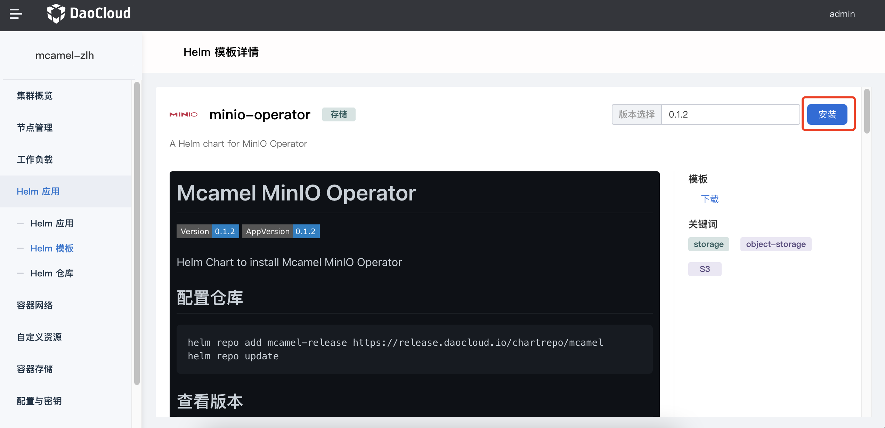
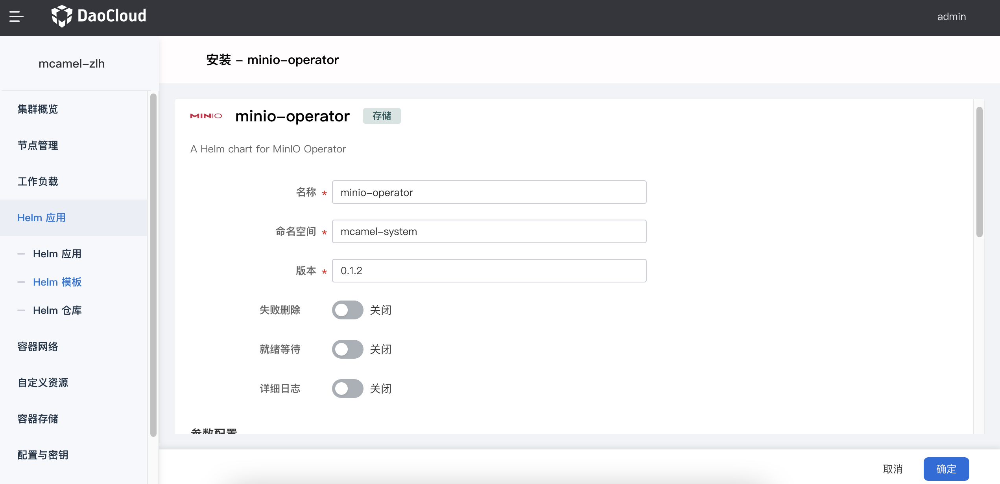
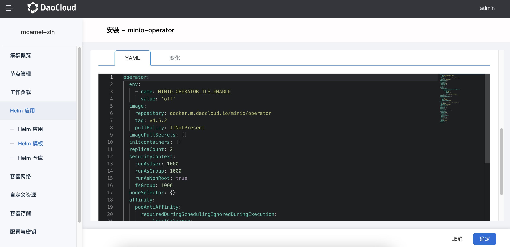
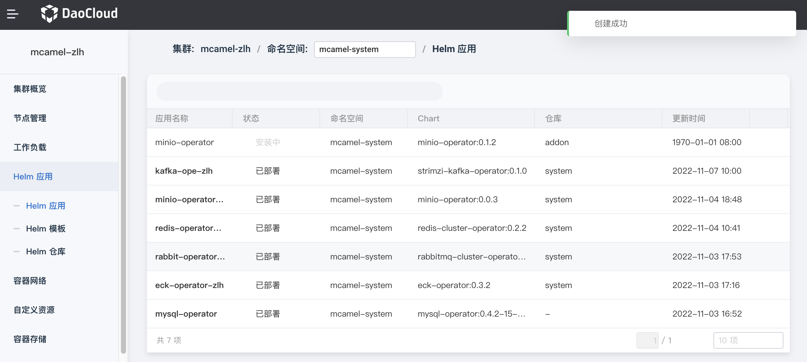
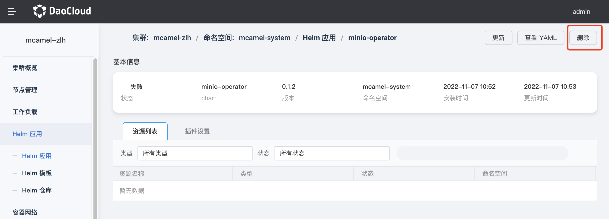
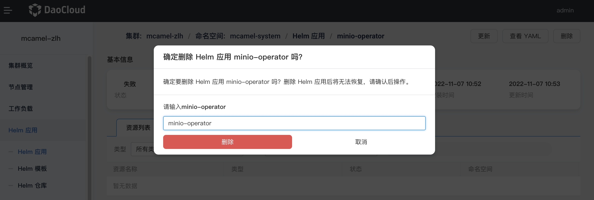

# 安装 MinIO

因为 MinIO 分属于 DCE 5.0 的应用层，所以需要先准备一个 DCE 环境。

按照以下步骤安装 MinIO。

## 安装 MinIO-operator

1. 在左侧导航栏点击`容器管理` -> `集群列表`。

    

2. 选择要安装 MinIO 的集群，点击集群名称。

    

3. 在左侧导航栏点击 `Helm 应用` -> `Helm 模板`，在搜索框中输入 `minio`，敲击回车键，点击 MinIO-operator 磁贴卡片。

    

4. 选择合适版本后，点击`安装`按钮。也可以遵循黑色区域的文字提示，从命令行安装。

    

5. 输入合适的名称，选择命名空间和版本后，点击`确定`。也可以在底部配置 YAML 来安装。

    

    

6. 系统返回 `Helm 应用`列表，屏幕提示创建成功。等待片刻后，状态将从`安装中`变为`已部署`。

    

## 安装 mcamel-MinIO

1. 配置仓库。

    ```shell
    helm repo add mcamel-release https://release.daocloud.io/chartrepo/mcamel
    helm repo update
    ```

2. 查看版本。

    ```shell
    helm search repo mcamel-release/mcamel-minio --versions
    NAME                            CHART VERSION   APP VERSION     DESCRIPTION
    mcamel-release/mcamel-MinIO  0.1.0           0.1.0           A Helm chart for Kubernetes
    ```

3. 安装和升级。

    ```shell
    helm upgrade --install mcamel-minio --create-namespace -n mcamel-system --cleanup-on-fail \
    --set global.mcamel.imageTag=v0.1.0 \
    --set global.imageRegistry=release.daocloud.io \
    mcamel-release/mcamel-minio \
    --version 0.1.0
    ```

    参数说明：

    ```shell
    --set ui.image.tag  # 指定前端镜像版本
    --set ghippo.createCrd  # 注册 ghippo 路由，默认开启
    --set insight.serviceMonitor.enabled  # 开启监控，默认开启
    --set insight.grafanaDashboard.enabled  # 开启监控面板，默认开启

    # 全局参数
    --set global.mcamel.imageTag  # mcamel-MinIO 镜像版本
    --set global.imageRegistry  # 镜像仓库地址
    ```

## 卸载

卸载时先卸载 mcamel-minio，再删除 minio-operator，释放相关资源。

### 卸载 mcamel-minio

```shell
helm uninstall mcamel-minio -n mcamel-system
```

### 删除 minio-operator

1. 在 Helm 应用列表中，点击最右侧的 `⋮` 或某个 Helm 应用名称，选择`删除`。

    

2. 在弹窗中输入要删除的名称，确认无误后，点击`删除`。

    
