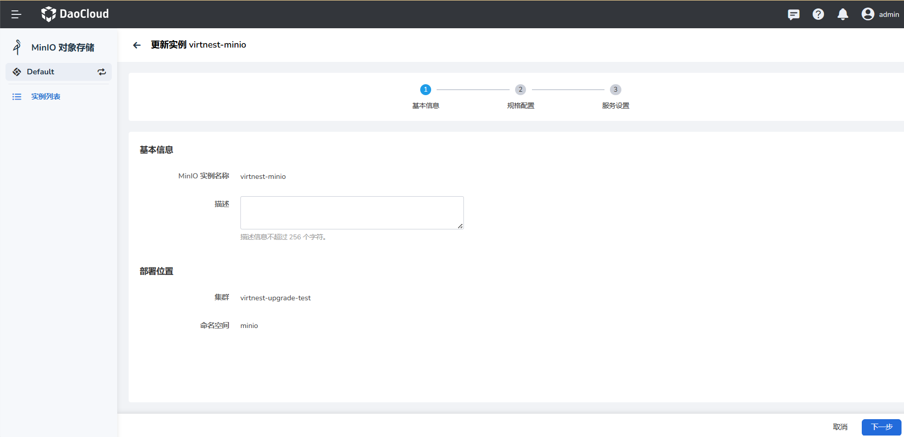
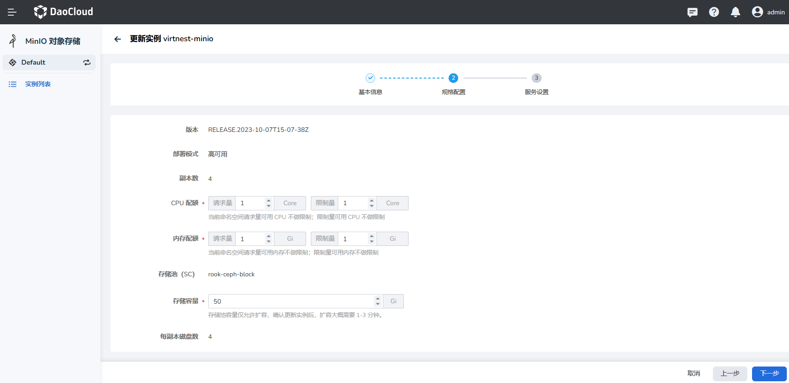

---
hide:
  - toc
---

# 更新 MinIO 实例

如果想要更新或修改 MinIO 的资源配置，可以按照本页说明操作。

1. 在实例列表中，点击右侧的 `...` 按钮，在弹出菜单中选择`更新实例`。

    

2. 修改基本信息，然后点击`下一步`。

    - 仅支持修改描述信息
    - 实例名称、部署位置不可修改

        

3. 修改规格配置，然后点击`下一步`。

    - 仅支持修改：CPU 配额和内存配额
    - 不可修改：版本、部署模式、存储类、容量

    

4. 修改服务设置，然后点击`确认`。

    

5. 返回实例列表，屏幕右上角将显示消息：`更新实例成功`。

    
