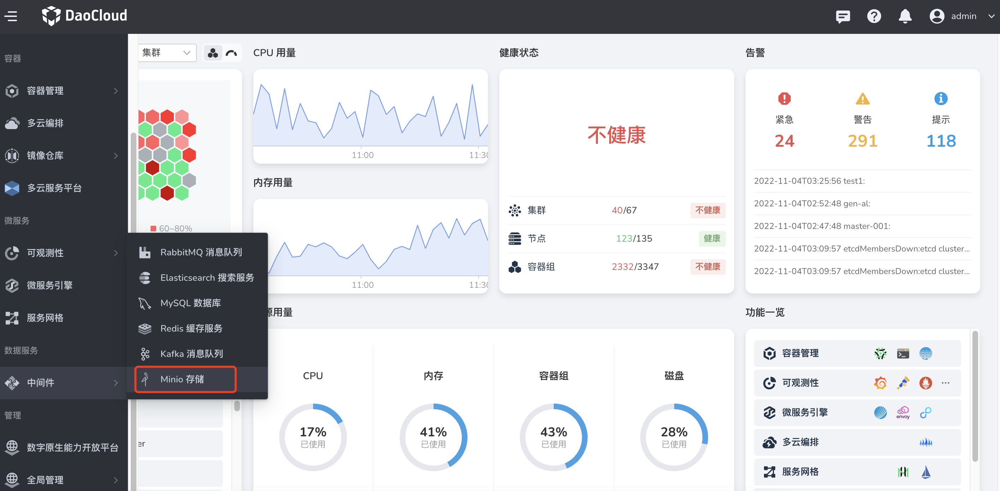
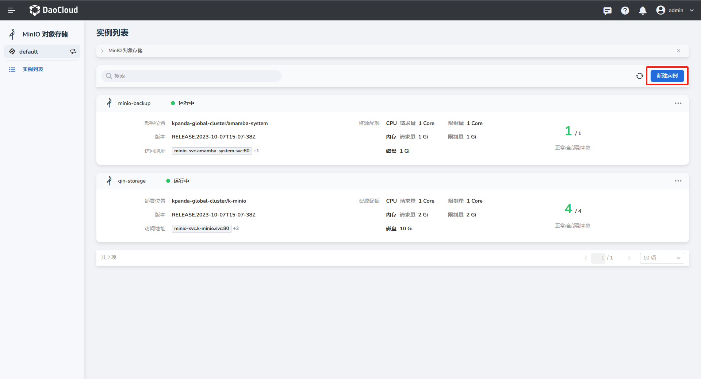
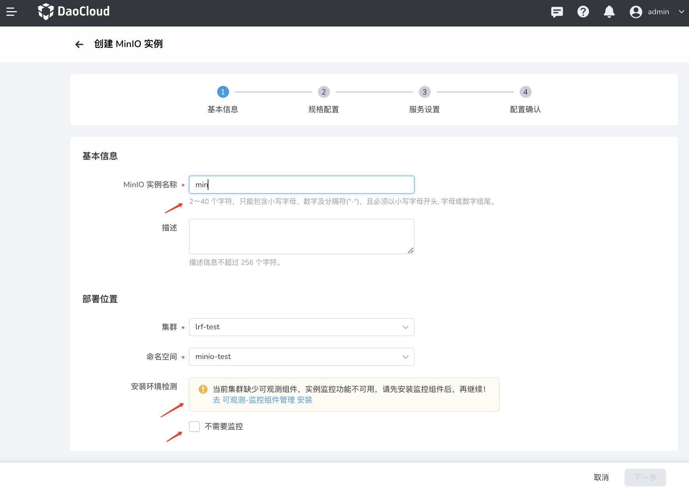
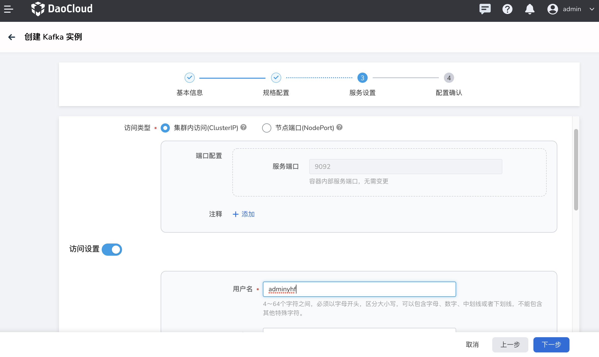
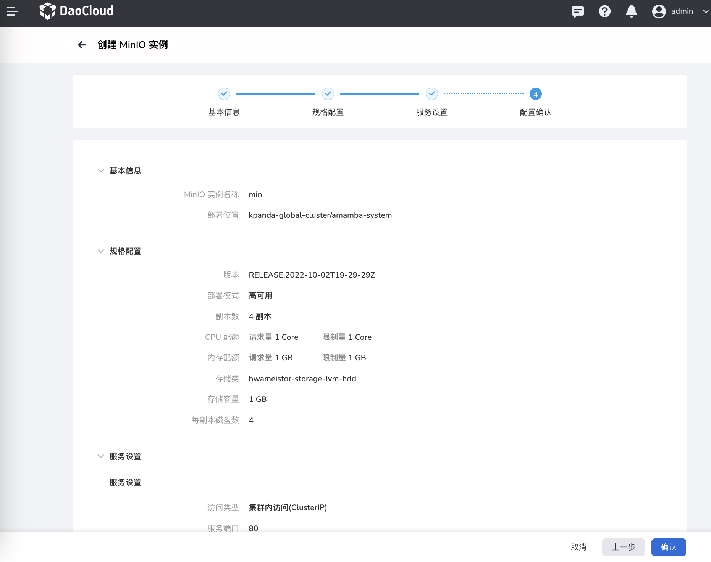
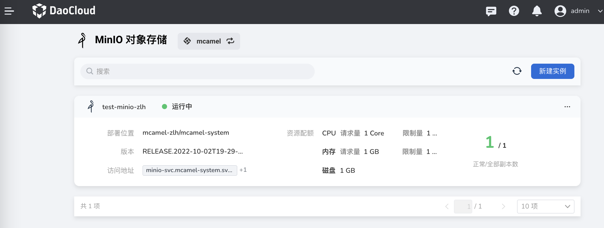

# 创建 MinIO

在 MinIO 实例列表中，执行以下操作创建 MinIO 实例。

1. 从左侧导航栏选择 `Minio 存储`。

    

2. 首次使用时点击`立即部署`创建 MinIO 实例。此后可以点击列表右上角的`新建实例`按钮。

    

3. 在`创建 MinIO 实例`页面中，设置基本信息后，点击`下一步`。

    

4. 配置规格后，点击`下一步`。

    - 版本：MinIO 的版本号，当前仅支持 MinIO 4.0.15
    - 副本数：高可用需 4 个以上副本
    - 资源配额：根据实际情况选择规则
    - 存储：选择 MinIO 实例的存储卷和储存空间总量

    

5. 服务设置后，点击`下一步`。

    - 访问方式：可以选择集群内访问还是 Nodeport 访问。
    - 服务设置：设置连接 MinIO 实例的用户名、密码。

    

6. 确认实例配置信息无误，点击`确认`完成创建。

    

7. 在实例列表页查看实例是否创建成功。刚创建的实例状态为`未就绪`，等几分钟后该状态变为`运行中`。

    
