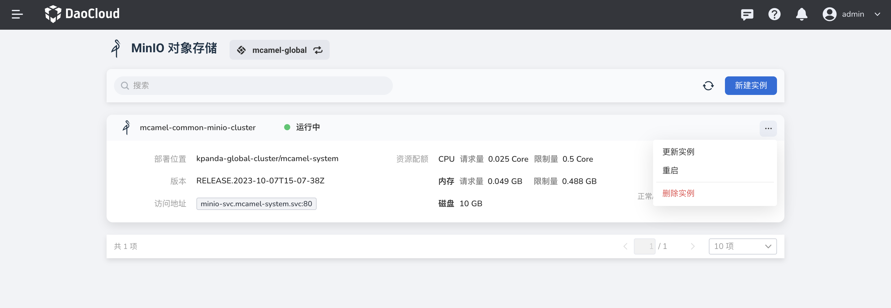
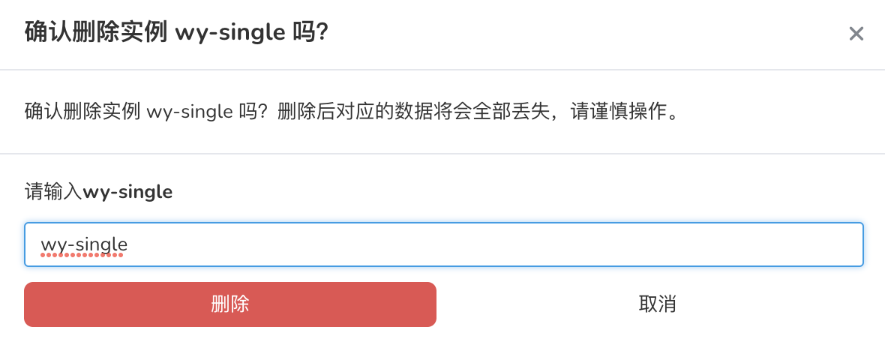

---
hide:
  - toc
---

# 删除 MinIO

如果想要删除一个实例列表，可以执行如下操作：

1.  在实例列表中，点击右侧的 `...` 按钮，在弹出菜单中选择`删除实例`。

    

2.  在弹窗中输入该实例列表的名称，确认无误后，点击`删除`按钮。

    

    !!! warning

        删除实例后，该实例相关的所有消息也会被全部删除，请谨慎操作。
