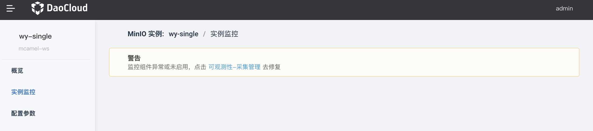

---
hide:
  - toc
---

# 实例监控

MinIO 内置了 Prometheus 和 Grafana 监控模块。

1. 在实例列表页面中，点击某个名称。

    

2. 在左侧导航栏，点击`实例监控`，可以接入监控模块。

    

!!! note

    如果提示监控组件异常，请按提示[安装 insight-agent 插件](../../../insight/06UserGuide/01quickstart/installagent.md)。

<!-- 各项监控指标的具体含义稍后补充(@justedennnnn)。 -->
