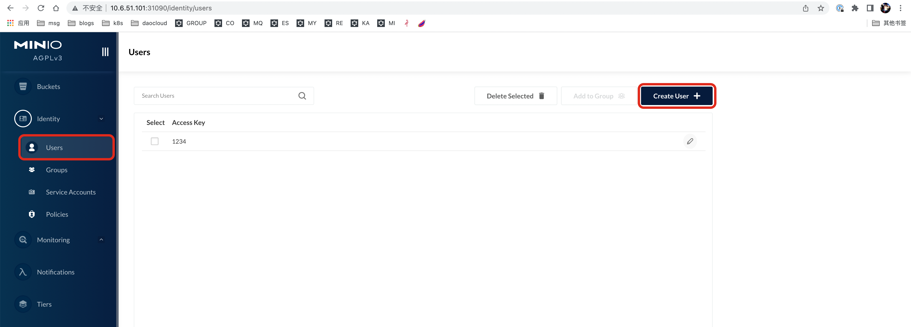
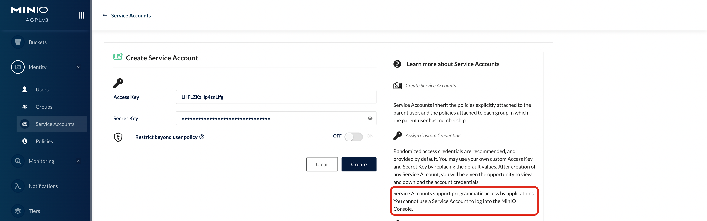

# MinIO 的身份管理

DCE5.0 提供的 MinIO 服务，自带 网页控制台（Web Console），了解 MinIO 的身份管理（identity management）, 帮助您快速了解如何在 MinIO 内完成子账号管理。

## 用户

默认情况下，minio 使用 built-in indentity provider（idp）来完成身份管理。除了 idp，还支持第三方 openid 和 ldap 的方式。

用户由一对 username 和 password 组成。在 minio 里，根据上下文不同，username 又被称为 access key（注意与后面 service account 层级的 access key 区分开来），password 又称为 secret key。

### root 用户

在启动 minio 时，通过环境变量的方式，可以设置 minio 集群中 root 用户的账号密码，分别是：

- MINIO_ROOT_USER
- MINIO_ROOT_PASSWORD
root 用户拥有对所有资源的所有操作权限。

> 注意：如果要变更 root 用户，需要重启 minio 集群中所有的节点。

### 普通用户

创建普通用户有三种方式进行创建，相对来讲创建的过程还是比较方便的。

- Web Console，使用 UI 进行界面化创建
- mc，使用 CLI 命令行创建
- Operator CR，使用 CR 进行创建

#### 通过 Console 创建普通用户



#### 通过 mc 创建普通用户

> 注意，需要自行事先安装 `mc` 命令，并配置连接到 MinIO 实例

创建用户

```bash
mc admin user add ALIAS ACCESSKEY SECRETKEY
```

授予权限

```bash
mc admin policy set ALIAS readwrite user=USERNAME
```

#### 通过 operator CR 创建普通用户

如果是通过 cr 安装 minio，也可以通过 users 字段来指定普通用户的 secret：

```go
type TenantSpec struct {
    ....
    ....
    ....
    // *Optional* +
    //
    // An array of https://kubernetes.io/docs/concepts/configuration/secret/[Kubernetes opaque secrets] to use for generating MinIO users during tenant provisioning. +
    //
    // Each element in the array is an object consisting of a key-value pair `name: <string>`, where the `<string>` references an opaque Kubernetes secret. +
    //
    // Each referenced Kubernetes secret must include the following fields: +
    //
    // * `CONSOLE_ACCESS_KEY` - The "Username" for the MinIO user +
    //
    // * `CONSOLE_SECRET_KEY` - The "Password" for the MinIO user +
    //
    // The Operator creates each user with the `consoleAdmin` policy by default. You can change the assigned policy after the Tenant starts. +
    // +optional
    Users []*corev1.LocalObjectReference `json:"users,omitempty"`
    ....
    ....
    ....
}
```

### Service Accounts

通常使用用户登陆 console 或者通过 mc 命令对 minio 进行管理操作。如果应用程序需要访问 minio，通常是使用 service account（service account 是比较正式的叫法，某些上下文中，也可以成为 access key）。

一个用户可以创建多个 service account。

> 注意：无法通过 service account 登陆 minio console，这也是它与用户最大的不同之处。

#### 通过 console 创建 service account



#### 通过 mc 命令创建 service account

```bash
mc [GLOBALFLAGS] admin user svcacct add     \
                            [--access-key]  \
                            [--secret-key]  \
                            [--policy]      \
                            ALIAS
                            USER
```

## 用户组

minio 中有用户组的概念。通过用户组，可以方便的同时为一组用户新增权限。
