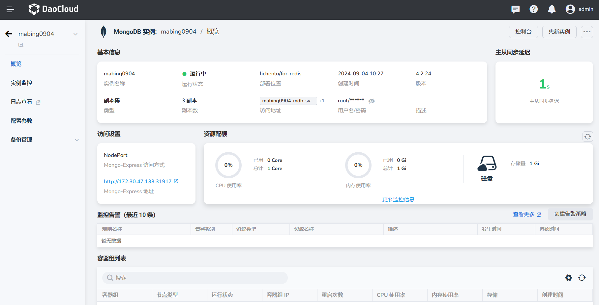
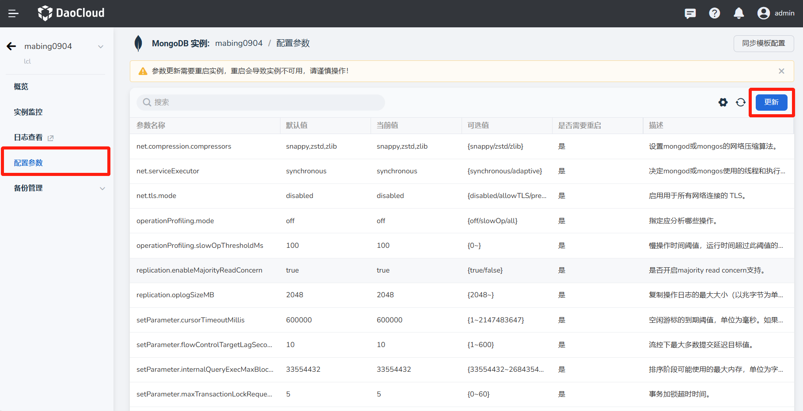
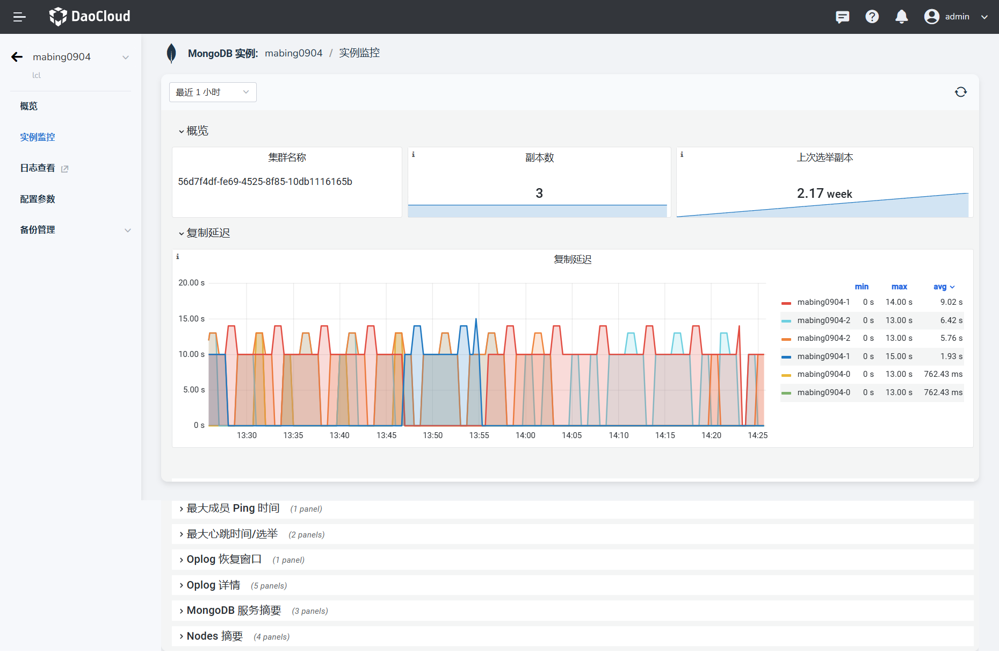

# 查看实例

在 MongoDB 实例列表中，选择想要查看的实例，点击实例名称进入详情页面。

## 概览

概览页面支持查看基本信息、访问设置、资源配额、主从同步延迟、监控告警、容器组列表、最近事件等。其中，

- 主从同步延迟：是指主从复制或同步过程中由于网络延迟或其他因素导致的从节点接收到主节点发送的数据包的时间差。

- 监控告警：在概览页面仅支持查看最近 10 条告警，点击 __查看更多__ 可跳转至告警列表。

## 配置参数

在左侧导航栏点击 __配置参数__ ，点击页面右上角 __更新__ 即可更新 `当前值`。

!!! warning

    参数更新需要重启实例，重启会导致实例不可用，请谨慎操作！

## 实例监控

在左侧导航栏，点击 __实例监控__ ，可以接入监控模块。

