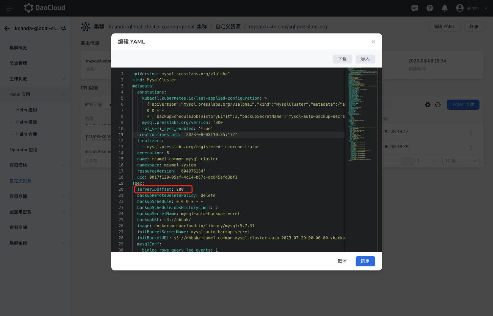
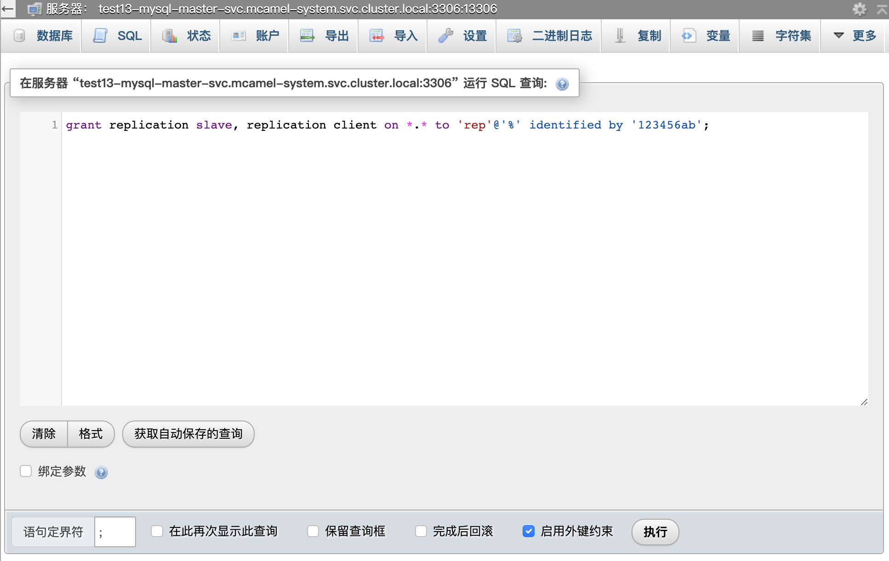
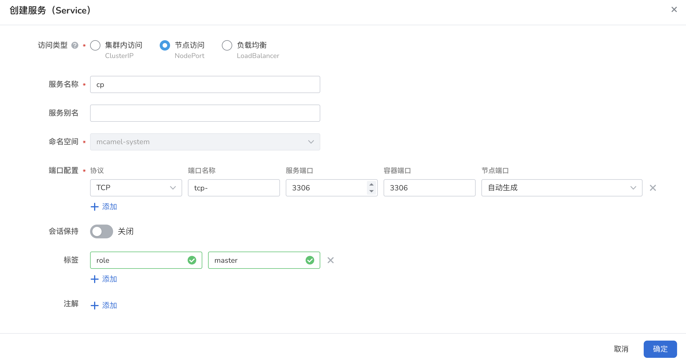
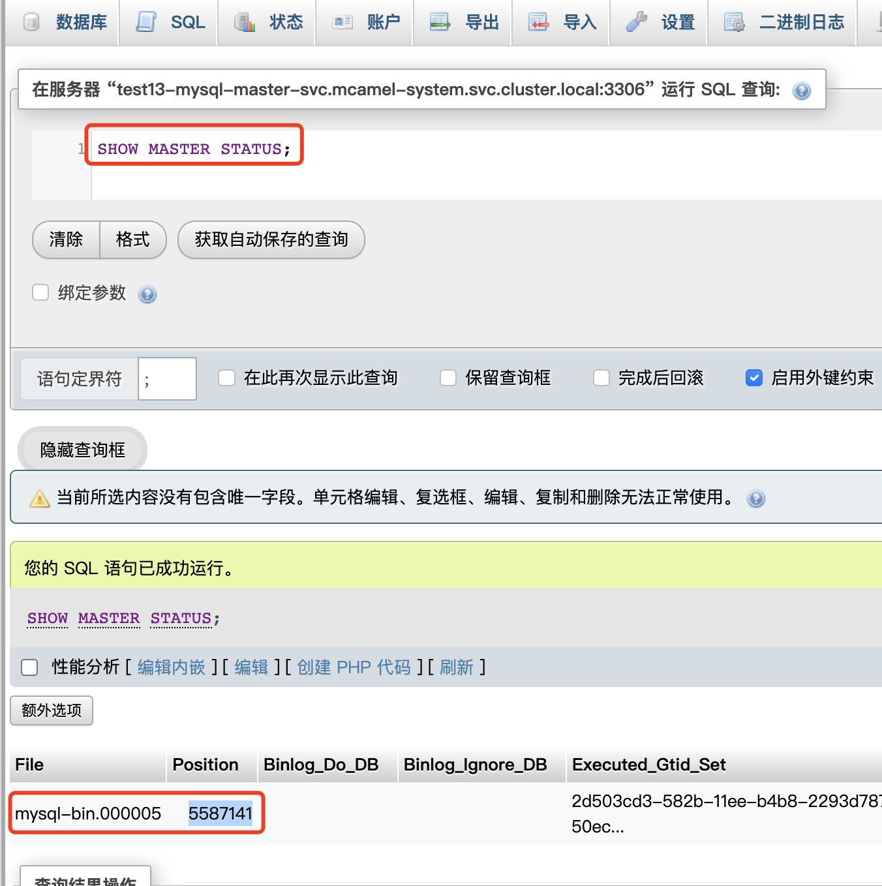
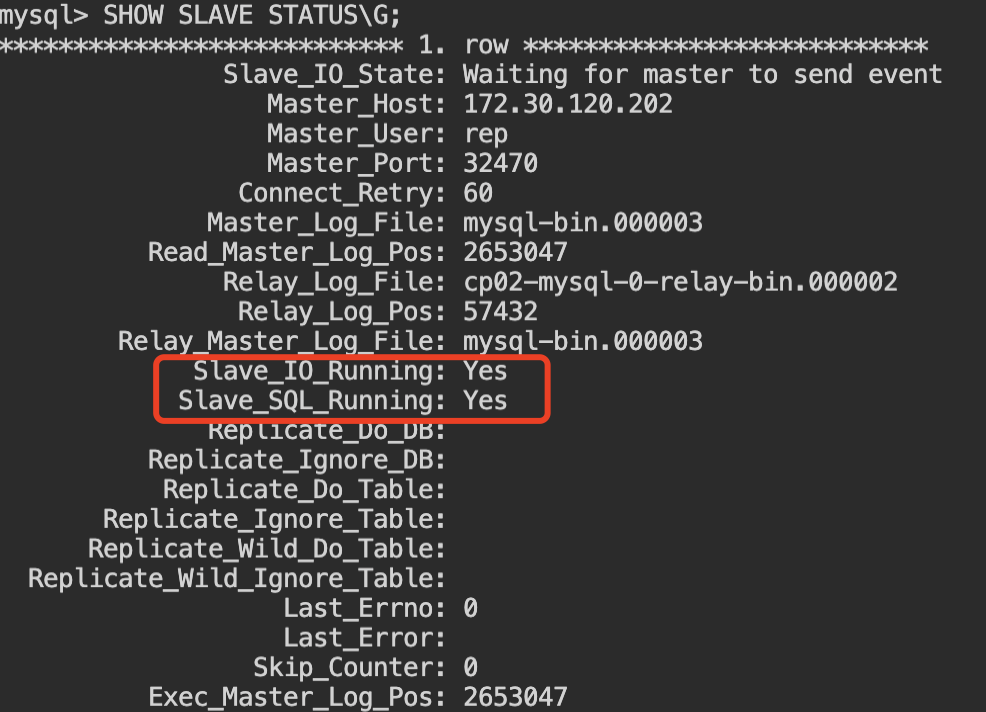
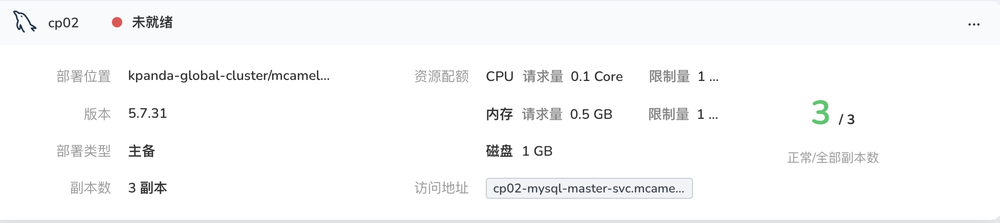

# MySQL 跨集群同步

MySQL 自带的复制能力提供了主从、多从、多主、级联等多种复制方式，并支持跨版本（5.x，8.x）数据同步。

本例以 1 对 1 主从为例，实现跨集群的 MySQL 实例间数据同步，源端与目标端均为 3 副本实例，目标端实例在同步期间仅提供只读服务，解除同步关系后，可作为独立实例运行。

注意：复制功能仅执行增量同步，任务开始前已产生的数据差异不会同步，因此需在目标库中创建相同的库结构，或采用 mysqldump 命令先做一个全量数据同步，下面以 mysqldump 为例。

## 全量数据 dump（可选）

当用户的业务数据库具有一定存量数据时，建议先采用 dump 操作，完成一次全量备份，确保主从库之间的库结构、内容一致。

1. 登录源端节点，执行备份操作：

    ````shell
    # 进入源端 Pod
    kubectl exec -it [Pod名称] -- /bin/bash
    # 锁表，防止数据出现不一致情况
    mysql> FLUSH TABLES WITH READ LOCK;
    # 对目标数据库执行 dump
    shell> mysqldump -u [用户名] --set-gtid-purged=off -p [数据库名称] > backup.sql
    # 对表释放锁。
    mysql> UNLOCK TABLES;
    # 退出源 Pod 终端，回到节点控制台
    shell> exit
    # 将备份文件从源 Pod 复制到所在节点上。
    kubectl cp [源 Pod 名称]:/path/to/backup.sql /path/on/local/computer/backup.sql
    # 将备份文件复制到目标节点。
    scp backup.sql [用户名]@[目标节点地址]:[存放路径]
    ````
2. 登录目标端节点，执行恢复操作：

    ````shell
    # 将备份文件从所在节点复制到目标端 Pod 上。
    kubectl cp backup.sql [目标端 Pod 名称]:[存放路径] -n [命名空间]
    # 进入目标端 Pod
    kubectl exec -it [目标端 Pod 名称] -n [命名空间] -- /bin/bash
    # 进入目标端 pod，执行数据恢复命令
    shell> mysql -u [用户名] -p [数据库名称] < backup.sql
    ````

## 增量数据同步

在主从库库结构一致的前提下，即可采用 MySQL 提供的复制功能持续同步。操作如下：

### 源端

1. 进入中间件的参数配置页面，确定以下配置参数

    ````configuration
    server-id = <实例的唯一标识符> #源实例与目标实例的ID必须不同
    log-bin = <二进制日志文件的路径和名称>
    binlog-format = Mixed
    ````

    其中 `server-id` 未在参数配置页面提供，修改方法如下：

        a) 进入实例的 CR 文件：容器管理 - 实例所在集群 - 自定义资源 - mysqlclusters.mysql.presslabs.org - 实例CR

        b) 增加字段：spec.serverIDOffset: 200

        

2. 创建复制账户

	进入 mysql 服务的控制台，执行以下创建命令。该用户专用于集群间数据同步，出于安全性考虑，建议创建该用户。

    ````shell
    mysql> grant replication slave, replication client on *.* to 'rep'@'%' identified by '123456ab';
    ````

    参数解释：

    - grant  # 授权
    - replication  # 授予复制权限
    - *.*   # 所有库和所有表
    - rep        # 授权用户
    - %   # 所有机器能够访问
    - by '123456ab'  # 该用户密码

    

3. 服务配置

    进入`容器管理` 模块，为实例配置一个 Nodeport 服务，用于目标端实例的同步访问：

    

    - 服务端口、容器端口：3306

    - 添加标签：role/master 

### 目标端

1. 确保目标端的 server-id 与源端不同，如需配置可参考源端配制方法。

    ````mysql
    server-id = <目标端集群的唯一标识符>
    ````

2. 在目标端的mysql命令行中配置源端信息：

    ````mysql
    mysql> CHANGE MASTER TO
             MASTER_HOST = '<源集群的 Nodeport 服务 IP 地址>',
             MASTER_PORT = <源集群的 Nodeport 服务端口号>,
             MASTER_USER = '<用户名>',
             MASTER_PASSWORD = '<密码>',
             MASTER_LOG_FILE = '<源集群的File值>', # 源端操作中记录的 File 值
             MASTER_LOG_POS = <源集群的Position值>, # 源端操作中记录的 Position 值
             MASTER_RETRY_COUNT = <重试连接的次数>;  # 0为无限制
    ````

    其中 File 与 Position 字段可在源端的控制台查看，查看命令如下：

    ````mysql
    mysql> SHOW MASTER STATUS;
    ````

    

    样例：

    ````mysql
    mysql> CHANGE MASTER TO
             MASTER_HOST = '172.30.120.202',
             MASTER_PORT = 32470,
             MASTER_USER = 'rep',
             MASTER_PASSWORD = '123456ab',
             MASTER_LOG_FILE = 'mysql-bin.000003',
             MASTER_LOG_POS = 2595935,
             MASTER_RETRY_COUNT = 0;
    ````

3. 启动同步，启动后将自动持续执行两实例间的数据同步；

    ````mysql
    mysql> start slave;
    ````

4. 状态检测，重点关注以下两项，状态为`Yes`，表示复制功能已开始运行。

    ````mysql
    mysql> SHOW SLAVE STATUS\G
    ````

    

    !!! note

        此时目标端处于 slave 状态，在中间件列表中将显示为`未就绪`状态，这是正常的，解除主从关系后可以恢复正常。

        

## 目标端提供服务
当源端出现故障后，目标端转换角色对外提供服务，需要首先解除主从同步关系。操作如下

````mysql
# 如需解除主从关系，首先需要停止从节点角色
mysql> stop slave; 
mysql> reset slave all;
# 重启目标端的数据库服务
mysql> service mysql restart
````

重启后，目标端实例将恢复独立运行。

## 数据恢复

如需数据恢复，可通过dump方式实现数据恢复，可参考 `全量数据 dump` 这里不再赘述。
