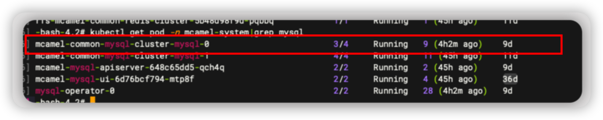
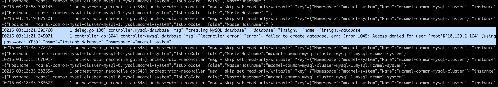

# MySQL 排障手册

本文将持续统计和梳理常见的 MySQL 异常故障以及修复方式，若遇到使用问题，请优先查看此排障手册。

> 如果您发现遇到的问题，未包含在本手册，可以快速跳转到页面底部，提交您的问题。


## 1. MySQL 健康检查
一句命令确定 MySQL 健康状态
```none
[root@demo-dev-master-01 ~]# kubectl get pod -n mcamel-system -Lhealthy,role | grep mysql
mcamel-common-mysql-cluster-auto-2023-03-28t00-00-00-backujgg9m   0/1     Completed          0               27h              
mcamel-common-mysql-cluster-auto-2023-03-29t00-00-00-backusgf59   0/1     Completed          0               3h43m            
mcamel-common-mysql-cluster-mysql-0                               4/4     Running            6 (11h ago)     25h     yes       master
mcamel-common-mysql-cluster-mysql-1                               4/4     Running            690 (11h ago)   4d20h   yes       replica
mcamel-mysql-apiserver-9797c7f76-bvf5n                            2/2     Running            0               22h              
mcamel-mysql-ui-7ffd9dd8db-d5jfm                                  2/2     Running            0               25m              
mysql-operator-0                                                  2/2     Running            109 (47m ago)   2d21h  
 ```
如上所述，主备节点（`master` `replica`）的状态均为`yes`,即表示 MySQL 为正常状态。

## 2. MySQL Pod
我们可以通过以下命令快速地查看当前集群上所有 MySQL 的健康状态：

```bash
[root@-master-01 /]$ kubectl get mysql -A
NAMESPACE       NAME                          READY   REPLICAS   AGE
ghippo-system   test                          True    1          3d
mcamel-system   mcamel-common-mysql-cluster   False   2          62d
```


### 2.1. Pod `running` 为 `0/4`，状态为`Init:Error`

遇到此类问题时，我们优先查看 `master` 节点的（sidecar）日志信息。

```bash
kubectl get pod -n mcamel-system -Lhealthy,role | grep cluster-mysql | grep master | awk '{print $1}' | xargs -I {} kubectl logs -f {} -n mcamel-system -c sidecar
```

输出示例：

```none
2023-02-09T05:38:56.208445-00:00 0 [Note] [MY-011825] [Xtrabackup] perl binary not found. Skipping the version check
2023-02-09T05:38:56.208521-00:00 0 [Note] [MY-011825] [Xtrabackup] Connecting to MySQL server host: 127.0.0.1, user: sys_replication, password: set, port: not set, socket: not set
2023-02-09T05:38:56.212595-00:00 0 [Note] [MY-011825] [Xtrabackup] Using server version 8.0.29
2023-02-09T05:38:56.217325-00:00 0 [Note] [MY-011825] [Xtrabackup] Executing LOCK INSTANCE FOR BACKUP ...
2023-02-09T05:38:56.219880-00:00 0 [ERROR] [MY-011825] [Xtrabackup] Found tables with row versions due to INSTANT ADD/DROP columns
2023-02-09T05:38:56.219931-00:00 0 [ERROR] [MY-011825] [Xtrabackup] This feature is not stable and will cause backup corruption.
2023-02-09T05:38:56.219940-00:00 0 [ERROR] [MY-011825] [Xtrabackup] Please check https://docs.percona.com/percona-xtrabackup/8.0/em/instant.html for more details.
2023-02-09T05:38:56.219945-00:00 0 [ERROR] [MY-011825] [Xtrabackup] Tables found:
2023-02-09T05:38:56.219951-00:00 0 [ERROR] [MY-011825] [Xtrabackup] keycloak/USER_SESSION
2023-02-09T05:38:56.219956-00:00 0 [ERROR] [MY-011825] [Xtrabackup] keycloak/AUTHENTICATION_EXECUTION
2023-02-09T05:38:56.219960-00:00 0 [ERROR] [MY-011825] [Xtrabackup] keycloak/AUTHENTICATION_FLOW
2023-02-09T05:38:56.219968-00:00 0 [ERROR] [MY-011825] [Xtrabackup] keycloak/AUTHENTICATOR_CONFIG
2023-02-09T05:38:56.219984-00:00 0 [ERROR] [MY-011825] [Xtrabackup] keycloak/CLIENT_SESSION
2023-02-09T05:38:56.219991-00:00 0 [ERROR] [MY-011825] [Xtrabackup] keycloak/IDENTITY_PROVIDER
2023-02-09T05:38:56.219998-00:00 0 [ERROR] [MY-011825] [Xtrabackup] keycloak/PROTOCOL_MAPPER
2023-02-09T05:38:56.220005-00:00 0 [ERROR] [MY-011825] [Xtrabackup] keycloak/RESOURCE_SERVER_SCOPE
2023-02-09T05:38:56.220012-00:00 0 [ERROR] [MY-011825] [Xtrabackup] keycloak/REQUIRED_ACTION_PROVIDER
2023-02-09T05:38:56.220018-00:00 0 [ERROR] [MY-011825] [Xtrabackup] keycloak/COMPONENT
2023-02-09T05:38:56.220027-00:00 0 [ERROR] [MY-011825] [Xtrabackup] keycloak/RESOURCE_SERVER
2023-02-09T05:38:56.220036-00:00 0 [ERROR] [MY-011825] [Xtrabackup] keycloak/CREDENTIAL
2023-02-09T05:38:56.220043-00:00 0 [ERROR] [MY-011825] [Xtrabackup] keycloak/FED_USER_CREDENTIAL
2023-02-09T05:38:56.220049-00:00 0 [ERROR] [MY-011825] [Xtrabackup] keycloak/MIGRATION_MODEL
2023-02-09T05:38:56.220054-00:00 0 [ERROR] [MY-011825] [Xtrabackup] keycloak/REALM
2023-02-09T05:38:56.220062-00:00 0 [ERROR] [MY-011825] [Xtrabackup] keycloak/CLIENT
2023-02-09T05:38:56.220069-00:00 0 [ERROR] [MY-011825] [Xtrabackup] keycloak/REALM_ATTRIBUTE
2023-02-09T05:38:56.220075-00:00 0 [ERROR] [MY-011825] [Xtrabackup] keycloak/OFFLINE_USER_SESSION
2023-02-09T05:38:56.220084-00:00 0 [ERROR] [MY-011825] [Xtrabackup] Please run OPTIMIZE TABLE or ALTER TABLE ALGORITHM=COPY on all listed tables to fix this issue.
E0209 05:38:56.223635       1 deleg.go:144] sidecar "msg"="failed waiting for xtrabackup to finish" "error"="exit status 1"
```

登录 `master` 节点的 `MySQL`，执行 `alter` 表结构：

```bash
[root@master-01 ~]$ kubectl get pod -n mcamel-system -Lhealthy,role | grep cluster-mysql | grep master
mcamel-common-mysql-cluster-mysql-0

#获取密码
[root@master-01 ~]$ kubectl get secret -n mcamel-system mcamel-common-mysql-cluster-secret -o=jsonpath='{.data.ROOT_PASSWORD}' | base64 -d

[root@master-01 ~]$ kubectl exec -it mcamel-common-mysql-cluster-mysql-0 -n mcamel-system -c mysql -- /bin/bash

# 注意：修改表结构需要root权限登录
~bash:mysql -uroot -p
```

SQL 语句如下：

```sql
use keycloak;
ALTER TABLE USER_SESSION ALGORITHM=COPY;
ALTER TABLE AUTHENTICATION_EXECUTION ALGORITHM=COPY;
ALTER TABLE AUTHENTICATION_FLOW ALGORITHM=COPY;
ALTER TABLE AUTHENTICATOR_CONFIG ALGORITHM=COPY;
ALTER TABLE CLIENT_SESSION ALGORITHM=COPY;
ALTER TABLE IDENTITY_PROVIDER ALGORITHM=COPY;
ALTER TABLE PROTOCOL_MAPPER ALGORITHM=COPY;
ALTER TABLE RESOURCE_SERVER_SCOPE ALGORITHM=COPY;
ALTER TABLE REQUIRED_ACTION_PROVIDER ALGORITHM=COPY;
ALTER TABLE COMPONENT ALGORITHM=COPY;
ALTER TABLE RESOURCE_SERVER ALGORITHM=COPY;
ALTER TABLE CREDENTIAL ALGORITHM=COPY;
ALTER TABLE FED_USER_CREDENTIAL ALGORITHM=COPY;
ALTER TABLE MIGRATION_MODEL ALGORITHM=COPY;
ALTER TABLE REALM ALGORITHM=COPY;
ALTER TABLE CLIENT ALGORITHM=COPY;
ALTER TABLE REALM_ATTRIBUTE ALGORITHM=COPY;
ALTER TABLE OFFLINE_USER_SESSION ALGORITHM=COPY
```

### 2.2. Pod `running` 为 `2/4`
一般出现此类问题，很可能是因为 MySQL 实例使用的磁盘用量达到了 100%，您可以在 `master` 节点上运行以下命令检测磁盘用量。

```bash
kubectl get pod -n mcamel-system | grep cluster-mysql | awk '{print $1}' | xargs -I {} kubectl exec {} -n mcamel-system -c sidecar -- df -h | grep /var/lib/mysql
```

输出类似于：

```console
/dev/drbd43001            50G   30G   21G  60% /var/lib/mysql
/dev/drbd43005            80G   29G   52G  36% /var/lib/mysql
```

如果发现某个 `pvc` 满了进行 `pvc` 扩容即可。

```bash
kubectl edit pvc data-mcamel-common-mysql-cluster-mysql-0 -n mcamel-system # 修改request大小即可
```
### 2.3. Pod `running` 为 `3/4`


使用 `kubectl describe` 上图中框起来的 pod，发现异常提示： `Warning Unhealthy 4m50s (x7194 over 3h58m) kubelet Readiness probe failed: `

此时需要手工进行修复，这是目前开源 `mysql-operator` 版本的 BUG，详情查看： [[bugfix]update node_controller.go](https://github.com/bitpoke/mysql-operator/pull/857)

修复方式有两种：

1. 可以重启 `mysql-operator`
2. 手工更新 `sys_operator` 的配置状态

```bash
kubectl exec mcamel-common-mysql-cluster-mysql-1 -n mcamel-system -c mysql -- mysql --defaults-file=/etc/mysql/client.conf -NB -e 'update sys_operator.status set value="1"  WHERE name="configured"'
```


## 3. MySQL Operator
### 3.1. 未指定 `storageClass`
由于没有指定 `storageClass`，导致 `mysql-operator` 无法获取 pvc 而处于 `pending` 状态
如果采用 helm 启动，可以做如下设置： 
1. 关闭 pvc 的申请
```bash
orchestrator.persistence.enabled=false 
```

2. 指定 storageClass 去获取 pvc
```bash
orchestrator.persistence.storageClass={storageClassName} 

```
如果使用其他工具，可以修改 `value.yaml` 内对应字段，即可达到和 helm 启动一样的效果。


## 4. MySQL 主从关系
1. 执行以下命令确认 MySQL 状态:
```bash
[root@-master-01 /]# kubectl get mysql -A
NAMESPACE       NAME                          READY   REPLICAS   AGE
ghippo-system   test                          True    1          3d
mcamel-system   mcamel-common-mysql-cluster   False   2          62d

```
2. 关注 `Ready` 为 `False` 的库 (这里为 True 的判断是 延迟小于 30s 同步)，查看 MySQL 从库的日志
```bash
[root@master-01 ~]$ kubectl get pod -n mcamel-system -Lhealthy,role | grep cluster-mysql | grep replica | awk '{print $1}' | xargs -I {} kubectl logs {} -n mcamel-system -c mysql | grep ERROR
```
### 4.1. 从库无报错，但同步延迟较大
如果日志中没有任何错误 `ERROR` 信息，说明  `False` 只是因为主从同步的延迟过大，可对从库执行以下命令进一步排查：

1. 寻找到从节点的 pod
```bash
[root@master-01 ~]$ kubectl get pod -n mcamel-system -Lhealthy,role | grep cluster-mysql | grep replica | awk '{print $1}'
mcamel-common-mysql-cluster-mysql-1
```

2. 设置 binlog 参数
```bash
[root@master-01 ~]$ kubectl exec mcamel-common-mysql-cluster-mysql-1 -n mcamel-system -c mysql -- mysql --defaults-file=/etc/mysql/client.conf -NB -e 'set global sync_binlog=10086;'
```

3. 进入 MySQL 的容器
```bash
[root@master-01 ~]$ kubectl exec -it mcamel-common-mysql-cluster-mysql-1 -n mcamel-system -c mysql -- mysql --defaults-file=/etc/mysql/client.conf
```


4. 在 MySQL 容器中执行查看命令，获取从库状态。 `Seconds_Behind_Master` 字段为主从延迟，如果取值在 0~30，可以认为没有延迟；表示主从可以保持同步。
```sql
mysql> show slave status\G; 
*************************** 1. row ***************************
               Slave_IO_State: Waiting for source to send event
                  Master_Host: mcamel-common-mysql-cluster-mysql-0.mysql.mcamel-system
                  Master_User: sys_replication
                  Master_Port: 3306
                Connect_Retry: 1
              Master_Log_File: mysql-bin.000304
          Read_Master_Log_Pos: 83592007
               Relay_Log_File: mcamel-common-mysql-cluster-mysql-1-relay-bin.000002
                Relay_Log_Pos: 83564355
        Relay_Master_Log_File: mysql-bin.000304
             Slave_IO_Running: Yes
            Slave_SQL_Running: Yes
              Replicate_Do_DB:
          Replicate_Ignore_DB:
           Replicate_Do_Table:
       Replicate_Ignore_Table:
      Replicate_Wild_Do_Table:
  Replicate_Wild_Ignore_Table:
                   Last_Errno: 0
                   Last_Error:
                 Skip_Counter: 0
          Exec_Master_Log_Pos: 83564299
              Relay_Log_Space: 83592303
              Until_Condition: None
               Until_Log_File:
                Until_Log_Pos: 0
           Master_SSL_Allowed: No
           Master_SSL_CA_File:
           Master_SSL_CA_Path:
              Master_SSL_Cert:
            Master_SSL_Cipher:
               Master_SSL_Key:
        Seconds_Behind_Master: 0
Master_SSL_Verify_Server_Cert: No
                Last_IO_Errno: 0
                Last_IO_Error:
               Last_SQL_Errno: 0
               Last_SQL_Error:
  Replicate_Ignore_Server_Ids:
             Master_Server_Id: 100
                  Master_UUID: e17dae09-8da0-11ed-9104-c2f9484728fd
             Master_Info_File: mysql.slave_master_info
                    SQL_Delay: 0
          SQL_Remaining_Delay: NULL
      Slave_SQL_Running_State: Replica has read all relay log; waiting for more updates
           Master_Retry_Count: 86400
                  Master_Bind:
      Last_IO_Error_Timestamp:
     Last_SQL_Error_Timestamp:
               Master_SSL_Crl:
           Master_SSL_Crlpath:
           Retrieved_Gtid_Set: e17dae09-8da0-11ed-9104-c2f9484728fd:21614244-21621569
            Executed_Gtid_Set: 4bc2107c-819a-11ed-bf23-22be07e4eaff:1-342297,
7cc717ea-7c1b-11ed-b59d-c2ba3f807d12:1-619197,
a5ab763a-7c1b-11ed-b5ca-522707642ace:1-178069,
a6045297-8743-11ed-8712-8e52c3ace534:1-4073131,
a95cf9df-84d7-11ed-8362-5e8a1c335253:1-493942,
b5175b1b-a2ac-11ed-b0c6-d6fbe05d7579:1-3754703,
c4dc2b14-9ed9-11ed-ac61-36da81109699:1-945884,
e17dae09-8da0-11ed-9104-c2f9484728fd:1-21621569
                Auto_Position: 1
         Replicate_Rewrite_DB:
                 Channel_Name:
           Master_TLS_Version:
       Master_public_key_path:
        Get_master_public_key: 0
            Network_Namespace:
1 row in set, 1 warning (0.00 sec)
```


5. 主从同步后 (Seconds_Behind_Master 小于 30s)，设置 sync_binlog=1
```bash
kubectl exec mcamel-common-mysql-cluster-mysql-1 -n mcamel-system -c mysql -- mysql --defaults-file=/etc/mysql/client.conf -NB -e 'set global sync_binlog=1';
```

6. 如果此时依然不见缓解，可以查看从库的宿主机负载或者 IO 是否太高，执行以下命令：

```bash
[root@master-01 ~]$ uptime
11:18  up 1 day, 17:49, 2 users, load averages: 9.33 7.08 6.28
```
`load averages`在正常情况下 3 个数值都不应长期超过 10；如果 超过 >30 以上，请合理调配下该节点的 Pod 和磁盘。


### 4.2. 从库日志出现`复制错误`

如果在查看从库 Pod 日志中出现从库复制错误，可能有多种情况，可以根据同时出现的其他错误信息，确认修复方法
#### 出现 purged binlog 错误
注意以下示例，如果出现关键字 `purged binlog`，通常需要对从库执行重建处理，
```bash
[root@demo-alpha-master-01 /]$ kubectl get pod -n mcamel-system -Lhealthy,role | grep cluster-mysql | grep replica | awk '{print $1}' | xargs -I {} kubectl logs {} -n mcamel-system -c mysql | grep ERROR
2023-02-08T18:43:21.991730Z 116 [ERROR] [MY-010557] [Repl] Error reading packet from server for channel '': Cannot replicate because the master purged required binary logs. Replicate the missing transactions from elsewhere, or provision a new slave from backup. Consider increasing the master's binary log expiration period. The GTID sets and the missing purged transactions are too long to print in this message. For more information, please see the master's error log or the manual for GTID_SUBTRACT (server_errno=1236)
2023-02-08T18:43:21.991777Z 116 [ERROR] [MY-013114] [Repl] Slave I/O for channel '': Got fatal error 1236 from master when reading data from binary log: 'Cannot replicate because the master purged required binary logs. Replicate the missing transactions from elsewhere, or provision a new slave from backup. Consider increasing the master's binary log expiration period. The GTID sets and the missing purged transactions are too long to print in this message. For more information, please see the master's error log or the manual for GTID_SUBTRACT', Error_code: MY-013114
```
重建操作如下：


1. 寻找从节点的 Pod
```bash
[root@master-01 ~]$ kubectl get pod -n mcamel-system -Lhealthy,role | grep cluster-mysql | grep replica | awk '{print $1}'
mcamel-common-mysql-cluster-mysql-1
```
2. 寻找从节点的 pvc
```bash
[root@master-01 /]$ kubectl get pvc -n mcamel-system | grep mcamel-common-mysql-cluster-mysql-1
data-mcamel-common-mysql-cluster-mysql-1                                        Bound    pvc-5840569e-834f-4236-a5c6-878e41c55c85   50Gi       RWO            local-path                   33d
```
3. 删除从节点的 pvc
```bash
[root@master-01 /]$ kubectl delete pvc data-mcamel-common-mysql-cluster-mysql-1 -n mcamel-system
persistentvolumeclaim "data-mcamel-common-mysql-cluster-mysql-1" deleted
```
4. 删除从库的 Pod
```bash
[root@master-01 /]$ kubectl delete pod mcamel-common-mysql-cluster-mysql-1 -n mcamel-system
pod "mcamel-common-mysql-cluster-mysql-1" deleted
```

#### 主键冲突错误

先看一段示例：
```bash
[root@demo-alpha-master-01 /]$ kubectl get pod -n mcamel-system -Lhealthy,role | grep cluster-mysql | grep replica | awk '{print $1}' | xargs -I {} kubectl logs {} -n mcamel-system -c mysql | grep ERROR
2023-02-08T18:43:21.991730Z 116 [ERROR] [MY-010557] [Repl] Could notexecute Write_rows event on table dr_brower_db.dr_user_info; Duplicate entry '24' for key 'PRIMARY', Error_code:1062; handler error HA_ERR_FOUND_DUPP_KEY; the event's master logmysql-bin.000010, end_log_pos 5295916
```

如果在错误日志中看到如下内容：

> `Duplicate entry '24' for key 'PRIMARY', Error_code:1062; handler error HA_ERR_FOUND_DUPP_KEY;`

说明出现了主键冲突，或者主键不存在的错误。此时，可以以幂等模式恢复或插入空事务的形式跳过错误：

- 方法1：幂等模式恢复
1. 寻找到从节点的pod
```bash
[root@master-01 ~]$ kubectl get pod -n mcamel-system -Lhealthy,role | grep cluster-mysql | grep replica | awk '{print $1}'
mcamel-common-mysql-cluster-mysql-1
```
2. 设置mysql 幂等模式
```bash
[root@master-01 ~]$ kubectl exec mcamel-common-mysql-cluster-mysql-1 -n mcamel-system -c mysql -- mysql --defaults-file=/etc/mysql/client.conf -NB -e 'stop slave;set global slave_exec_mode="IDEMPOTENT";set global sync_binlog=10086;start slave;'
```

- 方法2：插入空事务跳过错误


```sql
mysql> stop slave;
mysql> SET @@SESSION.GTID_NEXT= 'xxxxx:105220'; /* 具体数值，在日志里面提到 */
mysql> BEGIN;
mysql> COMMIT;
mysql> SET SESSION GTID_NEXT = AUTOMATIC;
mysql> START SLAVE;
```

执行完成以上操作后，观察从库重建的进度：

```bash
# 进入mysql的容器
[root@master-01 ~]$ kubectl exec -it mcamel-common-mysql-cluster-mysql-1 -n mcamel-system -c mysql -- mysql --defaults-file=/etc/mysql/client.conf
```

执行以下命令，查看从库的主从延迟状态字段 `Seconds_Behind_Master`，如果取值在 0~30，表示已没有主从延迟，主库和从库基本保持同步。

```sql
mysql> show slave status\G;
```

确认主从同步后 (Seconds_Behind_Master 小于 30s)，执行以下命令，设定 MySQL 严格模式：

```bash
[root@master-01 ~]$ kubectl exec mcamel-common-mysql-cluster-mysql-1 -n mcamel-system -c mysql -- mysql --defaults-file=/etc/mysql/client.conf -NB -e 'stop slave;set global slave_exec_mode="STRICT";set global sync_binlog=10086;start slave;
```
#### 从库出现 `[Note] Slave: MTS group recovery relay log info based on Worker-Id 0, group_r` 类似错误
1. 寻找到从节点的pod
```shell
[root@master-01 ~]# kubectl get pod -n mcamel-system -Lhealthy,role | grep cluster-mysql | grep replica | awk '{print $1}' 
mcamel-common-mysql-cluster-mysql-1
```
2. 设置让从库跳过这个日志继续复制；
```shell
[root@master-01 ~]# kubectl exec mcamel-common-mysql-cluster-mysql-1 -n mcamel-system -c mysql -- mysql --defaults-file=/etc/mysql/client.conf -NB -e 'stop slave;reset slave;change master to MASTER_AUTO_POSITION = 1;start slave;'; 
````

!!! note

    1. 这种情况可以按幂等模式执行。

    2. 对于此种错误，也可以尝试重做从库。

### 4.3. 主备 Pod 均为 `replica` 

1. 通过以下命令，发现两个 MySQL 的 Pod均为 `replica` 角色，需修正其中一个为 `master`。
```bash
[root@aster-01 ~]$ kubectl get pod -n mcamel-system -Lhealthy,role|grep mysql
mcamel-common-mysql-cluster-mysql-0                          4/4     Running   5 (16h ago)   16h   no       replica
mcamel-common-mysql-cluster-mysql-1                          4/4     Running   6 (16h ago)   16h   no       replica
mysql-operator-0                                             2/2     Running   1 (16h ago)   16h
```

2. 进入 MySQL 查看：

```bash
[root@master-01 ~]$ kubectl exec -it mcamel-common-mysql-cluster-mysql-0 -n mcamel-system -c mysql -- mysql --defaults-file=/etc/mysql/client.conf
```

3. 查看 `slave` 的状态信息，查询结果为空的就是原来的 `master`，如下示例 `mysql-0` 所示:

```sql
-- mysql-0
mysql> show slave status\G;
empty set, 1 warning (0.00 sec)

-- mysql-1
mysql> show slave status\G;
*************************** 1. row ***************************
               Slave_IO_State: Waiting for source to send event
                  Master_Host: mcamel-common-mysql-cluster-mysql-0.mysql.mcamel-system
                  Master_User: sys_replication
                  Master_Port: 3306
                Connect_Retry: 1
              Master_Log_File: mysql-bin.000004
          Read_Master_Log_Pos: 38164242
               Relay_Log_File: mcamel-common-mysql-cluster-mysql-1-relay-bin.000002
                Relay_Log_Pos: 38164418
        Relay_Master_Log_File: mysql-bin.000004
             Slave_IO_Running: Yes
            Slave_SQL_Running: Yes
              Replicate_Do_DB:
          Replicate_Ignore_DB:
           Replicate_Do_Table:
       Replicate_Ignore_Table:
      Replicate_Wild_Do_Table:
  Replicate_Wild_Ignore_Table:
                   Last_Errno: 0
                   Last_Error:
                 Skip_Counter: 0
          Exec_Master_Log_Pos: 38164242
              Relay_Log_Space: 38164658
              Until_Condition: None
               Until_Log_File:
                Until_Log_Pos: 0
           Master_SSL_Allowed: No
           Master_SSL_CA_File:
           Master_SSL_CA_Path:
              Master_SSL_Cert:
            Master_SSL_Cipher:
               Master_SSL_Key:
        Seconds_Behind_Master: 0
Master_SSL_Verify_Server_Cert: No
                Last_IO_Errno: 0
                Last_IO_Error:
               Last_SQL_Errno: 0
               Last_SQL_Error:
  Replicate_Ignore_Server_Ids:
             Master_Server_Id: 100
                  Master_UUID: c16da70b-ad12-11ed-8084-0a580a810256
             Master_Info_File: mysql.slave_master_info
                    SQL_Delay: 0
          SQL_Remaining_Delay: NULL
      Slave_SQL_Running_State: Replica has read all relay log; waiting for more updates
           Master_Retry_Count: 86400
                  Master_Bind:
      Last_IO_Error_Timestamp:
     Last_SQL_Error_Timestamp:
               Master_SSL_Crl:
           Master_SSL_Crlpath:
           Retrieved_Gtid_Set: c16da70b-ad12-11ed-8084-0a580a810256:537-59096
            Executed_Gtid_Set: c16da70b-ad12-11ed-8084-0a580a810256:1-59096
                Auto_Position: 1
         Replicate_Rewrite_DB:
                 Channel_Name:
           Master_TLS_Version:
       Master_public_key_path:
        Get_master_public_key: 0
            Network_Namespace:
1 row in set, 1 warning (0.01 sec)
```

4. 针对 master 的 mysql shell 执行重置操作：

```sql
mysql > stop slave;reset slave;
```

5. 此时再手动编辑 master 的 pod：`role replica => master ,healthy no => yes`；针对 slave 的 mysql shell 执行：

```sql
mysql > start slave;
```

6. 如果主从没有建立联系，在 slave 的 mysql shell 执行：

```sql
-- 注意替换下 {master-host-pod-index}
mysql > change master to master_host='mcamel-common-mysql-cluster-mysql-{master-host-pod-index}.mysql.mcamel-system',master_port=3306,master_user='root',master_password='{password}',master_auto_position=1,MASTER_HEARTBEAT_PERIOD=2,MASTER_CONNECT_RETRY=1, MASTER_RETRY_COUNT=86400;
```
### 4.4. 主备数据不一致——主动数据同步
当主从实例数据不一致时，可以执行以下命令完成主从一致性同步：
```sql
pt-table-sync --execute --charset=utf8 --ignore-databases=mysql,sys,percona --databases=amamba,audit,ghippo,insight,ipavo,keycloak,kpanda,skoala dsn=u=root,p=xxx,h=mcamel-common-kpanda-mysql-cluster-mysql-0.mysql.mcamel-system,P=3306 dsn=u=root,p=xxx,h=mcamel-common-kpanda-mysql-cluster-mysql.mysql.mcamel-system,P=3306  --print

pt-table-sync --execute --charset=utf8 --ignore-databases=mysql,sys,percona --databases=kpanda dsn=u=root,p=xxx,h=mcamel-common-kpanda-mysql-cluster-mysql-0.mysql.mcamel-system,P=3306 dsn=u=root,p=xxx,h=mcamel-common-kpanda-mysql-cluster-mysql-1.mysql.mcamel-system,P=3306  --print
```

使用pt-table-sync 即可完成数据补充，示例中，是 mysql-0=> mysql-1 补充数据。

这种场景往往适用于主从切换，发现新从库有多余的已执行的gtid在重做之前补充数据。

这种补充数据只能保证数据不丢失，如果新主库已经删除的数据会被重新补充回去，是一个潜在的风险，如果是新主库有数据，会被替换成老数据，也是一个风险。


## 5. 其他故障
### 5.1 CR 创建数据库失败报错

数据库运行正常，使用 CR 创建数据库出现了报错，此类问题的原因有：`mysql root` 密码有特殊字符



1. 获取查看原密码：

```bash
[root@master-01 ~]$ kubectl get secret -n mcamel-system mcamel-common-mysql-cluster-secret -o=jsonpath='{.data.ROOT_PASSWORD}' | base64 -d
```
2. 如果密码含有特殊字符 `-` ，进入 MySQL 的 shell 输入原密码出现以下错误
```bash
bash-4.4# mysql -uroot -p
Enter password:
ERROR 1045 (28000): Access denied for user 'root'@'localhost' (using password: YES)
```
3. 清理重建：

- 方法一：清理数据目录，删除 Pod 等待 sidecar running 以后，再删除一次数据目录，再删除 Pod 即可恢复:
```bash
[root@master-01 ~]# kubectl exec -it mcamel-common-mysql-cluster-mysql-1 -n mcamel-system -c sidecar -- /bin/sh
sh-4.4# cd /var/lib/mysql
sh-4.4# ls | xargs rm -rf
```
- 方法二：删除 pvc 再删除 Pod 只需要处理一次,即可恢复：
[root@master-01 ~]# kubectl delete pvc data-mcamel-common-mysql-cluster-mysql-1 -n mcamel-system
[root@master-01 ~]# kubectl delete pod mcamel-common-mysql-cluster-mysql-1 -n mcamel-system
