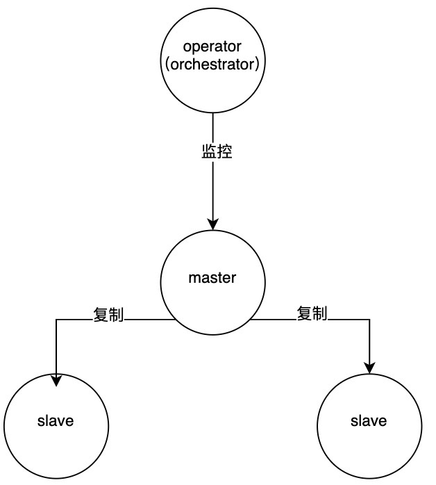
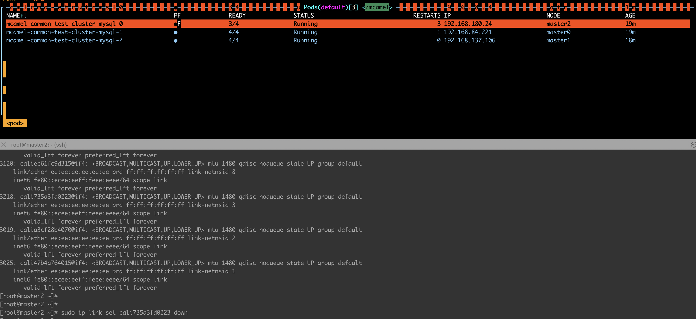
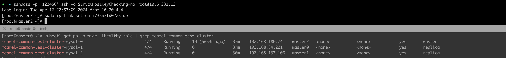

# MySQL 主从模式应对网络闪断

## 背景

MySQL 主从模式的高可用保障是独立于集群的，这就可能存在误判，例如下面的集群：



假设 master 的网络发生短暂闪断（时间大于 `orch` 切换的容忍时间），`orch` 会做 failover，
将其中一个 slave 提升为 master。然而 master 的网络有可能在切换后不久就恢复了，这时这个切换操作就是多余的。

为了应对这种场景，我们可以停止 `orch` 对该 MySQL 集群的自动切换能力。

!!! note

    适用于集群网络状态不可控的情况。原理是在 orch 监控到 master 网络不可达后，将其忽略。

### 操作步骤

1. 以 common-mysql 数据库，使用 helm 更新 operator：

    ```shell
    helm -n mcamel-system get values mysql-operator > values.yaml
    ```

2. 获取之前安装版本设置的 value，再升级 mysql-operator。

    ```shell
    helm upgrade \
      --install mysql-operator \
      --create-namespace \
      -n mcamel-system \
      --cleanup-on-fail mcamel-release/mysql-operator \
      --version 0.14.0-rc2 \
      -f values.yaml
      --set "orchestrator.config.RecoveryIgnoreHostnameFilters[0]=^mcamel-common"  # (1)!
    ```

    1. 这里是一个正则，这个正则最终会和  mysql pod 名字做匹配

!!! note

    确保执行完成后，operator 发生了重启；
    确保执行完成后，operator 的配置文件，名为 mysql-operator-orc 的 configmap 中有 --set 的内容。

## 验证方案

1. 建立一个 3 节点主从集群（-0 是 master），名字匹配上面设置的正则：

    

2. 停止 master 的网络；

    

3. 可以看到 master 没有发生切换；

    

4. 可以看到集群已经恢复正常，master 仍然是 -0。

    

!!! note

    另外再验证，名字不匹配上面正则的集群，同样的步骤，可以正常切换。
