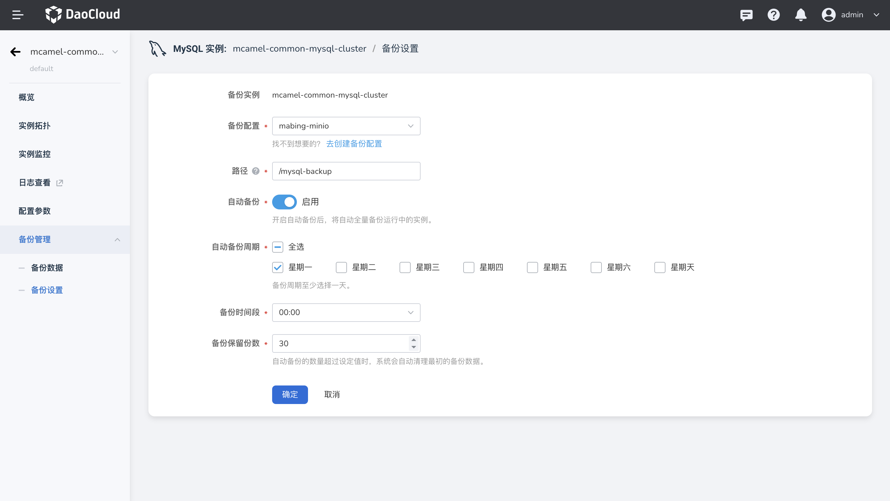

---
hide:
  - toc
---

# 配置自动备份

MySQL 数据库支持数据库实例的自动备份，由于开启备份会损耗数据库读写性能，
因此建议在业务低峰时间段对其自动备份。以保证数据库存在数据丢失时能够快速找回并保证数据安全。

## 操作步骤

1. 进入 **MySQL 数据库** 。
2. 在实例列表中选择需要开启自动备份的实例，点击其名称进入实例详情。
3. 点击左侧导航栏中的 **备份管理** -> **备份设置** 。

    

    - 备份配置：选择工作空间中已配置的对象存储实例，将备份数据存储在该所选实例中；
    - 路径：填写在对象存储中的地址，完整的 S3 路径格式为 `s3://bucket-name/object-key`。
      此处需要以 `/` 开头。
    - 自动备份：默认不开启。若开启，则按照设置的`自动备份周期`和`时间`定时对 MySQL 实例进行备份。
    - 自动备份周期：默认为全选。
        - 全选：选择一周内的每一天。系统每天都会进行自动备份。
        - 选择周期：选择一周内的一天或几天。系统会在所选时间进行自动备份。
    - 备份时间段：在所选时间内自动进行备份。
    - 备份保留份数：当该实例备份的数量达到设定值时，则删除超过该值的最早的备份数据。
