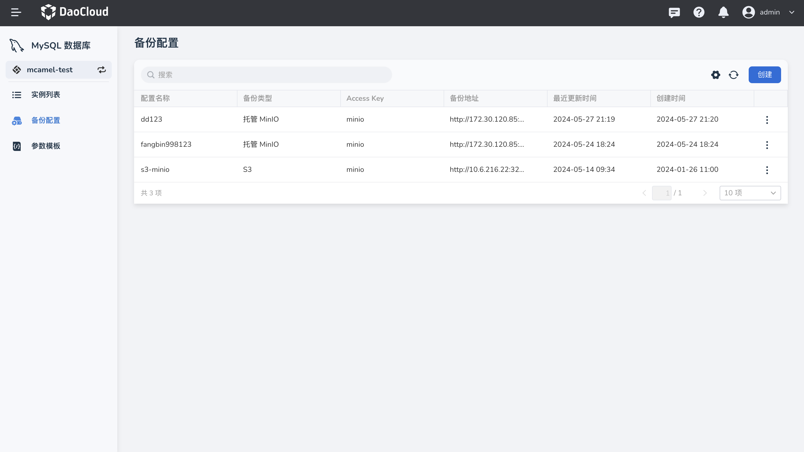
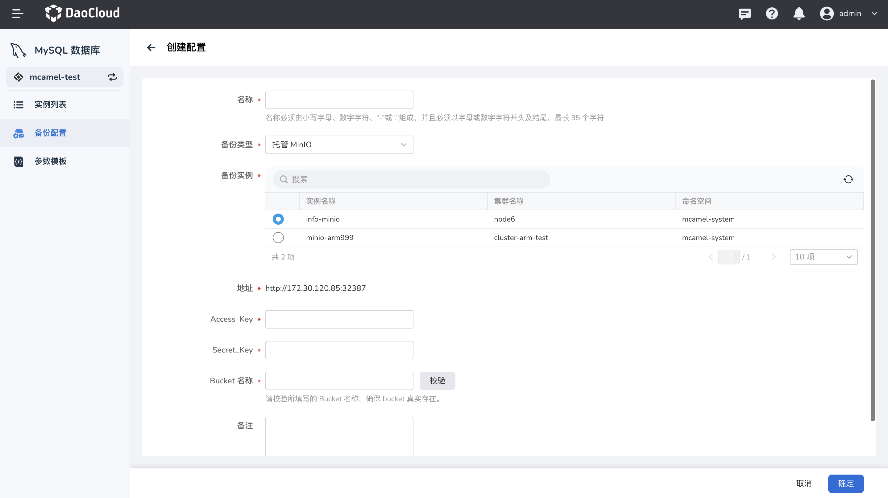
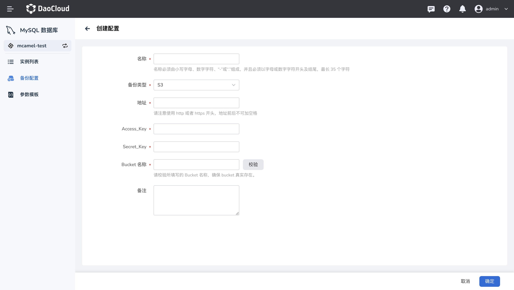
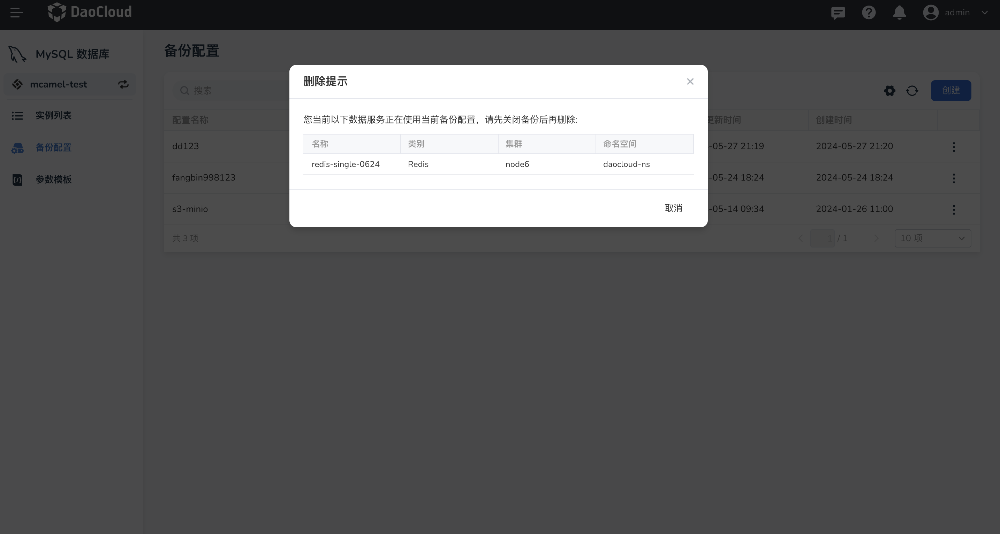

# 备份配置

DCE 数据服务提供的 MySQL 支持对数据库进行备份和恢复，以保证数据的安全性。在工作空间中，工作空间管理员可以统一管理 MySQL 数据备份的存储配置。

## 创建备份配置

1. 点击导航栏进入 **MySQL 数据库**
2. 点击 MySQL 数据库导航栏中 **备份配置** ，点击列表中的 **创建** 按钮

    

3. 选择备份配置的类型。

    - 使用 DCE 5.0 数据服务中提供的 MinIO 实例时，选中需要备份数据的 MinIO 实例，
      系统会自动获取所选 MinIO 的地址，用户需要填写所选 MinIO 实例的 Access_Key、Secret_Key、Bucket 名称。请确保 MinIO 中已存在填写的 Bucket。

    - 使用其他 S3 对象存储：填写要使用的 S3 的访问地址、Access_Key、Secret_Key 以及 Bucket 名称。

    

    

4. 填写并校验完成后，点击 **确认** 后返回备份配置列表，即可查看创建成功的存储信息。

## 编辑备份配置

进入备份配置列表，点击想要编辑的对象存储最后一列的 **...** -> **更新** ，对其进行修改。

## 删除备份配置

进入备份配置列表，点击想要编辑的对象存储最后一列的 **...** -> **删除** 。

若工作空间中的中间件实例正在使用所选的对象存储实例，则不允许被删除。

