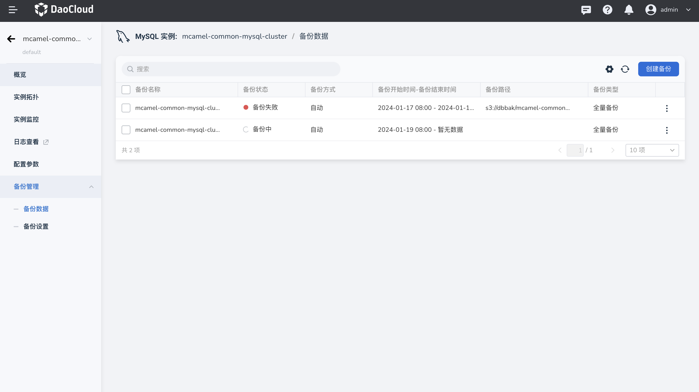

# 手动备份

MySQL 数据库支持对`运行中` 状态的实例进行手动备份，以便随时对数据库数据进行备份，以保证数据安全。

## 操作步骤

1. 进入 **MySQL 数据库** .
2. 在实例列表中选择需要开启自动备份的实例，点击进入实例详情。
3. 点击左侧导航栏中的 **备份管理** -> **备份数据** 。

    

4. 点击列表右上角的 **创建备份** 按钮，并填写备份的名称。

    - 确保 **备份管理** -> **备份设置** 中已选择目标备份的对象存储实例以及存储的路径。
    - 可视情况确认是否开启自动备份。

    

5. 点击 **确认** ，返回备份列表，即可在列表中查看备份的状态。
