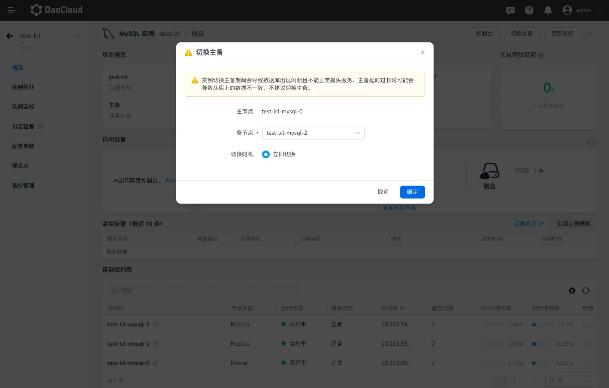

# MySQL 手动切换主备节点

MySQL 手动切换主备功能允许数据库管理员在主服务器出现故障或需要维护时，手动将备份服务器提升为新的主服务器。通过执行适当的命令和配置，确保数据一致性和服务的连续性，从而实现高可用性。

## 注意事项

1. 确保主节点和备节点的数据一致性，避免在切换过程中出现数据丢失或不一致。
2. 在切换之前，确认实例的状态为运行中。

## 操作步骤

1. 点击进入目标 MySQL 实例的详情页。
2. 在概览页的右上角，点击`切换主备`。
3. 展开备节点的下拉框可以指定升级为主节点的备节点。

{: width=1000px}
