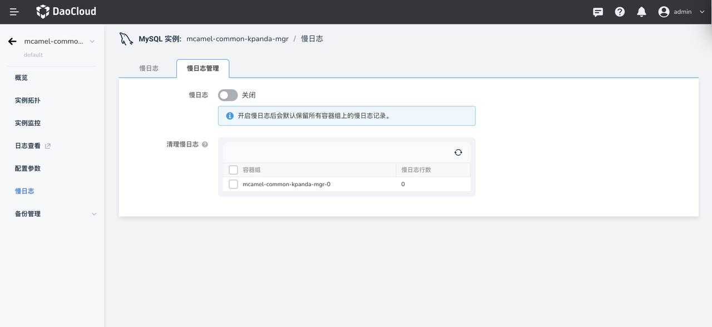
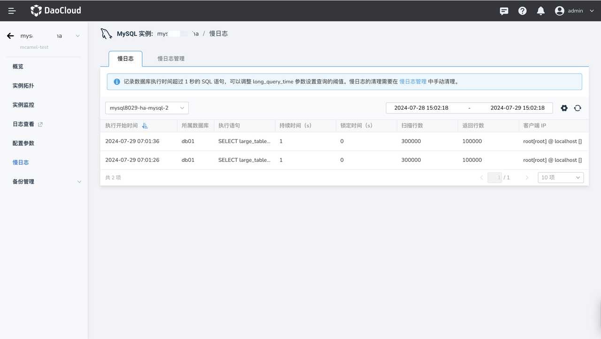

# MySQL 慢日志

MySQL 慢查询日志（Slow Query Log）是 MySQL 数据库引擎提供的一种功能，用于记录执行时间超过指定阈值的查询语句。通过记录执行时间较长的查询语句，可以帮助数据库管理员识别并优化数据库中的性能问题。MySQL 慢日志的默认阈值为 1 s，则数据服务的 MySQL 记录数据库中执行时间超过 1s（可以在`参数设置`中修改 `long_query_time` 参数来设置阈值）的 SQL 语句，并进行相似语句去重。

## 开启慢日志

1. 进入 MySQL 数据库列表，点击目标 MySQL 实例名进入实例详情。
2. 点击左侧导航栏中 慢日志，并切换到 慢日志管理 页签。
3. 点击开启慢日志功能。

    !!! info

        开启慢日志功能会导致实例重启！

    

## 查看慢日志

1. 进入 MySQL 数据库列表，点击目标 MySQL 实例名进入实例详情。
2. 点击左侧导航栏中 慢日志，选择需要查看的 MySQL 容器组和时间范围。
    - 默认不开启慢日志功能，可前往 慢日志管理 页签开启该功能。

    

## 删除慢日志

1. 点击左侧导航栏中 慢日志，并切换到 慢日志管理 页签。
2. 在清除慢日志模块，可以查看当前实例的慢日志数量。
3. 勾选想要清理的 MySQL 容器组，点击删除即可清除对应的慢日志数据。

!!! info

    目前没有自动清理慢日志机制，需要手动执行！
