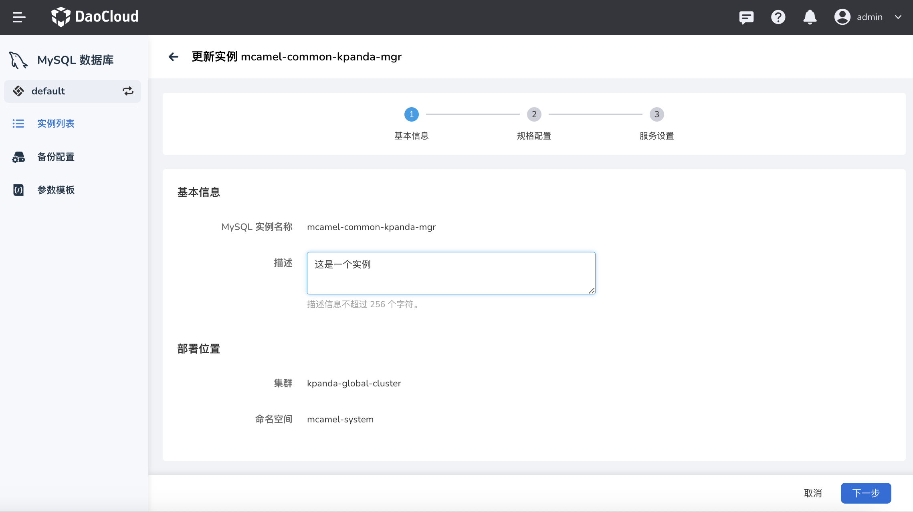
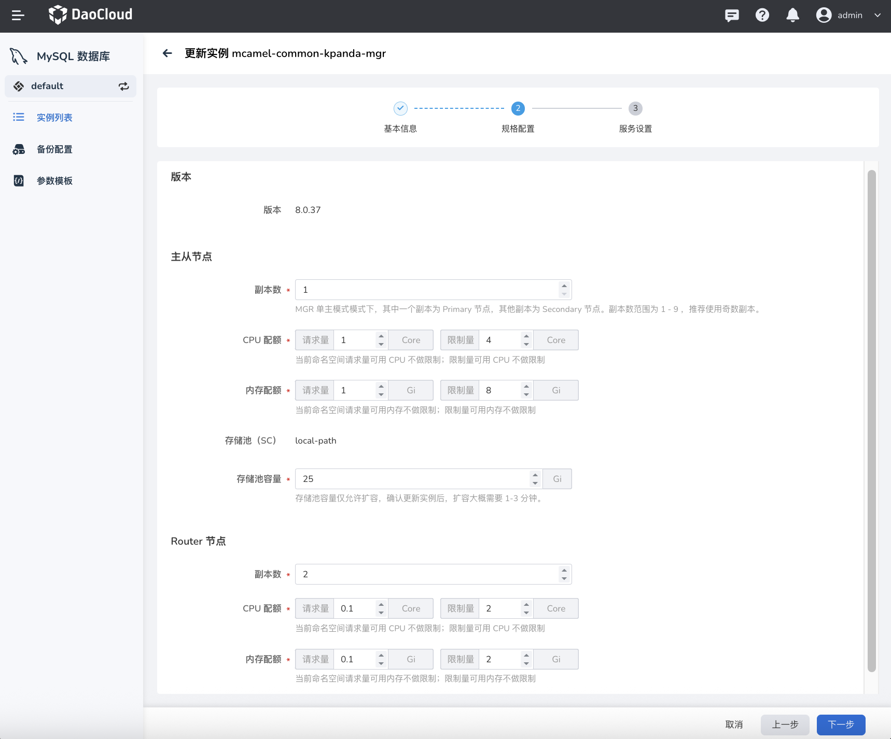
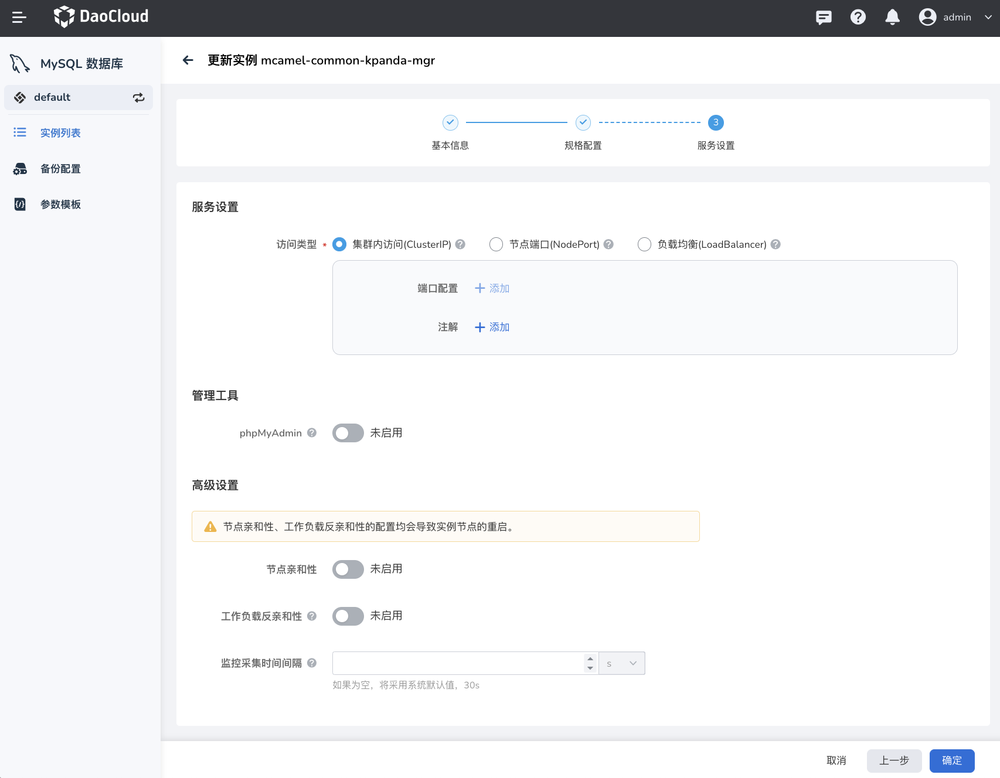

---
hide:
  - toc
---

# 更新 MySQL 实例

如果想要更新或修改 MySQL 的资源配置，可以按照本页说明操作。

1. 在实例列表中，点击右侧的 `...` 按钮，在弹出菜单中选择`更新实例`。

    

2. 基本信息：只能修改描述。然后点击`下一步`。

    

3. 修改规格配置后点击`下一步`。

    

4. 修改服务设置后点击`确认`。

    
