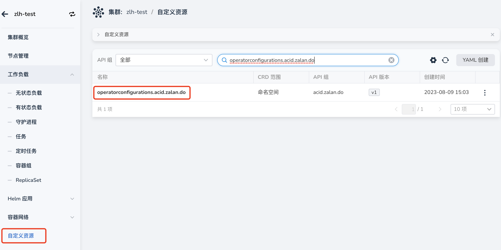
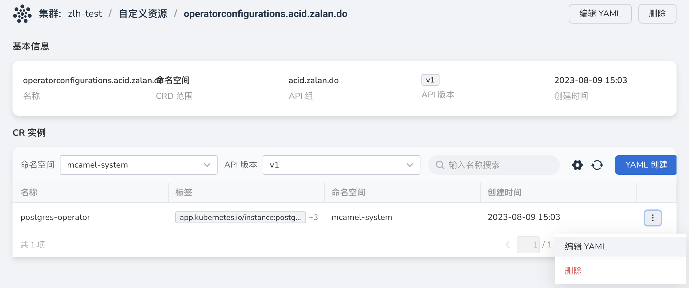
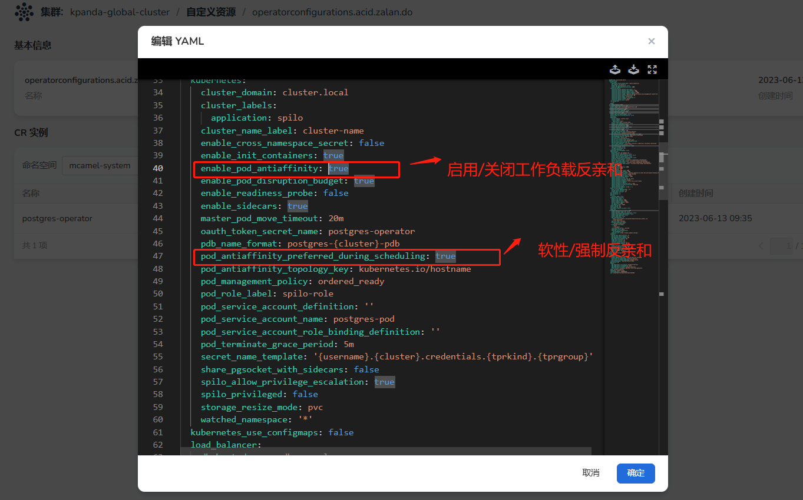
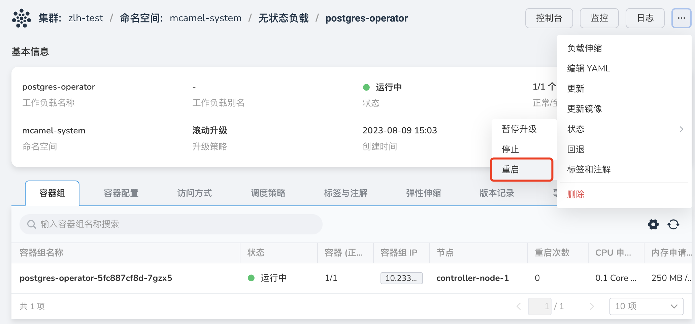

# 手工设置工作负载反亲和

PostgreSQL 中间件的的反亲和策略由同一集群下的所有实例共用，因此我们为用户默认开启了 `Preferred` 反亲和，如需关闭反亲和策略，或开启 `Required` 反亲和，需要修改 `Operator` 设置。配置方式如下：

!!! note

    修改 PostgreSQL 的反亲和设置会影响集群内所有 PostgreSQL 实例，建议谨慎操作。

1. 进入`容器管理`-`集群列表`，选择实例所在集群；

2. 点击`自定义资源`，查找资源：`operatorconfigurations.acid.zalan.do`

    

3. 在该资源下选择正确的`命名空间`-`CR实例`

    

3. 点击`编辑 YAML`，根据需求修改以下字段

    

    | 字段                                           | 说明                                               |
    | -------------------------------------------- | -------------------------------------------- |
    | enable_pod_antiaffinity                      | true：启用工作负载反亲和 false：关闭工作负载反亲和            |
    | pod_antiaffinity_preferred_during_scheduling | true：Preferred 软性反亲和 false：Required 强制反亲和 |

3. 重启 operator，已创建的实例也会随之重建并应用新的调度配置。

    

