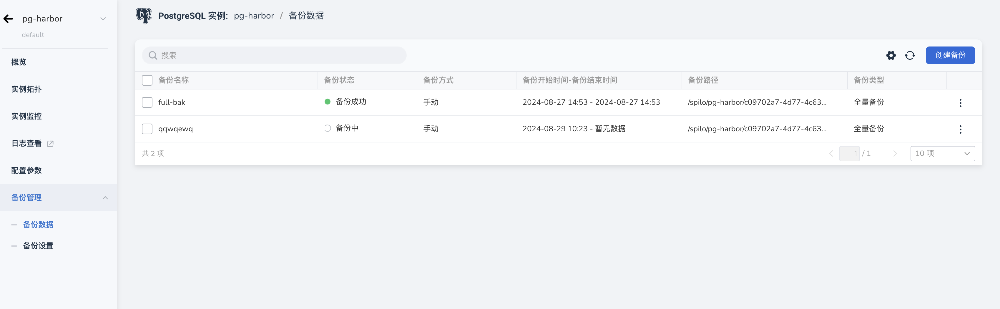
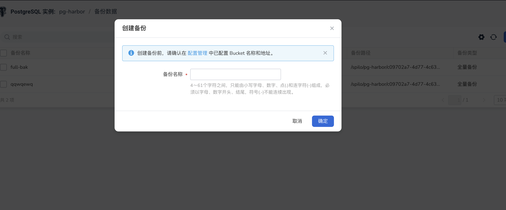
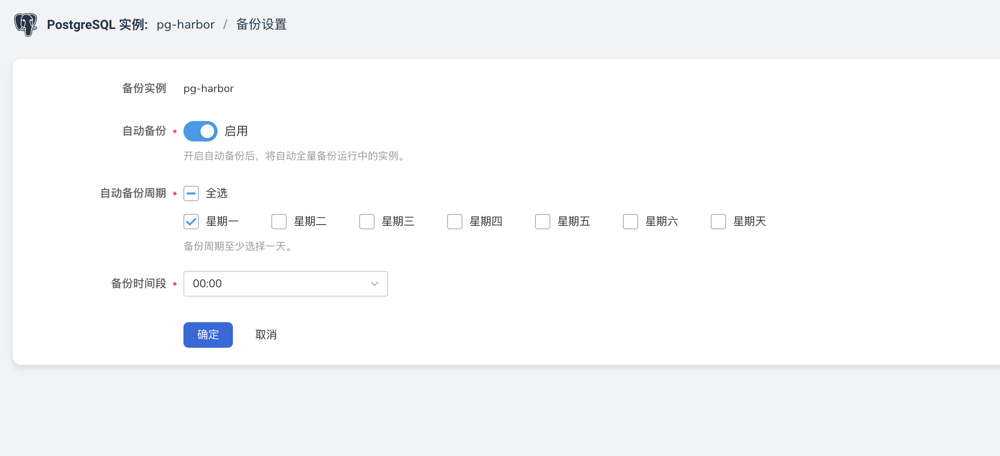

---
hide:
  - toc
---

# 配置备份数据

PostgreSQL 数据库支持数据库实例的自动备份，由于开启备份会损耗数据库读写性能，
因此建议在业务低峰时间段对其自动备份。以保证数据库存在数据丢失时能够快速找回并保证数据安全。

## 操作步骤

1. 进入 **PostgreSQL 数据库**
2. 在实例列表中选择需要开启自动备份的实例，点击其名称进入实例详情。
3. 点击左侧导航栏中的 **备份管理** -> **备份数据**

    

    

## 配置自动备份

备份配置：可设置自动备份，已经自动备份的周期。

- 自动备份：有一个开关，可以选择“启用”或“禁用”自动备份功能。提示信息说明启用后，系统将自动备份所有正在运行的实例。
- 自动备份周期：可以选择备份的周期，默认选项为“全选”。，允许用户选择具体的备份星期几（如星期一到星期天）。
- 备份时间段：允许用户设置备份开始的具体时间，默认值为 00:00。

