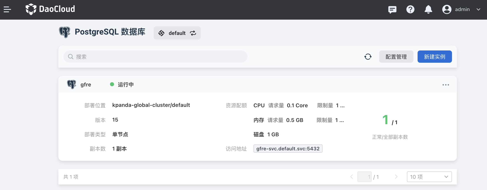
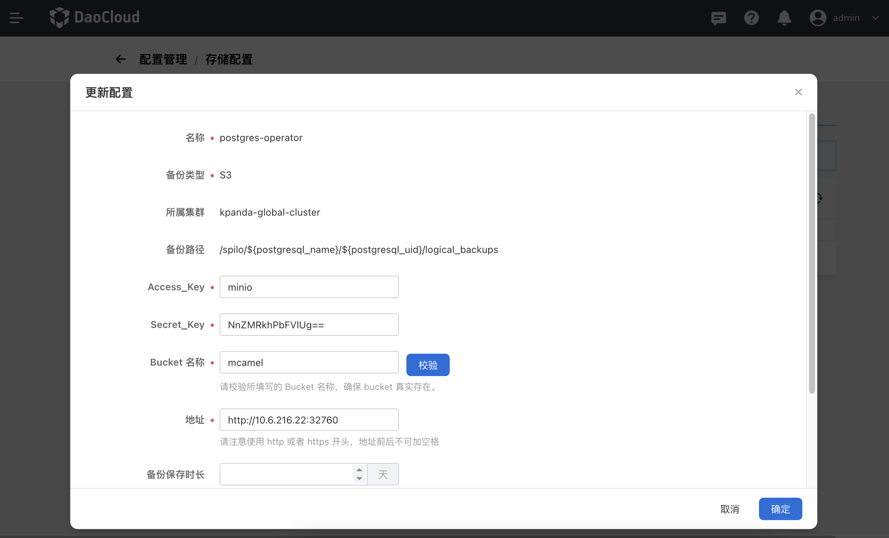
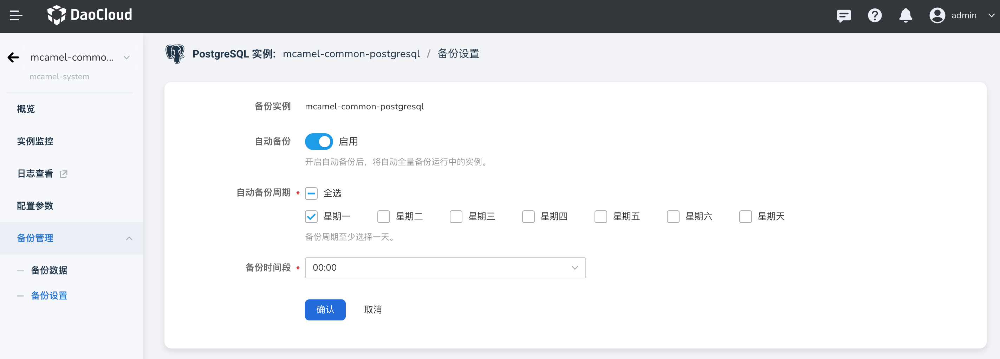
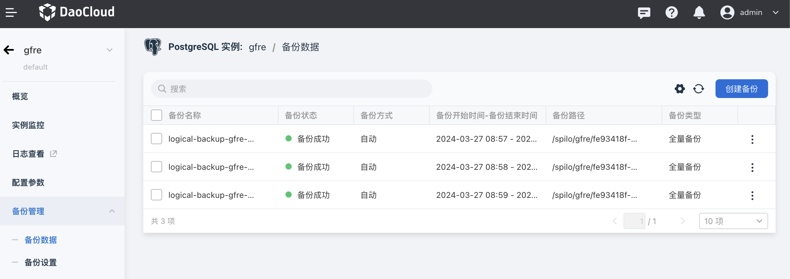

# 备份管理

PostgreSQL 支持对运行中的实例数据进行自动或手动备份。

## 备份配置

您可以针对不同的实例创建多个备份配置。例如一个实例一个备份配置。

1. 在 PostgreSQL 数据库首页，点击 **配置管理**

    

2. 在 **存储配置** 页签中查看已有的配置，或者点击 **创建** 按钮。

    

    - 备份类型：托管 MinIO 或 S3
    - 备份实例：选择一个实例
    - 输入访问实例的 Access_Key、Secret_Key 和 Bucket 名称

    !!! note

        在 **参数模板** 页签中，可以创建各种模板用于后续配置。

3. 确认无误后点击 **确定** 。

## 备份设置

备份之前，先要做好备份设置。

进入某个 PostgreSQL 实例，从左侧导航栏点击 **备份管理** -> **备份设置** 。

自动备份：开启自动备份后，将自动全量备份运行中的实例

## 创建备份

1. 进入某个 PostgreSQL 实例，从左侧导航栏点击 **备份管理** -> **备份数据** -> **创建备份** 按钮

    

2. 在弹窗中输入一个备份名称后点击 **确定**

    

3. 屏幕显示创建成功提示，点击右侧的 **⋮** 按钮，可以执行更多操作。

## 删除备份数据

如果想要删除备份数据，可以在备份数据列表中，点击右侧的 **⋮** 按钮，在弹出菜单中选择 **删除** 。

在弹窗中确认无误后点击 **确定** 。
