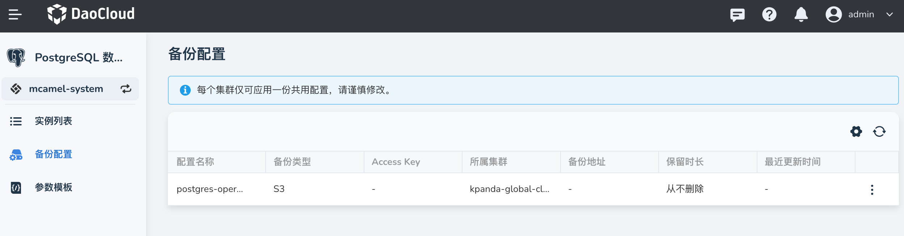

# 备份管理

PostgreSQL 支持对运行中的实例数据进行自动或手动备份。

## 备份配置

每个集群仅可应用一份共用配置，请谨慎修改。

## 备份设置

备份之前，先要做好备份设置。

进入某个 PostgreSQL 实例，从左侧导航栏点击 **备份管理** -> **备份设置** 。

自动备份：开启自动备份后，将自动全量备份运行中的实例

## 创建备份

1. 进入某个 PostgreSQL 实例，从左侧导航栏点击 **备份管理** -> **备份数据** -> **创建备份** 按钮

    

2. 在弹窗中输入一个备份名称后点击 **确定**

    

3. 屏幕显示创建成功提示，点击右侧的 **┇** 按钮，可以执行更多操作。

## 删除备份数据

如果想要删除备份数据，可以在备份数据列表中，点击右侧的 **┇** 按钮，在弹出菜单中选择 **删除** 。

在弹窗中确认无误后点击 **确定** 。
