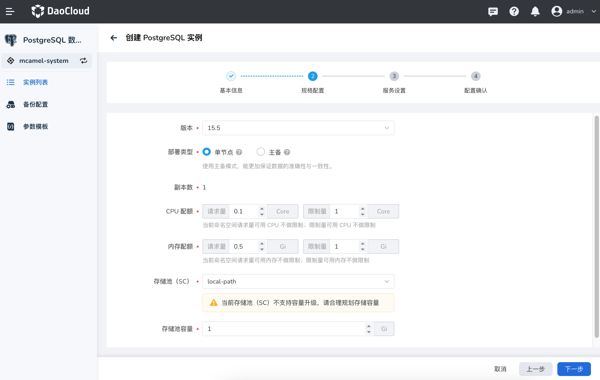
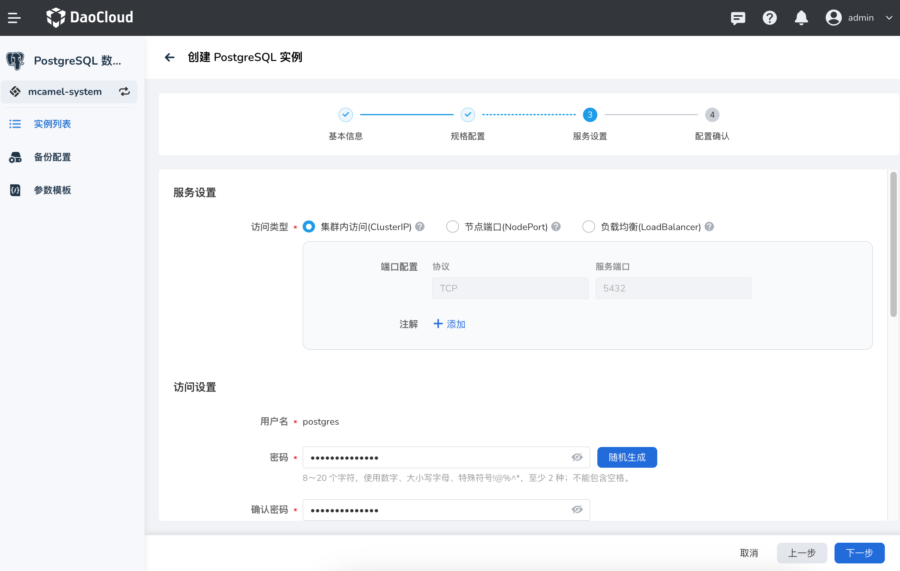
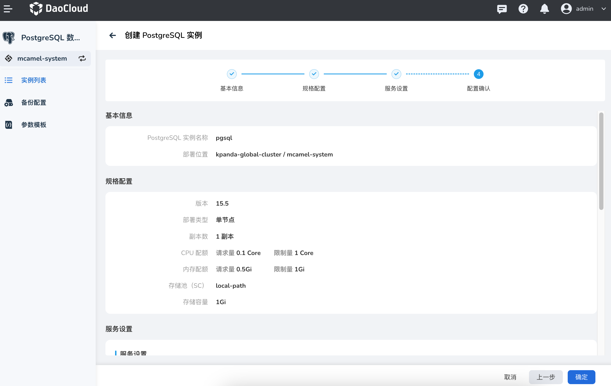

---
hide:
  - toc
---

# 创建 PostgreSQL 实例

接入 PostgreSQL 数据库后，参照以下步骤创建 PostgreSQL 实例。

1. 在实例列表中，点击右上角的 __新建实例__ 。

    

2. 在 __创建 PostgreSQL 实例__ 页面中，配置 __基本信息__ 后，点击 __下一步__ 。

    

3. 选择部署类型、CPU、内存和存储等 __规格配置__ 后，点击 __下一步__ 。

    

    !!! info
        
        使用主备模式，更能保证数据的准确性与一致性。
        主备部署类型提供高可用，当主节点故障后，备节点自动升级为主节点。包含一个主节点和多个备节点，主备节点的数据通过实时复制保持一致，备节点为只读节点，系统自动进行读请求的负载均衡。

4. 默认采用 ClusterIP 作为 __服务设置__ ，在 __访问设置__ 中可点击 __随机生成__ 设置随机密码，也可手动设置密码，__管理工具__ 中默认启用 pgAdmin 管理工具管理 PostgreSQL。

    

6. 确认基本信息、规格配置、服务设置的信息准确无误后，点击 __确定__ 。

    

7. 返回实例列表，屏幕将提示 __创建实例成功__ 。

    
