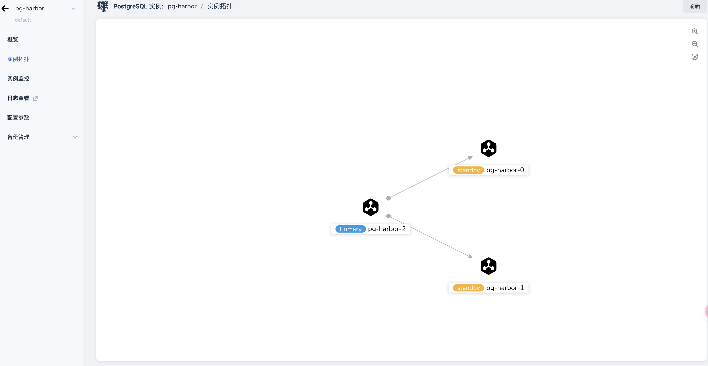
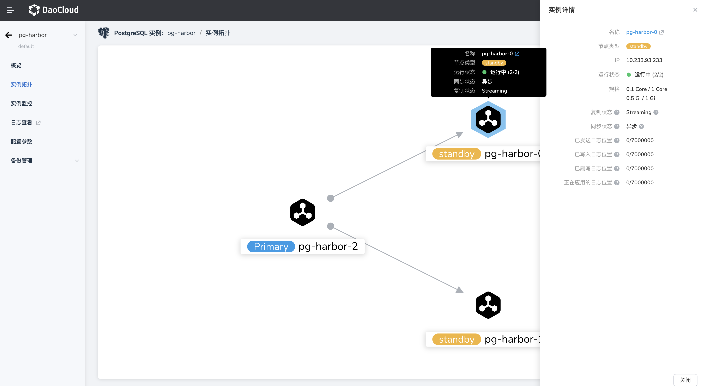

---
hide:
  - toc
---

# 实例拓扑

PostgreSQL 实例拓扑展示实例中节点间数据同步的实例状态，以及基本信息。

## 操作步骤

点击进入目标实例的详情页，点击左侧导航栏，选择 **实例拓扑** 。

- 在拓扑中，可以看到实例节点之间的主从关系以及数据同步的方向；
- 点击右上角的图标可以放大或缩小拓扑图；

    

- 鼠标悬浮在节点上或点击节点时，可以查看所选节点的详细信息，包括其 IP 地址、运行状态、同步状态等。同步状态的信息包括节点的日志状态和同步进度，包括已发送、已写入、已复制的日志量等。

    
