# 集群模式 VS 集群模式

Redis-shake 支持集群模式实例间的数据同步与迁移能力，现以以下 3 主 3 从集群模式 Redis 场景为例，演示跨集群同步配置方法。

假设 Redis 实例 A 与 Redis 实例 B 处于不同集群，二者均为 3 主 3 从集群模式，现将实例 A 作为主实例，实例 B 作为从实例搭建同步结构，提供以下灾备支持：

- 正常状态下，由实例 A 对外提供服务，并持续同步数据  实例 A >> 实例 B ；
- 当主实例 A 故障离线后，由实例 B 对外提供服务；
- 待实例 A 恢复上线后， 实例 B >> 实例 A 回写增量数据；
- 实例 A 数据恢复完成后，切换为初始状态，即由实例 A 提供服务，并向实例 B 持续数据同步。

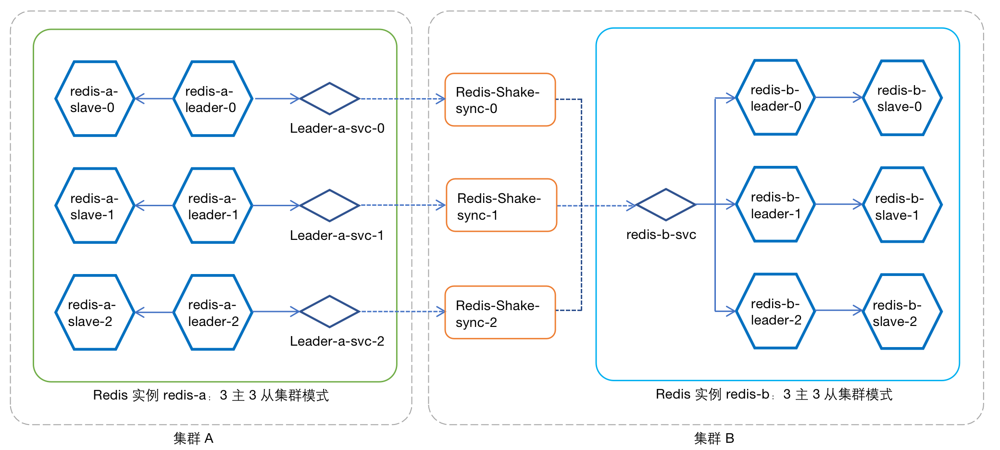

图例：数据同步 实例 A >> 实例 B


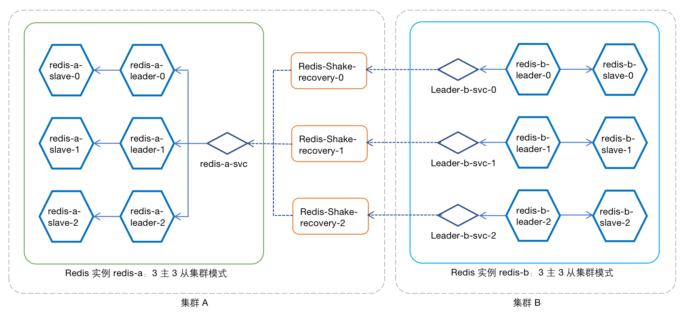

图例：数据恢复 实例 B >> 实例 A

!!! note

    数据同步与数据恢复需要通过不同的 Redis-shake 组完成，因此在本例中实际要创建两组（Redis-shake-sync/Redis-shake-recovery）共 6 个 Redis-shake 实例。

## 数据同步部署

### 为源端实例配置服务

为 Redis 实例的每一个 Leader Pod 创建一个 `Nodeport` 服务，用于 Redis-Shake 的数据同步访问。本例中需要为实例 A 的 3 个 Leader Pod 分别创建服务，下面以 Pod `redis-a-leader-0` 为例，为其创建服务：

1. 进入`容器管理` - `源端集群` - `有状态工作负载`：选择工作负载 `redis-a-leader`，为其创建一个服务，命名为 `redis-a-leader-svc-0`，访问类型为 `Nodeport`，容器端口和服务端口均为 6379。

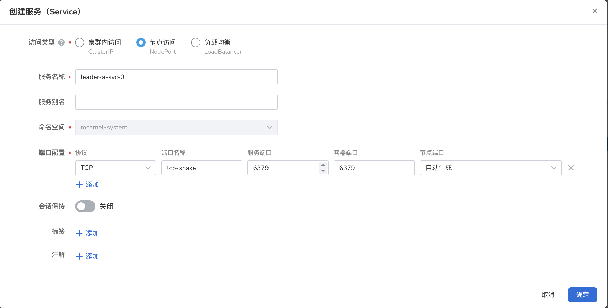

2. 更新该服务。并确定工作负载选择器包含以下标签
    ```shell
    app.kubernetes.io/component: redis
    app.kubernetes.io/managed-by: redis-operator
    app.kubernetes.io/name: redis-a
    app.kubernetes.io/part-of: redis-failover
    role: leader
    # 注意 pod-name 一定要选择正确的 leader pod 名称
    statefulset.kubernetes.io/pod-name: redis-a-leader-0
    ```

    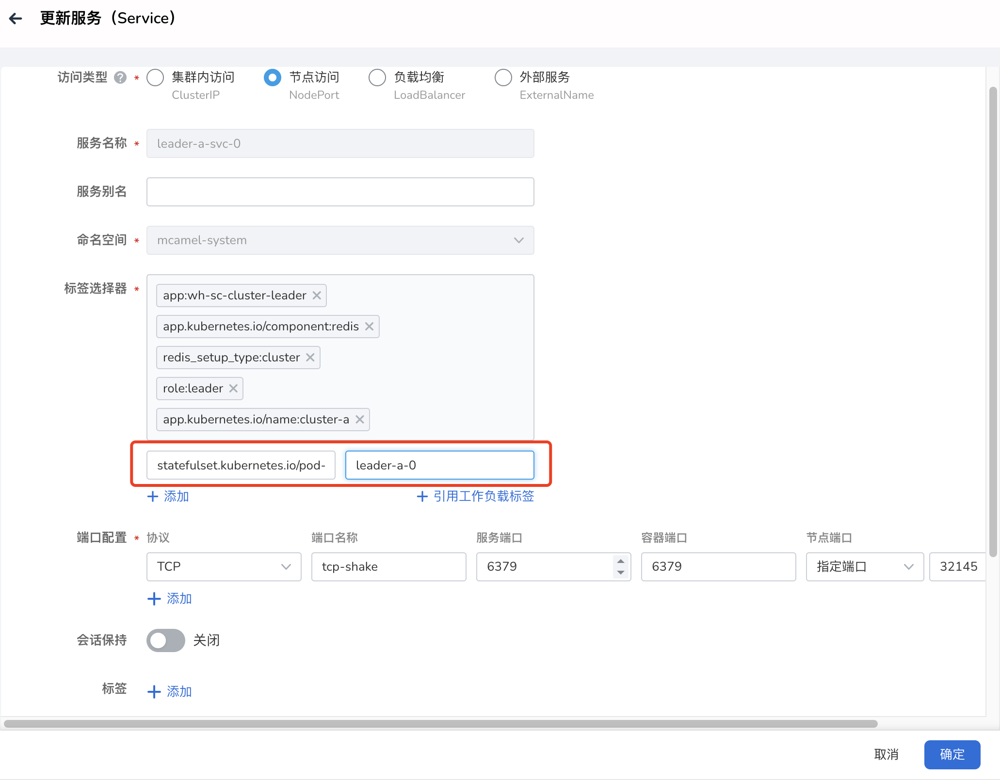

重试执行以上操作，为 `redis-a-leader-1` `redis-a-leader-2` 分别创建服务。

### Redis-shake 部署
Redis-shake 通常与数据传输的目标 Redis 实例运行于同一集群上，因此，本例中为了实现数据同步，需要在目标端部署redis-shake，配置方式如下。

在集群模式下，需要为源端 Redis 实例 cluster-a 的每一个 Leader Pod 部署独立的 Redis-shake。以 redis-a-leader-0  为例，创建 Redis-shake-sync-0：

#### 1. 创建配置项

在`容器管理` - `{目标端集群}` - `配置与存储` - `配置项`为 Redis-shake 实例创建配置项 `redis-sync-0`。导入文件 `sync.toml`（文件内容见附录），并注意需要修改以下内容：
 

    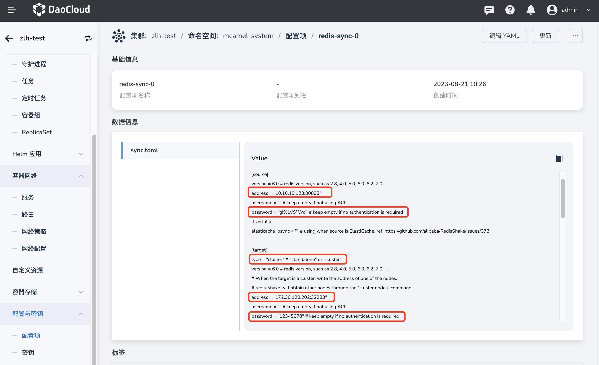

- source.address：源端 `redis-a-leader-0` 的 `redis-a-leader-svc-0` 服务地址：

    ```shell
    address = "10.233.109.145:6379"
    ```

- 源端实例的访问密码：可在【中间件】实例的概览页获取该信息：


    ```shell
    password = "3wPxzWffdn" # keep empty if no authentication is required
    ```

- 目标端实例访问地址，此处为目标端 redis-b 的默认 clusterIP 服务 redis-b-leader  的地址：

    ```shell
    address = "172.30.120.202:32283"
    ```

- 目标端实例的访问密码，可在`数据服务`模块下的 Redis 实例概览页获取该信息:

    ```shell
    password = "3wPxzWffdn" # keep empty if no authentication is required
    ```

    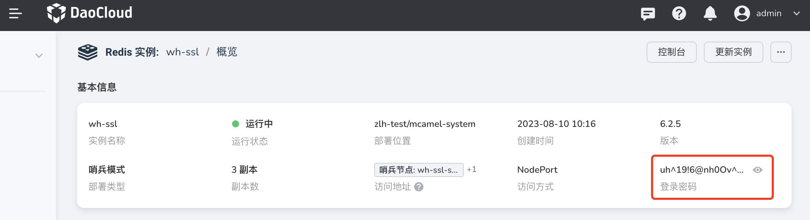

- 目标端类型需设置为 `cluster`：

    ```shell
    [target]
    type = "cluster" # "standalone" or "cluster"
    ```

#### 2. 创建 Redis-shake

a. 打开`应用工作台`，选择`向导`-`基于容器镜像`，创建一个应用 `Redis-shake-sync-0`：

    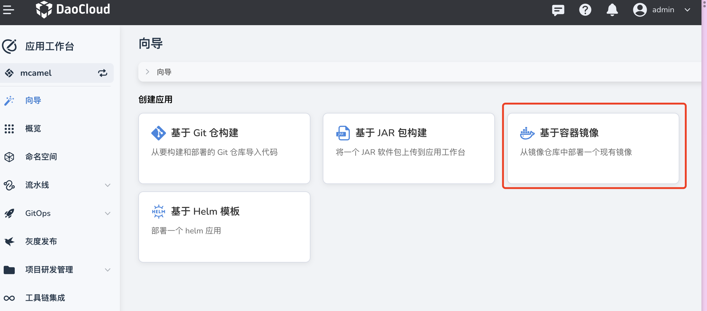

    应用各项配置如下：
    - 应用所属集群、命名空间需与 Redis 实例一致；
    - 镜像地址：

        ```shell
        release.daocloud.io/ndx-product/redis-shake@sha256:46652d7d8893fa4508c3c6725afc1e211fb9cb894c4dc85e94287395a32fc3dc
        ```

    - 默认服务的访问类型为 Nodeport ，容器端口和服务端口设置为 6379。

        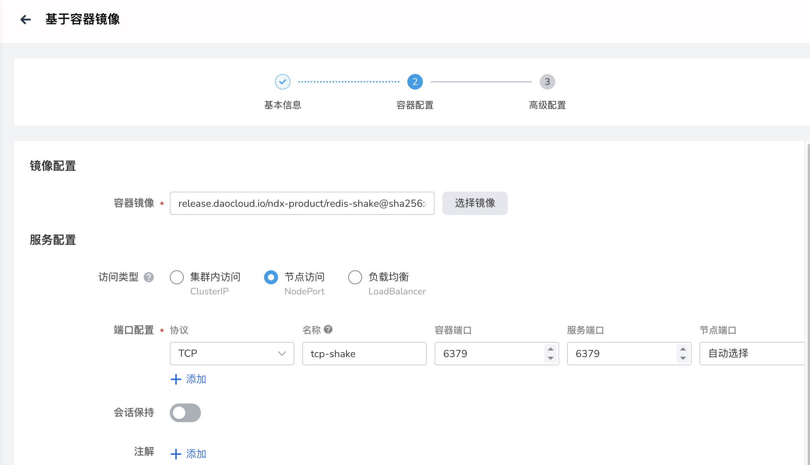

    - `高级设置` - `生命周期`  - `启动命`令 - `运行参数` 填入：

        ```shell
        /etc/sync/sync.toml
        ```

        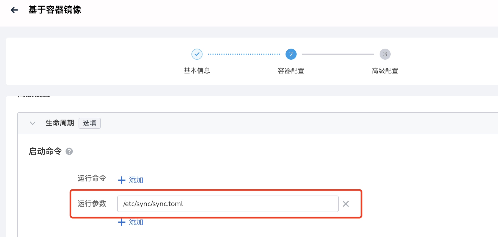

    - `高级设置` - `数据存储 `：添加配置项 `redis-sync-0`，路径必须设置为：

        ```shell
        /etc/sync
        ```

    - `高级设置` -` 数据存储`：添加一个临时路径，容器路径必须为：

        ```shell
        /data
        ```

       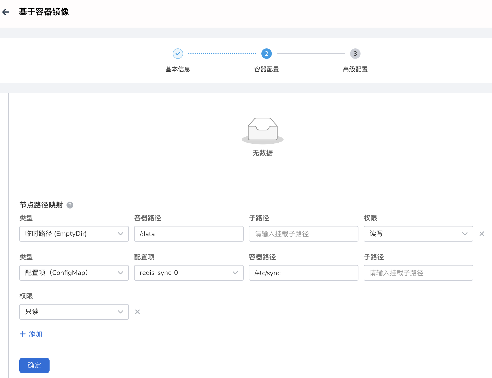

b. 点击`确定`，完成 Redis-shake 创建。

重复执行以上操作，分别为其他两个 Leader Pod 创建 `Redis-shake-sync-1`，`Redis-shake-sync-2`。

完成 Redis-shake 的创建后，实际就已经开始 Redis 实例间的同步，此时可通过 `redis-cli` 工具验证同步，这里就不做赘述。


## 数据恢复

当源端实例恢复上线后，首先需要从目标端实例恢复增量数据，因此需要在 **源端集群** 再次部署 3 个 redis-shake 实例，实现 **实例 B >> 实例 A** 的数据回传，此处配置方法与数据同步过程类似，执行 **反方向** 配置部署即可，完成 redis-shake 创建后，即自动开始数据恢复。

!!! note

    源端实例上线前，请先关闭运行在 **目标端集群** 的 3 个 Redis-shake 实例 `Redis-shake-sync`，避免发生错误的数据同步覆盖掉新增数据。

## 复原主从关系

如需复原初始的主从同步关系 **实例 A >> 实例 B**，需在`容器管理`中停止源端集群中的 3 个 Redis-shake-recovery 实例，重新启动目标端集群中的 3 个 Redis-shake-sync 实例，即可重建初始主从关系。

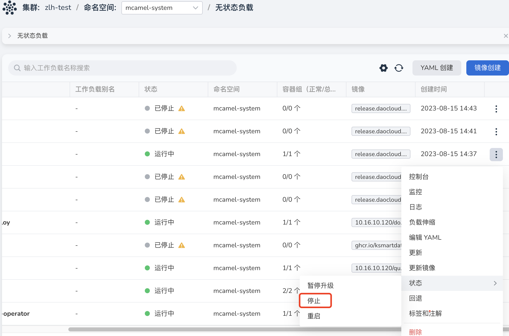


