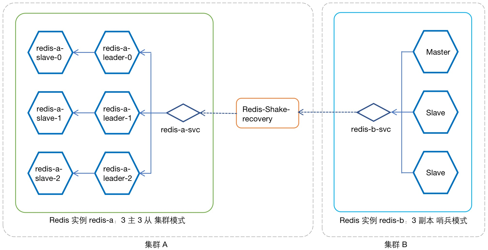
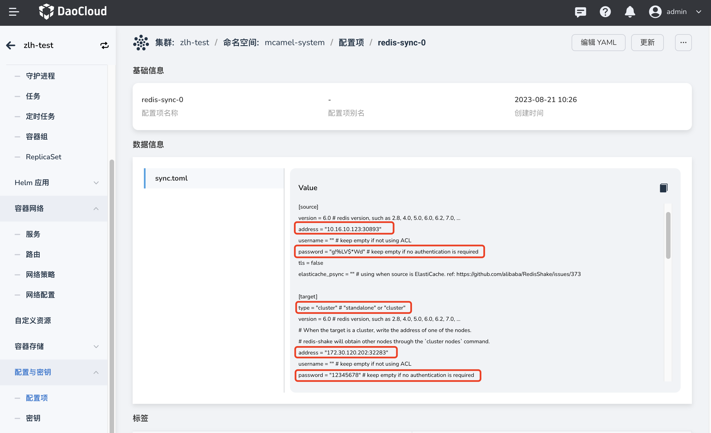
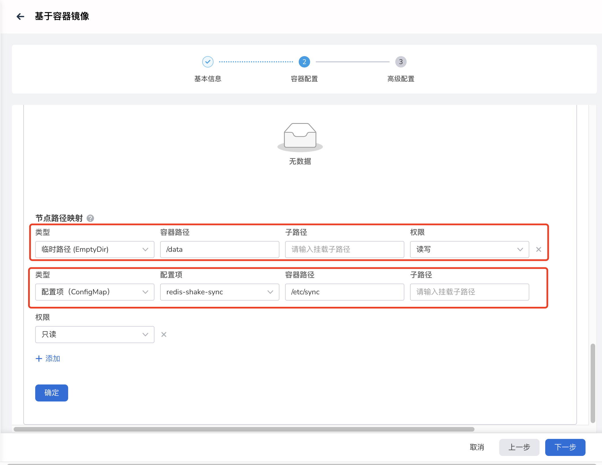
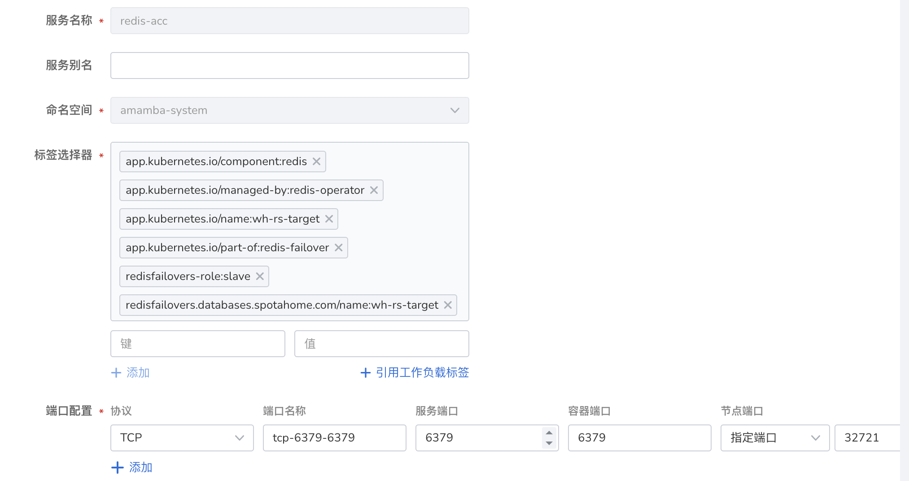

# 集群模式 to 哨兵模式

Redis-shake 支持不同部署模式实例间的数据同步与迁移能力，现以 3 主 3 从集群模式实例与 3 副本哨兵模式实例的场景为例，演示不同模式之间的同步配置方法。

假设 Redis 实例 A 为 3 主 3 从集群模式，实例 B 为 3 副本哨兵模式，两实例处于不同集群。现将实例 A 作为主实例，实例 B 作为从实例搭建同步结构，提供以下灾备支持：

- 正常状态下，由实例 A 对外提供服务，并持续同步数据  实例 A >> 实例 B ；
- 当主实例 A 故障离线后，由实例 B 对外提供服务；
- 待实例 A 恢复上线后， 实例 B >> 实例 A 回写增量数据；
- 实例 A 数据恢复完成后，切换为初始状态，即由实例 A 提供服务，并向实例 B 持续数据同步。

图例：数据同步 实例 A >> 实例 B


图例：数据恢复 实例 B >> 实例 A



!!! note

    由上图可见，数据传输的方式与传输源端实例有关，在`数据同步`中源端实例 A 为集群模式，需要为每个 leader 节点分别部署一个 Redis-shake（Redis-shake-recovery）；在`数据恢复`中源端实例 B 为哨兵模式，则仅需部署一个 Redis-shake（Redis-shake-sync），

## 数据同步部署

### 为 **实例 A** 配置服务

如果源端实例处于 DCE 5.0 的集群中，可在`数据服务` - `Redis` - `解决方案` - `跨集群主从同步`中开启方案，将自动完成服务配置工作。


如果源端实例处于第三方集群上，则需要手工完成服务配置，配置方法如下文：

为 Redis 实例的每一个 Leader Pod 创建一个 `Nodeport` 服务，用于 Redis-Shake 的数据同步访问。本例中需要为实例 A 的 3 个 Leader Pod 分别创建服务，下面以 Pod `redis-a-leader-0` 为例，为其创建服务：

1. 进入`容器管理` - `源端实例所在集群` - `有状态工作负载`：选择工作负载 `redis-a-leader`，为其创建一个服务，命名为 `redis-a-leader-svc-0`，访问类型为 `Nodeport`，容器端口和服务端口均为 6379。

    

2. 查看该服务。并确定工作负载选择器包含以下标签
   
    ```yaml
    app.kubernetes.io/component: redis
    app.kubernetes.io/managed-by: redis-operator
    app.kubernetes.io/name: redis-a
    app.kubernetes.io/part-of: redis-failover
    role: leader
    # 注意 pod-name 一定要选择正确的 leader pod 名称
    statefulset.kubernetes.io/pod-name: redis-a-leader-0
    ```

    

重复执行以上操作，为 `redis-a-leader-1` `redis-a-leader-2` 分别创建服务。

### Redis-shake 部署

Redis-shake 通常与数据传输的目标 Redis 实例运行于同一集群上，因此，本例中为了实现数据同步，需要在目标端部署redis-shake，配置方式如下。

注意，在集群模式下，Redis-shake 要求与源端 Redis 实例的 Leader Pod 形成一对一关系（请参考图例：数据同步 实例 A >> 实例 B），因此这里需要部署 3 个独立的 Redis-shake。以 `redis-a-leader-0` 为例，创建 `Redis-shake-sync-0`：

#### 1. 创建配置项

在`容器管理` - `目标端实例所在集群` - `配置与存储` - `配置项`为 Redis-shake 实例创建配置项 `redis-sync-0`。导入文件 `sync.toml`（文件内容见附录），并注意需要修改以下内容：



- source.address：源端实例 `redis-a` 的 `redis-a-leader-svc-0` 服务地址：

    ```toml
    address = "10.233.109.145:32283"
    ```
    
- 源端实例的访问密码：可在`数据服务`实例的概览页获取该信息：

    ```toml
    password = "3wPxzWffdn" # keep empty if no authentication is required
    ```

    

- 目标端实例访问地址，此处采用实例 `redis-b` 的默认 Headless 服务 `rfr-redis-b` 的地址：

    ```toml
    address = "rfr-redis-b:6379"
    ```
 
    该服务信息可在`集群管理` - `目标端所在集群` - `工作负载` - `访问方式`中查看。类似下图所示页面

    


- 目标端实例的访问密码，可在`数据服务`模块下的 Redis 实例概览页获取该信息:

    ```toml
    password = "3wPxzasd" # keep empty if no authentication is required
    ```

- 目标端类型需设置为 `standalone`：

    ```toml
    [target]
    type = "standalone" # "standalone" or "cluster"
    ```

#### 2. 创建 Redis-shake

1. 打开`应用工作台`，选择`向导`-`基于容器镜像`，创建一个应用 `Redis-shake-sync-0`：

    

2. 参考如下说明填写应用配置。
    
    - 应用所属集群、命名空间需与 Redis 实例一致；
    - 镜像地址：

        ```yaml
        release.daocloud.io/ndx-product/redis-shake@sha256:46652d7d8893fa4508c3c6725afc1e211fb9cb894c4dc85e94287395a32fc3dc
        ```

    - 默认服务的访问类型为 Nodeport ，容器端口和服务端口设置为 6379。

        

    - `高级设置` - `生命周期`  - `启动命令` - `运行参数` 填入：

        ```yaml
        /etc/sync/sync.toml
        ```

        

    - `高级设置` - `数据存储 `：添加配置项 `redis-sync-0`，路径必须设置为：

        ```yaml
        /etc/sync
        ```

    - `高级设置` -` 数据存储`：添加一个临时路径，容器路径必须为：

        ```yaml
        /data
        ```

       

3. 点击`确定`，完成 Redis-shake 创建。

重复执行以上操作，分别为其他两个 Leader Pod 创建 `Redis-shake-sync-1`，`Redis-shake-sync-2`。

完成 Redis-shake 的创建后，实际就已经开始 Redis 实例间的同步，此时可通过 `redis-cli` 工具验证同步，这里就不做赘述。

## 数据恢复

当源端实例 **实例 A** 发生故障离线后，将由目标端 **实例 B** 提供服务，该过程必然产生新增数据。**实例 A** 恢复上线后，首先需要从 **实例 B** 恢复增量数据，因 **实例 A** 为集群模式，因此需要在 **源端实例所在集群** 部署 3 个 redis-shake 实例，实现 **实例 B >> 实例 A** 的数据回传，配置方式如下。

!!! note

    源端实例上线前，请先关闭运行在 **目标端实例所在集群** 的 3 个 Redis-shake 实例，避免发生错误的数据同步覆盖掉新增数据。

### 为 **实例 B** 配置服务

在`数据服务` - `Redis` - `实例 B` - `解决方案` - `跨集群主从同步`中开启方案，如果 **实例 B** 不在 DCE 5.0 下集群，执行以下操作。

此时的数据源 **实例 B** 为哨兵模式，因此仅需要创建 1 个服务，以下为创建过程 ：

1. 进入`容器管理` - `源端实例所在集群` - `有状态工作负载`：选择工作负载 `redis-b`，创建一个 `Nodeport` 服务，容器端口和服务端口均为 6379

    

2. 查看该服务。并确定工作负载选择器包含以下标签
   
    ```yaml
    app.kubernetes.io/component: redis
    app.kubernetes.io/managed-by: redis-operator
    app.kubernetes.io/name: redis-b
    app.kubernetes.io/part-of: redis-failover
    redis-failover: master
    redisfailovers.databases.spotahome.com/name: redis-b
    ```

    

### Redis-shake 部署

Redis-shake 通常与数据传输的目标 Redis 实例运行于同一集群上，因此，本例中为了实现数据同步，需要在目标端部署redis-shake，配置方式如下。

#### 1. 创建配置项

在`容器管理` - `目标端实例所在集群` - `配置与存储` - `配置项`为 Redis-shake 实例创建配置项 `redis-sync`。导入文件 `sync.toml` （文件内容见`附录`），并注意需要修改以下内容：


- source.address：上一步骤创建的源端 `redis-b` 的服务地址：

    ```toml
    address = "10.233.109.145:32283"
    ```
    
- 源端实例的访问密码：可在 Redis 实例的概览页获取该信息：

    ```toml
    password = "3wPxzWffdn" # keep empty if no authentication is required
    ```
    

- 目标端实例访问地址，此处需要填写目标端实例 redis-b 的指向端口 6379 的 clusterIP 服务，这里使用 redis-a-leader 的地址：

    ```toml
    address = "172.30.120.202:6379"
    ```

    该配置可在`集群管理` - `目标端所在集群` - `工作负载` - `访问方式` 中查看。如下图所示

    

    点击服务名称，进入服务详情，可见 ClusterIP 地址

    

- 目标端实例的访问密码，可在`数据服务`模块下的 Redis 实例概览页获取该信息:

    ```toml
    password = "3wPxzWffdn" # keep empty if no authentication is required
    ```

- 目标端类型需设置为 `cluster`：

    ```toml
    [target]
    type = "cluster" # "standalone" or "cluster"
    ```

#### 2. 创建 Redis-shake

1. 打开`应用工作台`，选择`向导`-`基于容器镜像`，创建一个应用 `Redis-shake-sync`：

    

2. 参考如下说明填写应用配置。
    
    - 应用所属集群、命名空间需与 Redis 实例一致；
    - 镜像地址：

        ```yaml
        release.daocloud.io/ndx-product/redis-shake@sha256:46652d7d8893fa4508c3c6725afc1e211fb9cb894c4dc85e94287395a32fc3dc
        ```

    - 默认服务的访问类型为 Nodeport，容器端口和服务端口设置为 6379。

        

    - `高级设置` - `生命周期` - `启动命令` - `运行参数`填入：

        ```yaml
        /etc/sync/sync.toml
        ```

        

    - `高级设置` - `数据存储`：添加配置项 `redis-sync`，路径必须设置为：

        ```yaml
        /etc/sync
        ```

    - `高级设置` - `数据存储`：添加一个临时路径，容器路径必须为：

        ```yaml
        /data
        ```

       

3. 点击`确定`，完成 Redis-shake 创建。


完成 Redis-shake 的创建后，实际就已经开始 Redis 实例间的同步，此时可通过 `redis-cli` 工具验证同步，这里就不做赘述。


## 复原主从关系

如需复原初始的主从同步关系 **实例 A >> 实例 B**，需在`容器管理`中停止当前运行在 **实例 A** 所在集群的 `Redis-shake-sync` 实例，重新启动目标端实例所在集群中的 3 个 `Redis-shake` 实例，即可重建初始主从关系。


## 附录

sync.toml

??? note “请点击查看配置文件”

    ```toml
    type = "sync"
     
    [source]
    version = 6.0 # redis version, such as 2.8, 4.0, 5.0, 6.0, 6.2, 7.0, ...
    address = "10.233.109.145:6379"
    username = "" # keep empty if not using ACL
    password = "3wPxzWffdn" # keep empty if no authentication is required
    tls = false
    elasticache_psync = "" # using when source is ElastiCache. ref: https://github.com/alibaba/RedisShake/issues/373
     
    [target]
    type = "cluster" # "standalone" or "cluster"
    version = 6.0 # redis version, such as 2.8, 4.0, 5.0, 6.0, 6.2, 7.0, ...
    # When the target is a cluster, write the address of one of the nodes.
    # redis-shake will obtain other nodes through the `cluster nodes` command.
    address = "10.233.103.2:6379"
    username = "" # keep empty if not using ACL
    password = "Aa123456" # keep empty if no authentication is required
    tls = false
     
    [advanced]
    dir = "data"
     
    # runtime.GOMAXPROCS, 0 means use runtime.NumCPU() cpu cores
    ncpu = 4
     
    # pprof port, 0 means disable
    pprof_port = 0
     
    # metric port, 0 means disable
    metrics_port = 0
     
    # log
    log_file = "redis-shake.log"
    log_level = "info" # debug, info or warn
    log_interval = 5 # in seconds
     
    # redis-shake gets key and value from rdb file, and uses RESTORE command to
    # create the key in target redis. Redis RESTORE will return a "Target key name
    # is busy" error when key already exists. You can use this configuration item
    # to change the default behavior of restore:
    # panic:   redis-shake will stop when meet "Target key name is busy" error.
    # rewrite: redis-shake will replace the key with new value.
    # ignore:  redis-shake will skip restore the key when meet "Target key name is busy" error.
    rdb_restore_command_behavior = "rewrite" # panic, rewrite or skip
     
    # pipeline
    pipeline_count_limit = 1024
     
    # Client query buffers accumulate new commands. They are limited to a fixed
    # amount by default. This amount is normally 1gb.
    target_redis_client_max_querybuf_len = 1024_000_000
     
    # In the Redis protocol, bulk requests, that are, elements representing single
    # strings, are normally limited to 512 mb.
    target_redis_proto_max_bulk_len = 512_000_000
    ```

