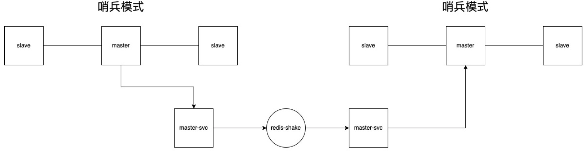
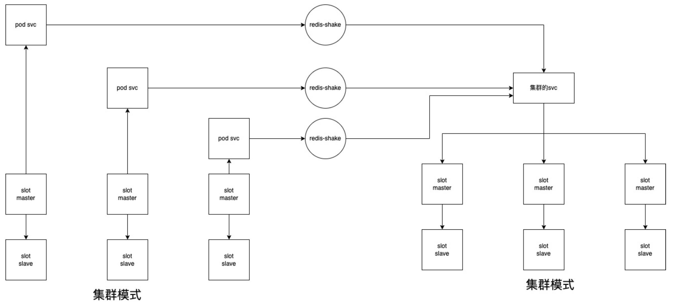
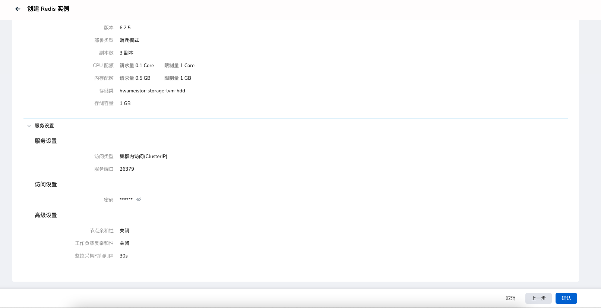
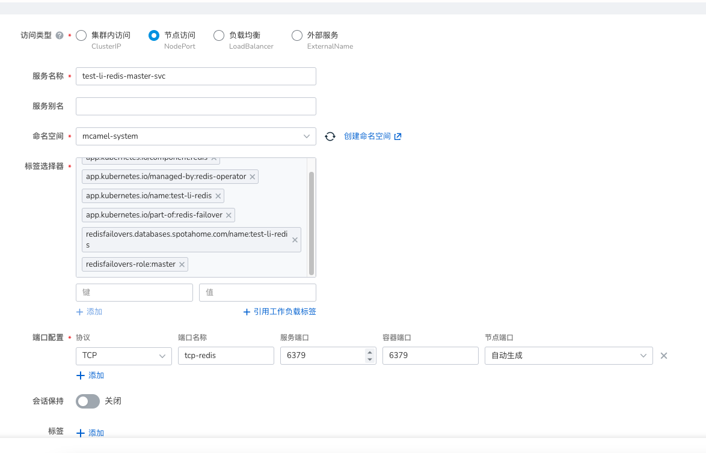
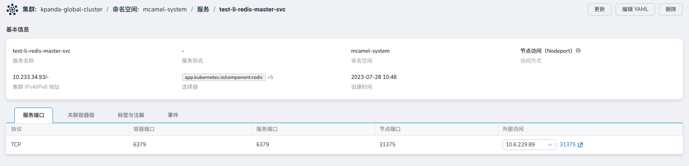

# Redis 容灾部署方案
Redis 作为开源的内存数据存储系统，具备出色的性能、高可用性和实时性能，可满足应用和服务的大量访问请求以及数据存储需求。然而，由于缺乏内置的数据安全保护功能，因此在实际应用中，需要采取容灾技术来保障 Redis 数据的可靠性。

容灾技术主要通过数据复制和数据备份等手段实现，以提供冷备和热备两种备份方式。在网络、服务器或数据库发生故障导致数据丢失时，通过主备切换和数据恢复等方式，确保企业数据的安全性，确保业务的连续性。

## 方案一：Redis-Shake 同步模式
### 简介

Redis-Shake 是一个用于合并、过滤和迁移Redis数据的工具。它支持三种数据迁移模式：sync、restore和scan。

本方案将采用 Redis-Shake 实现跨集群的 Redis 实例数据同步。

   

github 仓库地址: https://github.com/tair-opensource/RedisShake
### 同步模式简要说明
- 哨兵模式：
  1. 在源端的 `master` 节点创建一个 `NodePort` 服务. 

  2. 编辑 Redis-Shake 的同步配置文件，使用目标实例对源实例的配置方式

    

- 集群模式：
  1. 在源端的每一个节点都要创建一个 `NodePort` 服务。

  2. 配置多个 Redis-Shake，使用目标实例的各主节点分别对源集群实例的配置方式。

    

### 操作步骤
#### 源集群
1. 在dce5 中创建 redis 中间件实例。

    

2. 进入`容器管理`，给 `master` 节点创建一个服务。

    

    

   并配置相关标签选择器：
    ```shell
    app.kubernetes.io/component: redis
    app.kubernetes.io/managed-by: redis-operator
    app.kubernetes.io/name: test-li-redis
    app.kubernetes.io/part-of: redis-failover
    redisfailovers-role: master
    redisfailovers.databases.spotahome.com/name: test-li-redis
    ```
#### 目标集群
将 Redis-Shake 与目标集群部署在同一宿主机上，并按照以下配置进行操作：
```shell
wget https://github.com/tair-opensource/RedisShake/releases/download/v3.1.11/redis-shake-linux-amd64.tar.gz
mkdir redisShake
cd redisShake
cp ../redis-shake-linux-amd64.tar.gz .
tar -xzvf redis-shake-linux-amd64.tar.gz
vi sync.toml
./redis-shake sync.toml
```
编辑 sync.toml 配置文件:
```yaml
type = "sync"
 
[source]
version = 6.0 # redis version, such as 2.8, 4.0, 5.0, 6.0, 6.2, 7.0, ...
address = "10.233.109.145:6379"
username = "" # keep empty if not using ACL
password = "3wPxzWffdn" # keep empty if no authentication is required
tls = false
elasticache_psync = "" # using when source is ElastiCache. ref: https://github.com/alibaba/RedisShake/issues/373
 
[target]
type = "standalone" # "standalone" or "cluster"
version = 6.0 # redis version, such as 2.8, 4.0, 5.0, 6.0, 6.2, 7.0, ...
# When the target is a cluster, write the address of one of the nodes.
# redis-shake will obtain other nodes through the `cluster nodes` command.
address = "10.233.103.2:6379"
username = "" # keep empty if not using ACL
password = "Aa123456" # keep empty if no authentication is required
tls = false
 
[advanced]
dir = "data"
 
# runtime.GOMAXPROCS, 0 means use runtime.NumCPU() cpu cores
ncpu = 4
 
# pprof port, 0 means disable
pprof_port = 0
 
# metric port, 0 means disable
metrics_port = 0
 
# log
log_file = "redis-shake.log"
log_level = "info" # debug, info or warn
log_interval = 5 # in seconds
 
# redis-shake gets key and value from rdb file, and uses RESTORE command to
# create the key in target redis. Redis RESTORE will return a "Target key name
# is busy" error when key already exists. You can use this configuration item
# to change the default behavior of restore:
# panic:   redis-shake will stop when meet "Target key name is busy" error.
# rewrite: redis-shake will replace the key with new value.
# ignore:  redis-shake will skip restore the key when meet "Target key name is busy" error.
rdb_restore_command_behavior = "rewrite" # panic, rewrite or skip
 
# pipeline
pipeline_count_limit = 1024
 
# Client query buffers accumulate new commands. They are limited to a fixed
# amount by default. This amount is normally 1gb.
target_redis_client_max_querybuf_len = 1024_000_000
 
# In the Redis protocol, bulk requests, that are, elements representing single
# strings, are normally limited to 512 mb.
target_redis_proto_max_bulk_len = 512_000_000
```

## 方案二：虚拟机模式
下面以某客户实际落地方案为例演示如何在虚拟机模式下部署 Redis 集群并实现跨机房灾备。
### 部署架构
Redis 集群采用三主三从交叉复制架构。为了实现生产和灾备环境对 Redis 集群的访问，每个环境中都部署了三个副本。各环境分别准备了三台机器，每台机器上部署一个 Redis 节点，一主一从，进行交叉备份。生产区有两个主节点和一个从节点，灾备区有一个主节点和两个从节点。

| IP            | 端口   | 节点角色   | 物理位置 | 版本    |
| ------------- | ---- | ------ | ---- | ----- |
| 10.202.170.30 | 6379 | master | 生产机房 | 6.2.5 |
| 10.202.170.31 | 6379 | master | 生产机房 |
| 10.202.170.32 | 6379 | slave  | 生产机房 |
| 10.201.170.30 | 6379 | master | 灾备机房 |
| 10.201.170.31 | 6379 | slave  | 灾备机房 |
| 10.201.170.32 | 6379 | slave  | 灾备机房 |

### 安装部署
1. 下载二进制安装包、

    ```shell
    wget https://download.redis.io/releases/redis-6.2.5.tar.gz
    ```

2. 安装部署包
    ```shell
    # 切入到ipay用户
    tar -zxvf redis-6.2.5 -C /home/ipay
      
    # 安装gcc
    yum -y install gcc

    # 编译
    ./make

    # 安装
    cd src && make install
    ```
3. 节点磁盘容量调整

    您可以根据需要通过以下命令调整各节点存储容量（非必需）。

    ```shell
    sudo vgextend rootvg /dev/sdb
    ```

    将物理卷 `/dev/sdb` 添加到 `rootvg` 卷组中，以便为 Redis 集群提供额外的存储空间。

    ```shell
    sudo lvextend -L +50G /dev/rootvg/root
    ```
    将名为 `/dev/rootvg/root` 的逻辑卷的大小增加 50GB，以便容纳更多的 Redis 数据。

    ```shell
    sudo xfs_growfs /dev/rootvg/root
    ```
    扩展 `/dev/rootvg/root` 上的 XFS 文件系统，以利用逻辑卷的新增空间。如果您执行了前两个命令来扩展逻辑卷的大小，那么执行这个命令是必需的，以确保文件系统能够利用新增的空间。

4. 配置 `redis-server` 服务

    分别在各节点执行以下操作：
    - 创建数据和日志目录

        ```shell
        mkdir -p /data/redis/log
        ```

    - 编辑 redis.conf

        ```yaml
        bind 0.0.0.0
        protected-mode no #关闭保护模式
        port 6379 #端口号
        daemonize yes #后台运行
        pidfile /var/run/redis_6379.pid #pid存放路径
        loglevel notice
        logfile /data/redis/log/redis.log #志存放路径
        database 16
        always-show-logo yes #是否显示总日志
        dbfilename redis_6702.rdb #持久化数据文件名称
        dir /data/redis #持久化数据文件存放路径
        cluster-enabled yes #开启集群模式
        cluster-node-timeout 15000
        requirepass $passwd
        disable-thp yes
        aof-load-truncated yes
        aof-use-rdb-preamble yes
        lua-time-limit 5000
        cluster-enabled yes
        activerehashing yes
        replica-read-only yes
        ```

    - 启动 Redis 服务
    
        ```shell
        /usr/local/bin/redis-server /home/ipay/redis-6.2.5/redis.conf
        ```

### 创建集群模式
完成 6 个节点的 Redis 搭建后，使用如下命令快速创建三主三集群。

```shell
/usr/local/bin/redis-cli –cluster create 10.202.170.30:6379 10.202.170.31:6379 10.201.170.30:6379 10.201.170.31:6379 10.201.170.32:6379 10.202.170.32:6379 –cluster-replicas 1 -a $passwd
```
