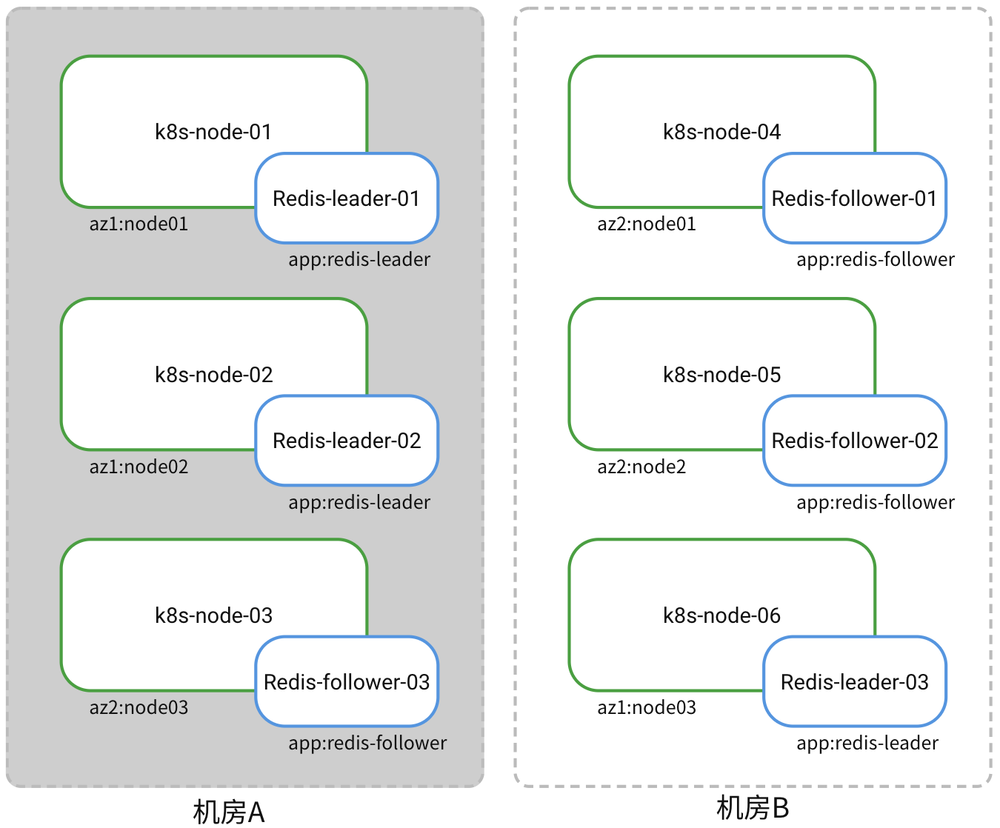
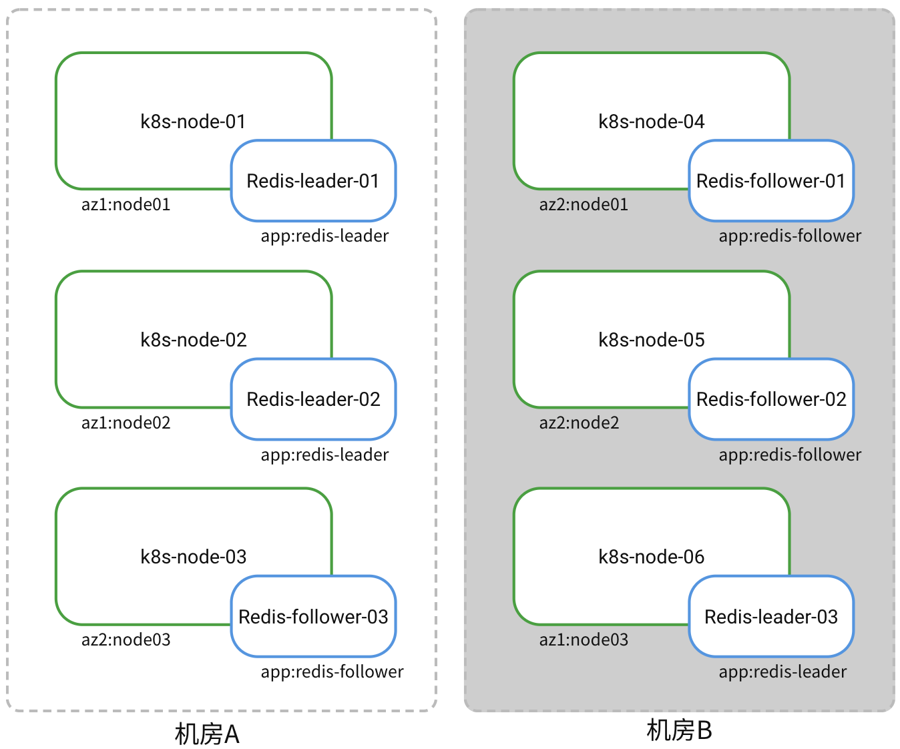

# 单集群跨机房高可用部署

## 场景需求

客户机房环境为单一 k8s 集群横跨`机房A`、`机房B`，期望可以部署一套 3 主 3 从集群模式 Redis，实现跨机房高可用，当任一机房整体离线时，Redis 仍可以正常提供服务。


## 解决方案

为了满足两机房高可用需要，Redis 副本需要采用以下部署方式：

- 3个 leader 副本运行于集群节点：k8s-node-01，k8s-node-02，k8s-node-06

- 3个follower 副本运行于集群节点：k8s-node-03，k8s-node-04，k8s-node-05

- 确保每个集群节点仅运行一个 Redis 副本


本方案采用了工作负载的调度策略，通过具有权重的节点亲和性策略和工作负载反亲和策略达成以上部署目标。

!!! note

    请保证各节点资源充足，避免因资源不足导致调度器无法完成正确调度。

### 1. 标签配置

#### Redis 工作负载标签

本方案需要对 `leader` 副本与 `follower` 副本分别调度，因此用标签划分 redis 副本：

| Redis 副本     | 标签                |
| -------------- | ------------------ |
| redis-leader   | app:redis-leader   |
| redis-follower | app:redis-follower |

#### 集群节点标签

为了把 Leader 与 follower 副本可控得分配在两个机房，需要在 6 个集群节点中划分两个拓扑域，用于分别调度 Leader 与 follower 副本。各集群节点的标签如下：

| 集群节点        | 标签         | 拓扑域|         
| ----------- | ----------- | ---------- |
| k8s-node-01 | az1:node01 |az1 | 
| k8s-node-02 | az1:node02  |az1 | 
| k8s-node-06 | az1:node03  |az1 | 
| k8s-node-04 | az2:node01 |az2 | 
| k8s-node-05 | az2:node02  |az2 | 
| k8s-node-03 | az2:node03  |az2 | 


### 2. 调度配置

    redis-leader 和 redis-follower 副本需要调度至不同的拓扑域中，因此需分别配置亲和策略，配置如下：

    **redis-leader**

    ```yaml
    # redis-leader 在拓扑域 `az1` 内的集群节点（k8s-node-01，k8s-node-02，k8s-node-06）执行工作负载反亲和，确保每个集群节点仅调度一个 leader 副本。
      affinity:
        podAntiAffinity:
          requiredDuringSchedulingIgnoredDuringExecution:
            - labelSelector:
                matchExpressions:
                  - key: app
                    operator: In
                    values:
                      - redis-leader
              topologyKey: az1
 
    # redis-leader 的副本在拓扑域 `az1` 内集群节点（k8s-node-01，k8s-node-02，k8s-node-06）亲和性调度
        nodeAffinity:
          preferredDuringSchedulingIgnoredDuringExecution:
            - weight: 100
              preference:
                matchExpressions:
                  - key: az1
                    operator: In
                    values:
                      - node01
            - weight: 90
              preference:
                matchExpressions:
                  - key: az1
                    operator: In
                    values:
                      - node02
            - weight: 80
              preference:
                matchExpressions:
                  - key: az1
                    operator: In
                    values:
                      - node03
    ```

    **redis-follower**

    ```yaml
    # redis-follower 的副本在拓扑域 `az2` 内集群节点（k8s-node-03，k8s-node-04，k8s-node-05）工作负载反亲和
      affinity:
        podAntiAffinity:
          requiredDuringSchedulingIgnoredDuringExecution:
            - labelSelector:
                matchExpressions:
                  - key: app
                    operator: In
                    values:
                      - redis-follower
              topologyKey: az2
 
    # redis-follower 的副本在拓扑域 `az2` 内集群节点（k8s-node-03，k8s-node-04，k8s-node-05）亲和性部署
        nodeAffinity:
          preferredDuringSchedulingIgnoredDuringExecution:
            - weight: 100
              preference:
                matchExpressions:
                  - key: az2
                    operator: In
                    values:
                      - node01
            - weight: 90
              preference:
                matchExpressions:
                  - key: az2
                    operator: In
                    values:
                      - node02
            - weight: 80
              preference:
                matchExpressions:
                  - key: az2
                    operator: In
                    values:
                      - node03
    ```

## 机房离线处理
### `机房 A` 离线
`机房 A` 离线将导致两个 `Redis-leader` 副本离线，整个 Redis 将无法提供正常服务，如下图所示：



**解决办法**

通过工具 `redis-cli`  进入 `机房 B` 中的任一 redis-follower 副本，手工转换为 leader 副本。

```shell
# 链接至一个 follower 节点
redis-cli -h <ip> -p <port>
# 密码验证，密码可在中间件模块的实例概览页查看
auth <password>
# 执行节点的角色转换
cluster failover takeover
# 查看节点角色信息，可见已改变
role
```

完成 `机房 B` 中副本角色转换后，集群可以恢复服务能力。当 `机房 A` 再次上线后，原 redis-leader 副本会以 follower 的角色接入 Redis 实例。

### `机房 B` 离线

`机房 B` 离线将仅导致一个 redis-leader 副本离线，Redis 服务不会中断，无需人工干预，如下图。


