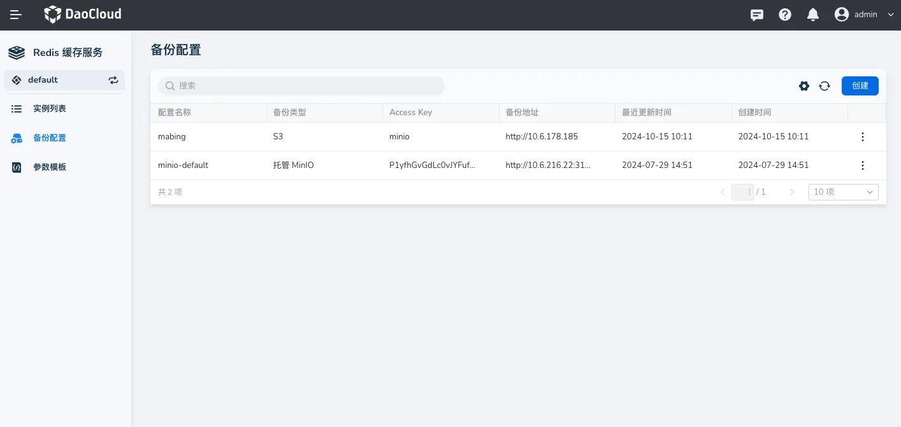
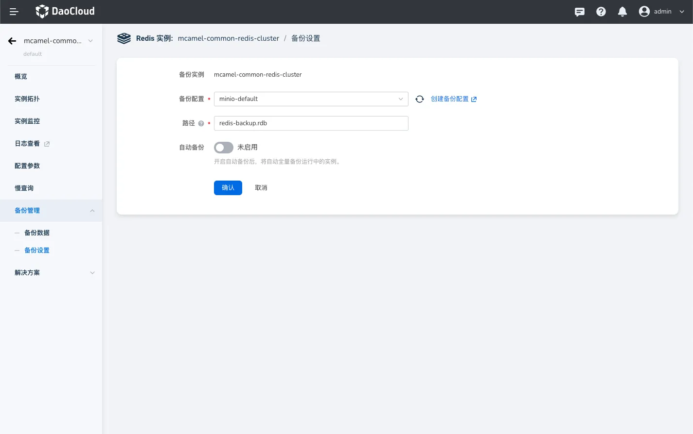
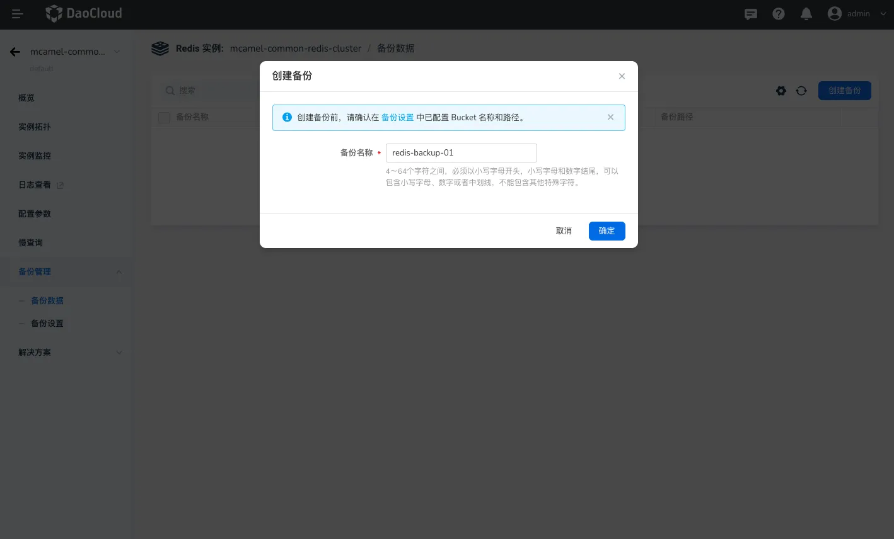
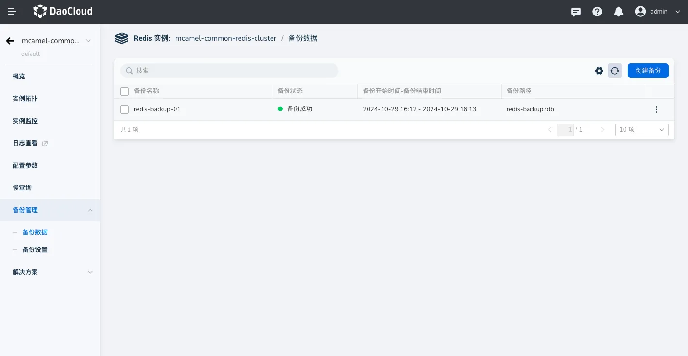
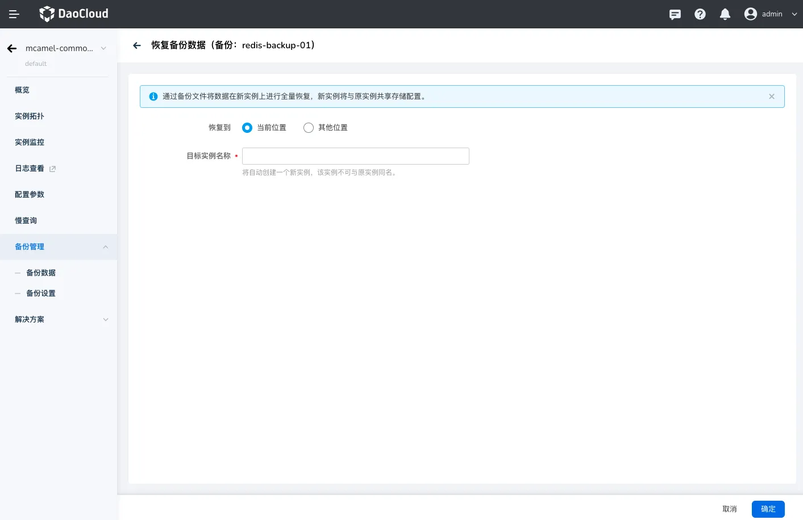
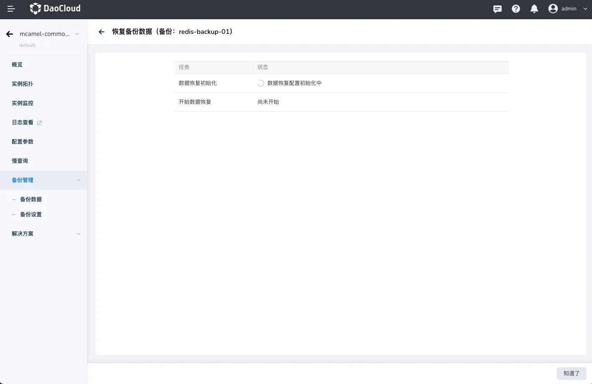

# Redis 备份还原

Redis 会在指定的时间间隔内自动生成数据快照，并将其保存为 `.rdb` 文件。Redis 的备份与还原功能可以确保数据持久性和安全性。本文将介绍如何执行 Redis 缓存服务数据的备份与还原操作。

## 前提条件

在开始给 Redis 实例备份前，请确认当前工作空间的`备份配置`中已有配置验证过的 S3 存储。

## 备份配置

1. 从实例列表中选择目标进行部分的  Redis 实例。
2. 点击左侧菜单的`备份管理 → 备份设置`。
3. 在当前页面选择备份存储的 S3 存储，并填写要存储的路径地址。

!!! note

    Redis 备份数据通常通过 RDB 文件实现。在配置备份路径时，您只需指定存储文件夹名称和 .rdb 文件扩展名即可。

4. 如需每天或每周定时自定备份，可开启自动备份功能，选择备份的周期和时间。

## 备份数据

1. 从实例列表中选择目标进行部分的  Redis 实例。
2. 点击左侧菜单的`备份管理 → 备份数据`。
3. 点击列表右上的`创建备份`，填写备份名称。

4. 点击确认后可在列表中查看备份状态、备份时间以及路径等信息。

## 恢复数据

1. 在备份数据列表中选择准备恢复的数据，点击备份数据列表最后一列的操作按钮，单击`恢复`。

- 可选择恢复在当前实例所在集群和命名空间 或 其他集群和命名空间。

2. 点击确认后，可查看数据恢复的状态。

