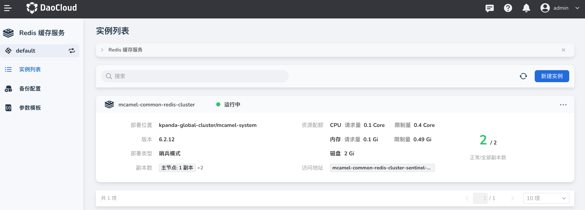
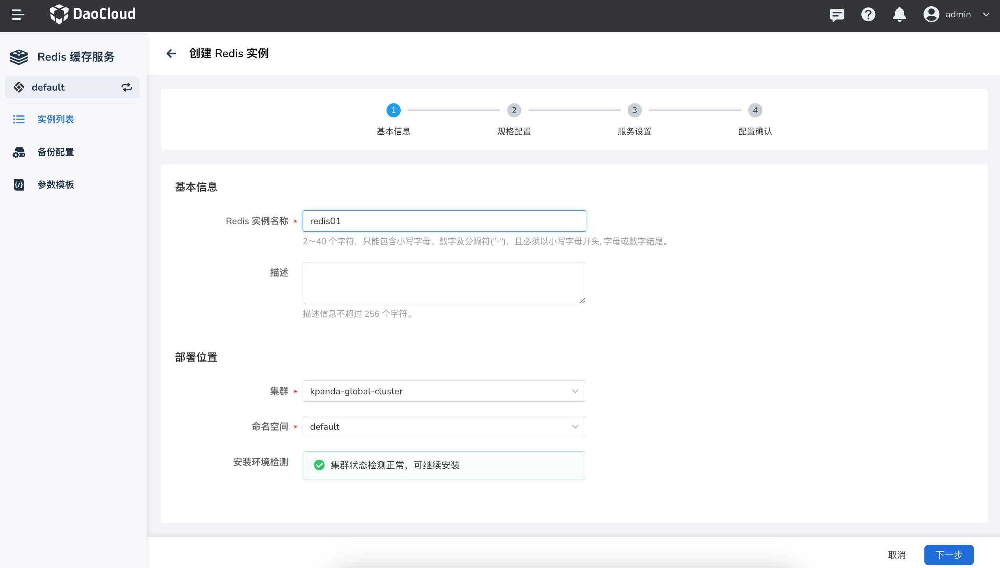
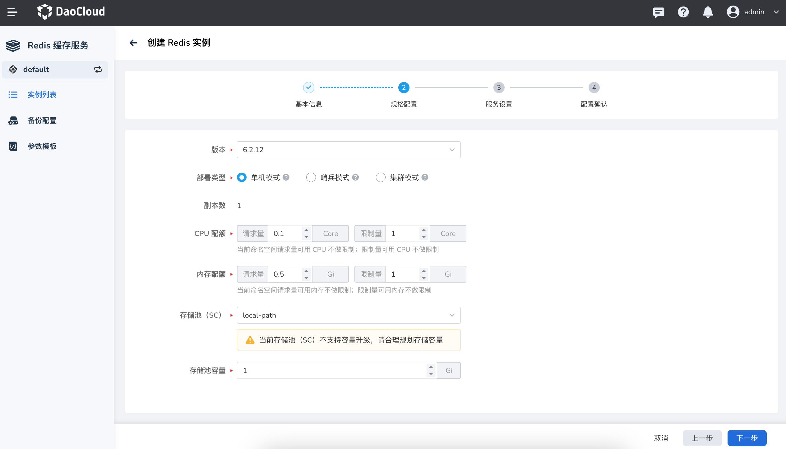
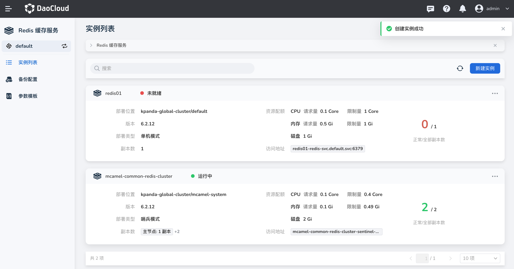

---
hide:
  - toc
---

# 创建 Redis 实例

接入 Redis 缓存服务后，参照以下步骤创建 Redis 实例。

1. 在 Redis 缓存服务的实例列表中，点击 __新建实例__ 按钮。

    

2. 在 __创建 Redis 实例__ 页面中，配置 __基本信息__ 后，点击 __下一步__

    

3. 选择版本、部署类型、CPU、内存和存储等 __规格配置__ 后，点击 __下一步__ 。
   部署类型有三种模式：

    - 单机模式：仅有主节点。当出现故障时，无法保障数据可靠性。
    - 哨兵模式：当主节点故障后，备节点自动升级为主节点。可保证服务的高可用。
    - 集群模式：支持多主多从结构。可满足用户低延迟、高性能的业务需求。

    

4. 设置用户名和密码等 __服务设置__

    - 服务设置：选择一种访问类型，默认为 ClusterIP
    - 访问设置：随机生成密码，或手动设置密码
    - 管理工具：可选择启用 RedisInsight，这是一款管理和监控工具，能够提供界面化的 Redis 的使用和管理
    - 高级设置：

    

5. 确认基本信息、规格配置、服务设置的信息准确无误后，点击 __确定__

    

6. 返回实例列表，屏幕将提示 __创建实例成功__ 。新创建的实例状态为 __未就绪__ ，等待片刻后将变为 __运行中__ 。

    
