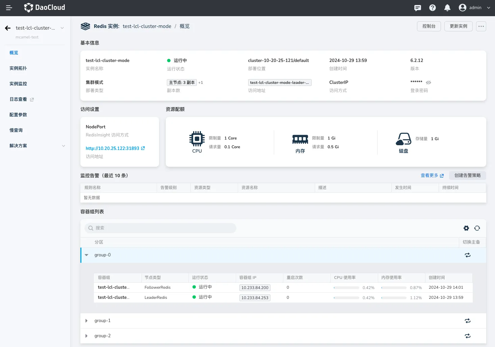
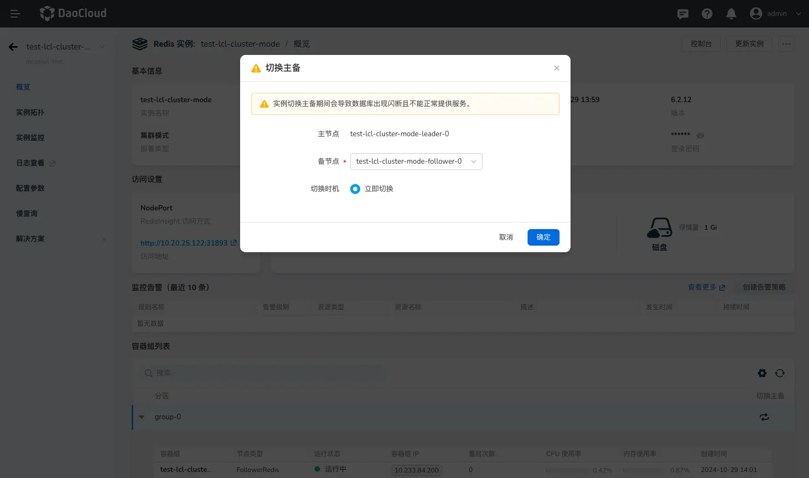
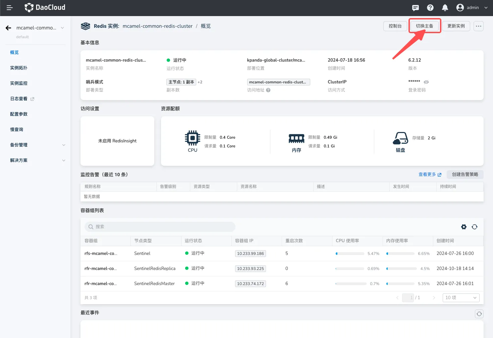
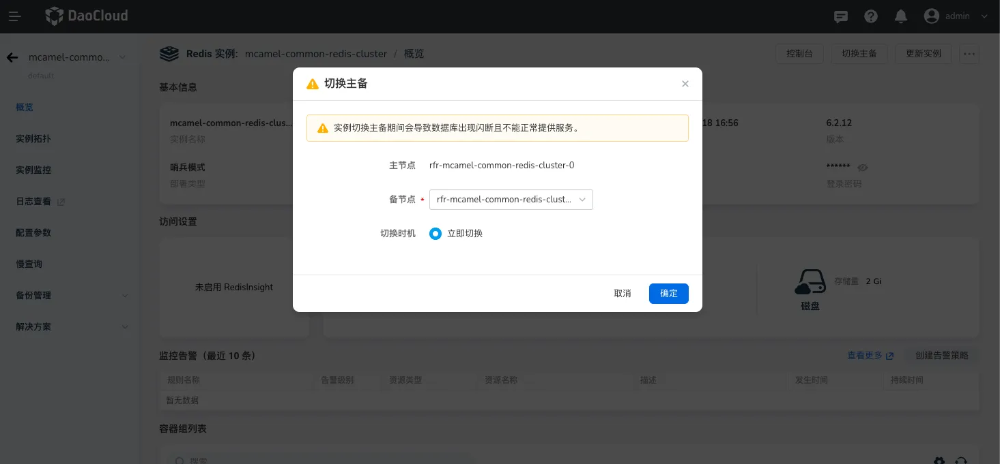

# Redis 手动切换主备

在 Redis 缓存服务中，通过手动切换主从角色，可以在主节点发生故障或需要维护时，确保系统的持续运行。本文将介绍如何通过 UI 手动切换 Redis 的主从角色，并讨论使用场景和限制。

## 使用场景

1. **故障恢复**: 当主节点出现故障时，可以将从节点提升为新的主节点，以确保服务的连续性。
2. **负载均衡**: 在高负载情况下，可以通过切换主从角色来分散请求，提升系统的响应能力。
3. **测试环境**: 在开发和测试环境中，手动切换主从角色可以帮助开发人员验证系统的容错能力和数据一致性。

## 集群模式

1. 点击进入目标 Redis 实例的详情页。
2. 在需要进行主备切换的实例的容器组列表中，单击分片名称前面的图标展开当前分片下所有节点。
3. 如需对某一组分片中的主备节点角色进行切换，可点击分片后的 `切换主从` 图表，将备节点升级为主节点。

    {: width=}

4. 展开备节点的下拉框可以指定升级为主节点的备节点。

    

## 哨兵模式

1. 点击进入目标 Redis 实例的详情页。
2. 在概览页的右上角，点击`切换主备`。

    

3. 展开备节点的下拉框可以指定升级为主节点的备节点。

    
