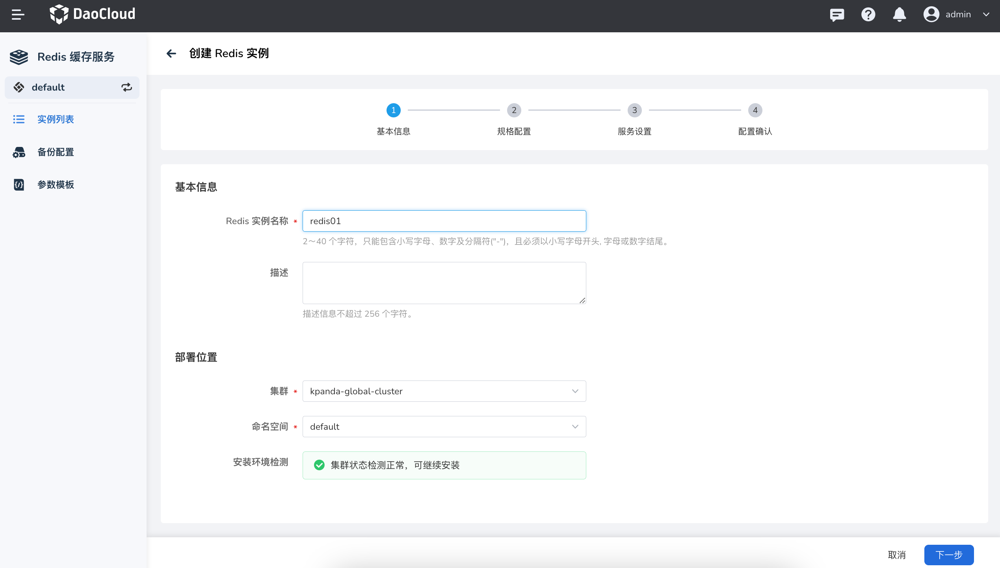
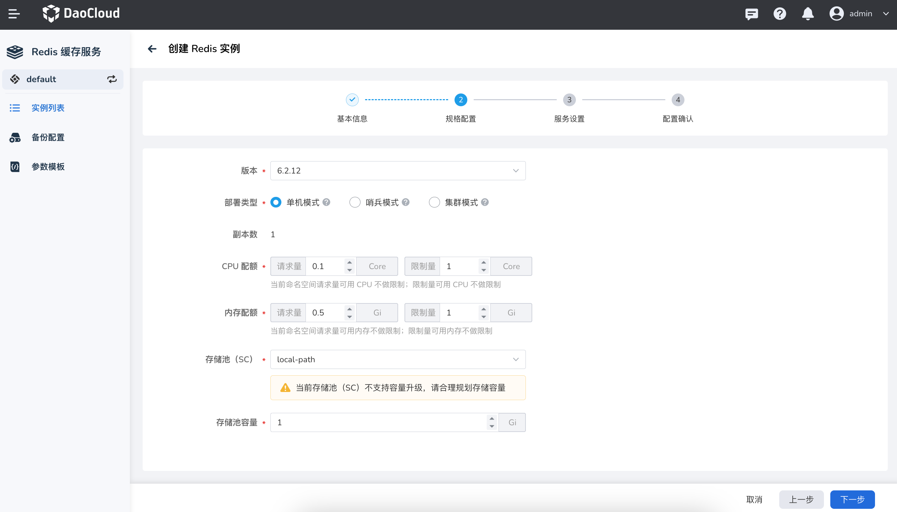
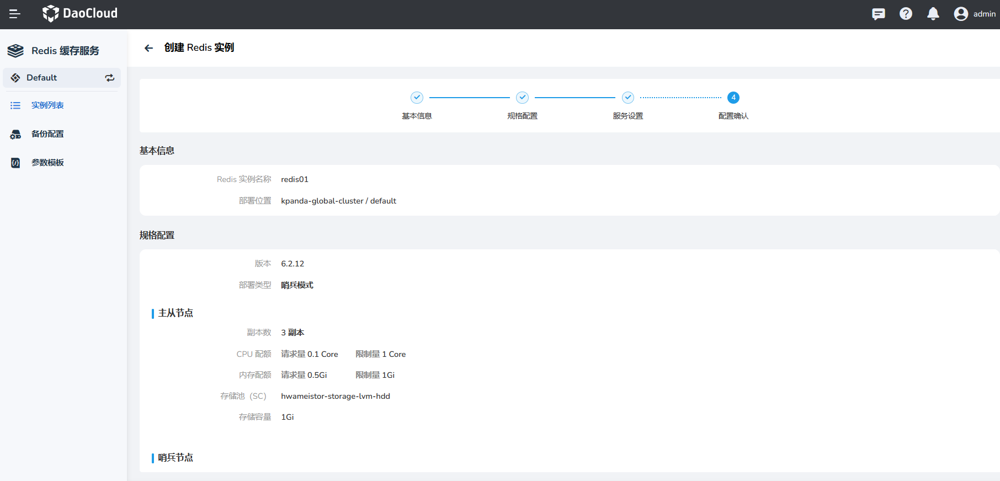
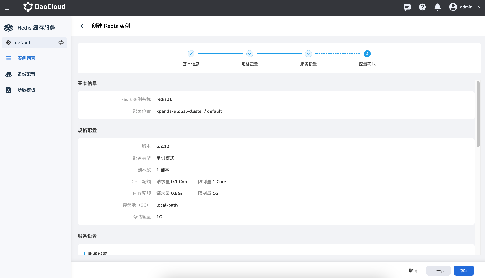
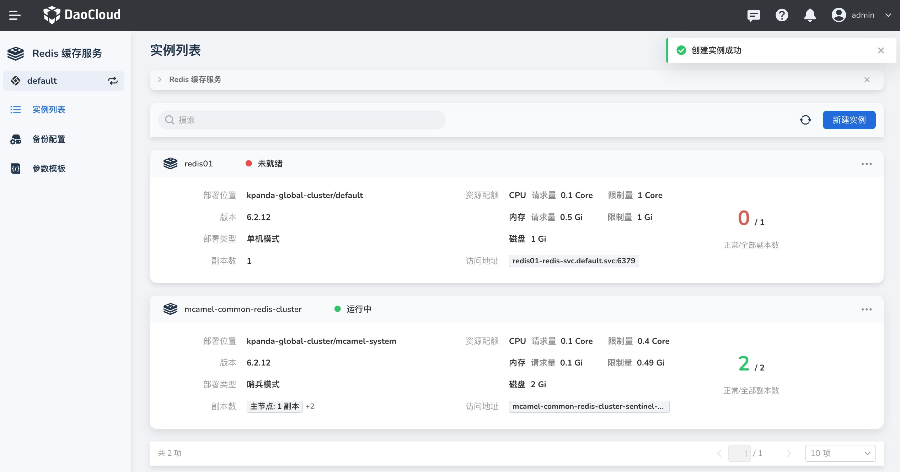

# 创建 Redis 实例

接入 Redis 缓存服务后，参照以下步骤创建 Redis 实例。

1. 在 Redis 缓存服务的实例列表中，点击`新建部署`按钮。

    

2. 在`创建 Redis 实例`页面中，配置`基本信息`后，点击`下一步`。

    

3. 选择部署类型、CPU、内存和存储等`规格配置`后，点击`下一步`。

    

4. 设置用户名和密码等`服务设置`，默认采用 ClusterIP 作为访问方式。

    

5. 确认基本信息、规格配置、服务设置的信息准确无误后，点击`确认`。

    

6. 返回实例列表，屏幕将提示`创建实例成功`。新创建的实例状态为`未就绪`，等待片刻后将变为`运行中`。

    
