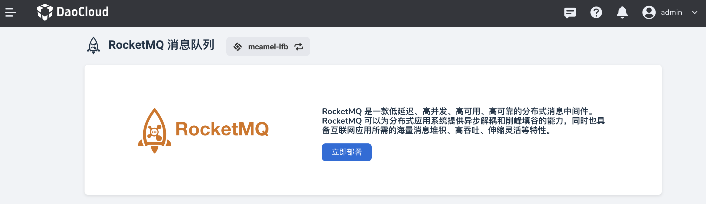

# 什么是 RocketMQ

RocketMQ 是一款低延迟、高并发、高可用、高可靠的分布式消息中间件。RocketMQ 可以为分布式应用系统提供异步解耦和削峰填谷的能力，
同时也具备互联网应用所需的海量消息堆积、高吞吐、伸缩灵活等特性。

RocketMQ 已经成为业内共识的金融级可靠业务消息首选方案，被广泛应用于互联网、大数据、移动互联网、物联网等领域的业务场景。

参阅 [RocketMQ 与 ActiveMQ 及 Kafka 消息队列的对比](https://rocketmq.apache.org/zh/docs/#rocketmq-vs-activemq-vs-kafka)。

DaoCloud 在开源 Apache RocketMQ 做了容器化的定制开发，提供了简单易用的 UI 界面，可以轻松部署 RocketMQ 集群处理消息业务。

