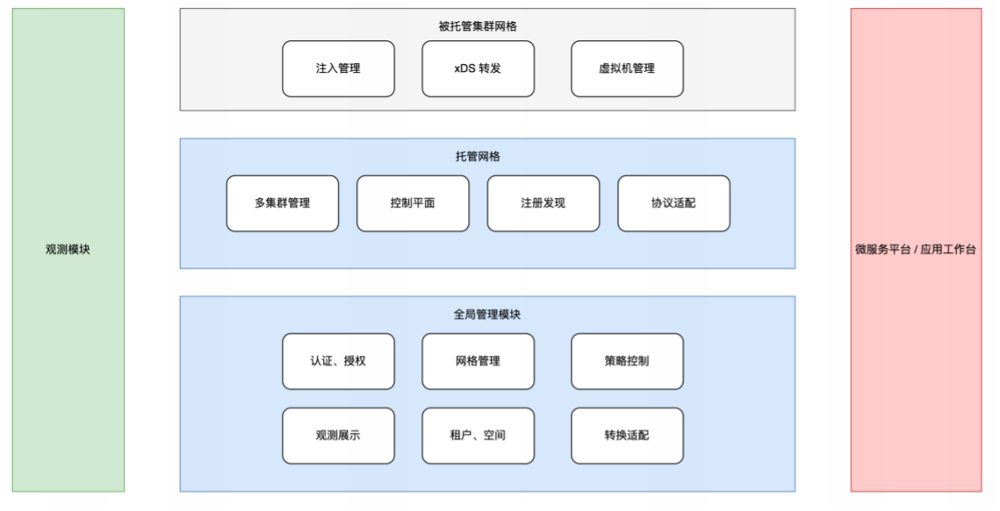
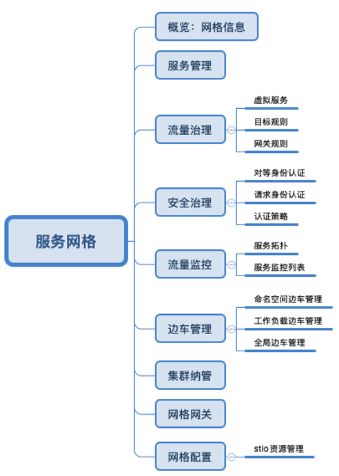

# 系统架构

服务网格产品用于对多个网格的客户集群尤其是多集群做聚合治理，用户可以在多云环境中，接入不同来源的集群至服务网格进行统一的流量管理和安全治理。

从整体架构上讲，服务网格产品可分为三个层面：全局管理模块、托管网格模块、被托管集群网格

- 全局管理模块

    运行于独立的控制面集群 Global Service Cluster（以下简称 GSC），⽤于统⼀对多个服务⽹格进⾏管理，处理与终端⽤户的交互。整个网格管理平台的资源配置、安全治理等主要业务逻辑都将在这⼀层进⾏构建。同时，也是和其它系统对接的主要承担模块，这样，将减少其它模块的适配成本。因其不参与具体的服务治理事务，因此并不包含 Istiod 组件。

- 托管网格模块

    运行于 Mesh Control Plane Cluster（以下简称 MCPC），本质上也是用户工作集群，同时具备网格控制面的角色，一个 GSC 可以管理多个 MCPC。istiod 等网格组件会安装在该集群，作为网格的核心控制平面，直接对本网格内多个集群进行管理，进行统一的策略管控和服务发现，实际执行、下发各项流量策略和安全策略，并确保仅有写入 MCPC 的策略才会对整个网格生效。

- 被托管集群网格

    处于一个网格中的实际工作集群中，包含了 istiod 的基本组件，但不会作为控制面使用，而是提供一个类似管理代理的模式，主要负责边车主任、证书、xDS 转发等业务，把获取自 MCPC 的策略、服务注册信息下发至集群的所在业务 Sidecar。

- 观测模块

    可观测性完全由 Insight 处理，服务网格通过接口调用的方式获取流量指标信息绘制拓扑图，并直接调用 Istio 原生 grafana 为用户提供各项指标图表。

## 功能架构

服务网格主要从服务管理、流量治理、安全治理三方面为用户提供服务。

如上图所示，服务网格提供了 9 个模块 12 个子模块功能，实现了多样化集群接入聚合、多网格管理的网格管理方式。
