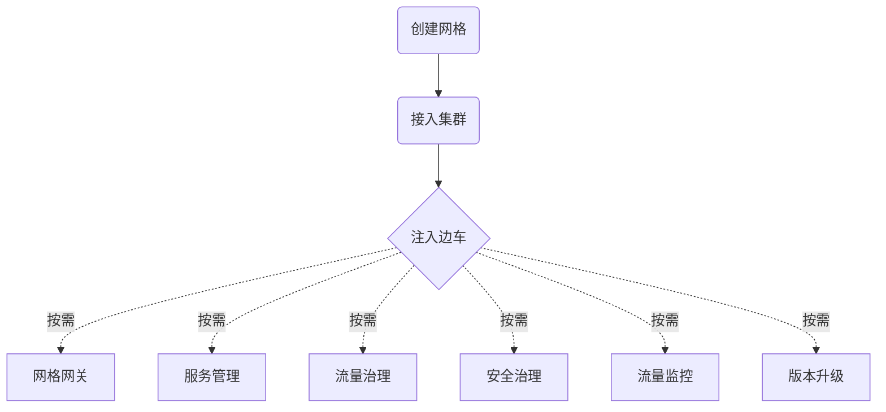

# 什么是服务网格

服务网格是基于 Istio 开源技术构建的面向云原生应用的下一代服务网格。

服务网格是一种具备高性能、高易用性的全托管服务网格产品，通过提供完整的非侵入式的微服务治理方案，能够统一治理多云多集群的复杂环境，
以基础设施的方式为用户提供服务流量治理、安全性治理、服务流量监控、以及传统微服务（SpringCloud、Dubbo）接入。

DCE 5.0 的服务网格兼容社区原生 Istio 开源服务网格，提供原生 Istio 接入管理能力。在较高的层次上，服务网格有助于降低服务治理的复杂性，减轻开发运维团队的压力。

服务网格作为 DCE 5.0 产品的体系一员，无缝对接[容器管理](../../kpanda/03ProductBrief/WhatisKPanda.md)平台，可以为用户提供开箱即用的上手体验，
并作为基础设施为[微服务引擎](../../skoala/intro/features.md)提供容器微服务治理支持，方便用户通过单一平台对各类微服务系统做统一管理。

## 部署方法

依次执行以下命令进行部署。

```console
export VERSION=v0.8.4 # 修改为实际部署的版本。
helm repo add mspider-release https://release.daocloud.io/chartrepo/mspider
helm repo update
helm upgrade --install --create-namespace -n mspider-system mspider mspider-release/mspider --version=${VERSION}
```

[申请社区免费体验](../../dce/license0.md){ .md-button .md-button--primary }

## 服务网格学习路径


