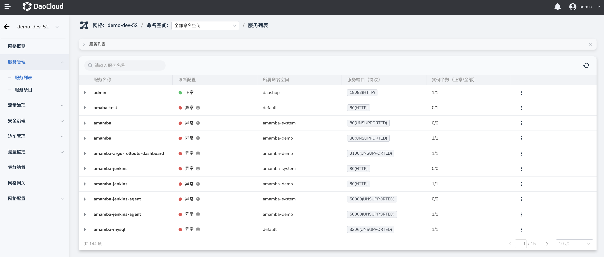

# 服务管理

服务管理为用户列出当前网格下所有集群中已注入边车的服务，用户也可以基于命名空间筛选服务。

服务网格对各集群的服务做聚合处理，同命名空间下的同名服务将聚合成同一服务，这样有利于对跨集群协同服务进行统一的流量治理。

同时用户也可以在服务的详情页中查看到来自个集群的服务地址、端口用等具体信息，并且可以修改服务的通信协议来保证后续能能够稳定可靠的治理服务。

用户需要特别关注服务列表中`诊断状态`这一列，当诊断信息为异常时，该状态将会影响后续服务进行下一阶段的流量治理等网格相关能力的使用。

服务列表提供了治理页面跳转功能，用户可以跳转至流量治理和安全治理页面，为当前服务创建各类治理策略，稍后在治理策略介绍中将详细说明。更多关于服务自身属性的配置则需要用户在[容器管理](../../../kpanda/03ProductBrief/WhatisKPanda.md)模块中完成。
