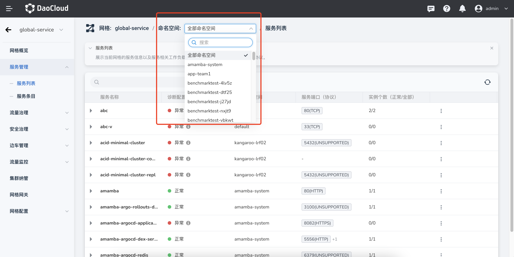
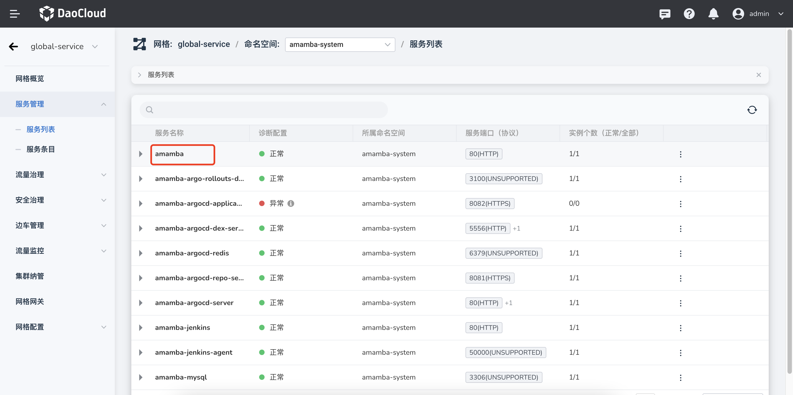
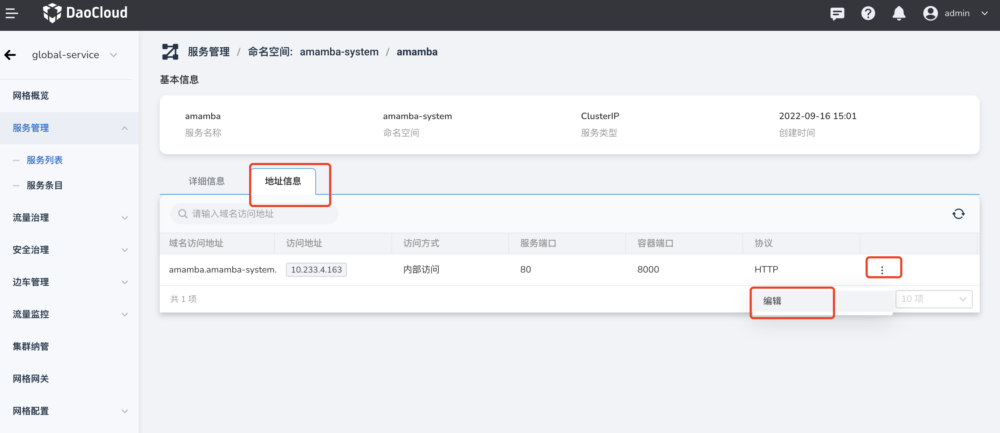
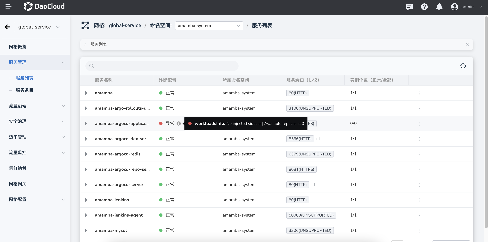

---
hide:
  - toc
---

# 服务管理

服务管理列出了当前网格下集群中已注入边车的所有服务，您可以基于命名空间筛选服务。

服务网格对各集群的服务做了聚合处理，同一个命名空间下的同名服务将聚合为一个服务，这样有利于对跨集群协同服务进行统一的流量治理。

您可以点击某个服务名称，进入详情页查看各集群的服务地址、端口等具体信息，还可以在`地址信息`页签中修改通信协议。

请特别关注服务列表中`诊断配置`这一列。当诊断信息为`异常`时，光标悬浮在 `ⓘ` 上将显示异常原因。异常状态会影响下一阶段的服务流量治理等网格相关能力。

在服务列表右侧，点击 `⋮` 选择相应的菜单项，可以跳转至流量治理和安全治理。

关于如何创建和配置服务，请参阅[创建服务](../../../kpanda/07UserGuide/ServicesandRoutes/CreatingServices.md)。
