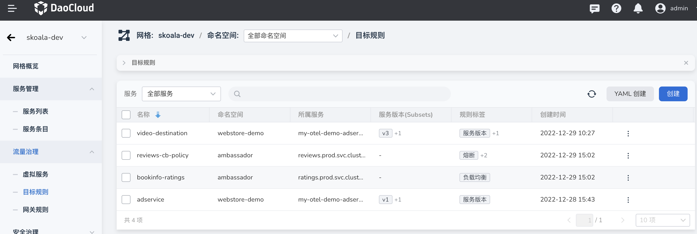
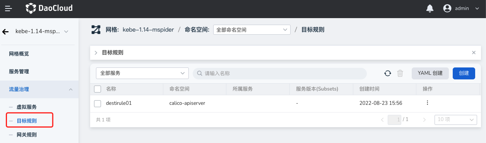
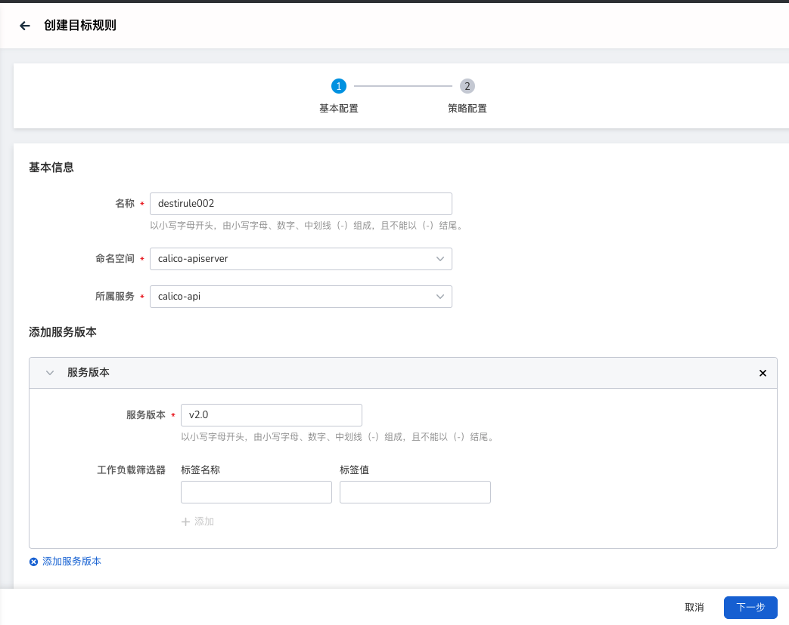
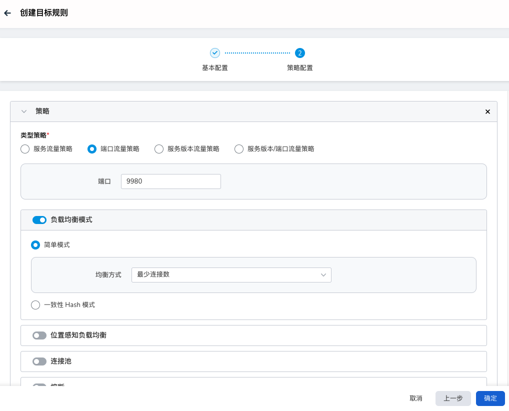
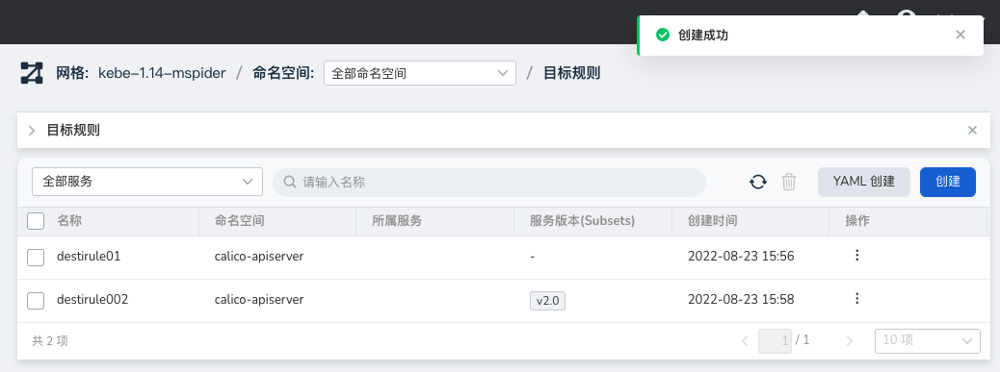
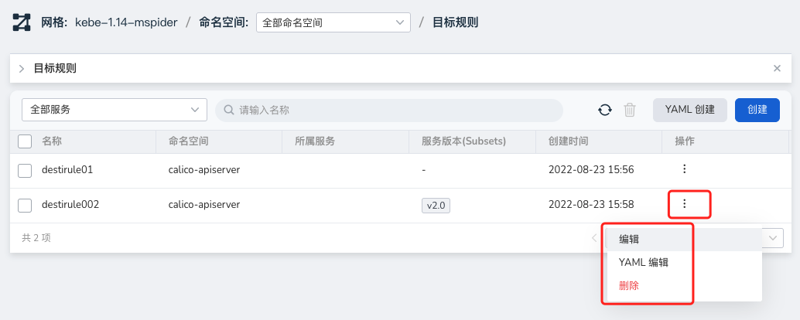
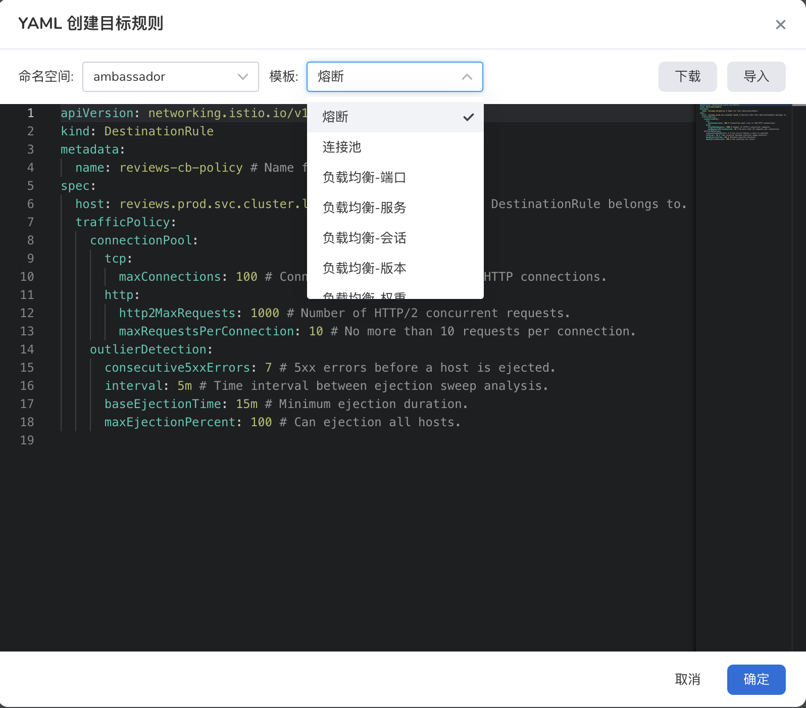

# 目标规则

目标规则（DestinationRule）同样是服务治理中重要的组成部分，目标规则通过端口、服务版本等方式对请求流量进行划分，并对各请求分流量订制 envoy 流量策略，应用到流量的策略不仅有负载均衡，还有最小连接数、熔断等。

## 概念介绍

几个重要字段如下：

- Host

    使用 Kubernetes Service 的短名称。含义同 VirtualService 中 `destination` 的 `host` 字段一致。服务一定要存在于对应的服务注册中心中，否则会被忽略。

- LoadBalancer

    默认情况下，Istio 使用轮询的负载均衡策略，实例池中的每个实例依次获取请求。
    Istio 同时支持如下的负载均衡模型，可以在 DestinationRule 中为流向某个特定服务或服务子集的流量指定这些模型。

    - 随机：请求以随机的方式转到池中的实例。
    - 权重：请求根据指定的百分比转到实例。
    - 最少请求：请求被转到最少被访问的实例。

- Subsets

    `subsets` 是服务端点的集合，可以用于 A/B 测试或者分版本路由等场景。
    可以将一个服务的流量切分成 N 份供客户端分场景使用。
    `name` 字段定义后主要供 VirtualService 里 `destination` 使用。
    每个子集都是在 `host` 对应服务的基础上基于一个或多个 `labels` 定义的，在 Kubernetes 中它是附加到像 Pod 这种对象上的键/值对。
    这些标签应用于 Kubernetes 服务的 Deployment 并作为元数据信息（Metadata）来识别不同的版本。

- OutlierDetection

    熔断是减少服务异常和降低服务延迟的一种设计模式，主要是无感的处理服务异常并保证不会发生级联甚至雪崩。
    如果在一定时间内服务累计发生错误的次数超过了预先定义的阈值，就会将该错误的服务从负载均衡池中移除，并持续关注服务的健康状态，当服务回复正常后，又会将服务再移回到负载均衡池。

## 目标规则列表介绍

目标规则列表展示了网格下的目标规则 CRD 信息，并提供了目标规则生命期管理能力。
用户可以基于规则名称、规则标签做 CRD 筛选，规则标签如下：

- 服务版本
- 负载均衡
- 位置感知负载均衡
- HTTP 连接池
- TCP 连接池
- 客户端TLS
- 熔断

## 操作步骤

服务网格提供了两种创建方式：表单创建和 YAML 创建。通过表单创建的具体操作步骤如下：

1. 在左侧导航栏点击`流量治理` -> `目标规则`，点击右上角的`创建`按钮。

    

2. 在`创建目标`界面中，先进行基本配置后点击`下一步`。

    

3. 按屏幕提示选择策略类型，并配置对应的治理策略后，点击`确定`。

    

4. 返回目标规则列表，屏幕提示创建成功。

    

5. 在列表右侧，点击操作一列的 `⋮`，可通过弹出菜单进行更多操作。

    

YAML 创建方式与虚拟服务相似，用户可以直接借助内置模版直接创建 YAML 文件，如下图所示。

