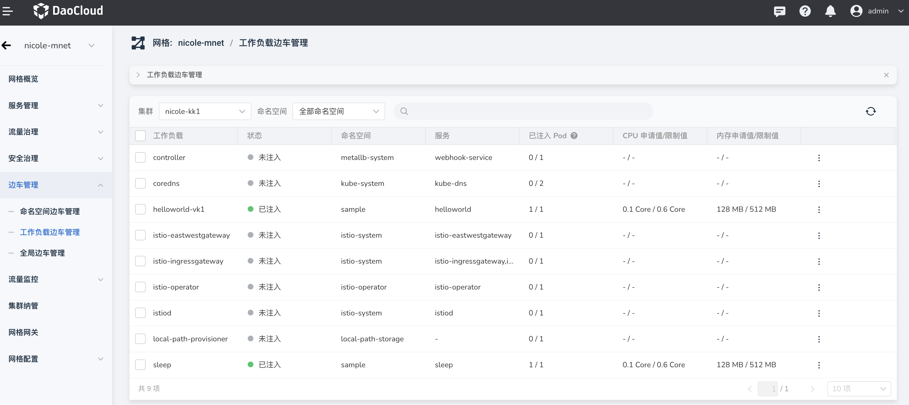
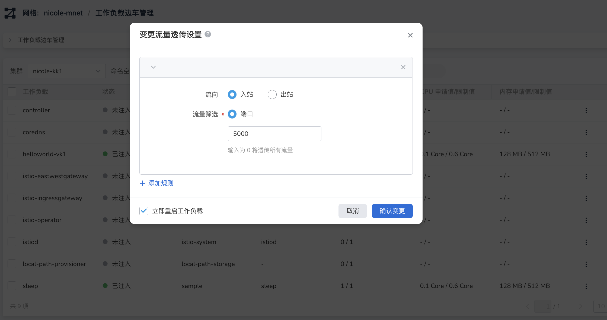
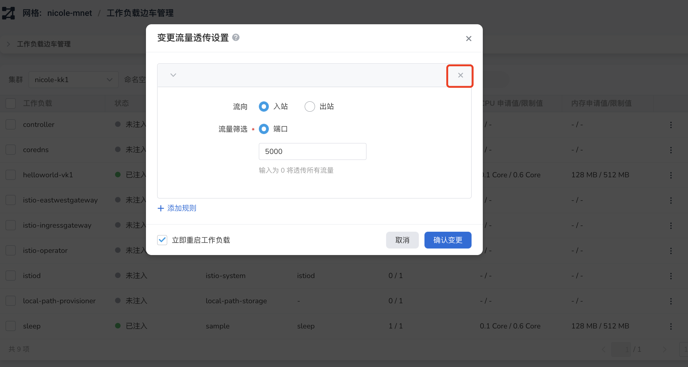
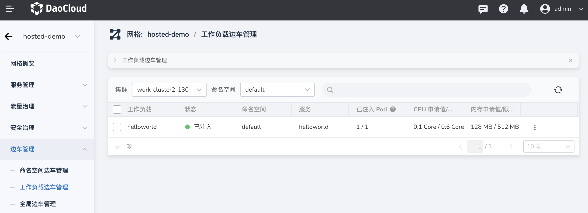

---
hide:
  - toc
---

# 边车流量透传

流量透传 (traffic passthrough) 指的是工作负载的全部或部分上游、下游流量不经边车转发，直接发送至工作负载本身。

DCE 5.0 服务网格实现了对工作负载出站/入站流量的边车透传可控，可针对特定端口、IP 段实现拦截设置。

- 功能设置对象：工作负载
- 设置参数：端口、IP 段
- 流向：入站、出站

流量透传相关字段：

```none
traffic.sidecar.istio.io/excludeOutboundPorts
traffic.sidecar.istio.io/excludeOutboundIPRanges
```

## 启用流量透传

本节说明如何在 DCE 图形界面上启用/禁用流量透传。

1. 进入某个网格，点击`边车管理` -> `工作负载边车管理`。

    

1. 点击某个负载右侧的 `⋮`，在弹出菜单中选择`流量透传设置`。

    

1. 设置流量透传的参数后，勾选`立即重启`，点击`确定`。

    

1. 屏幕提示流量透传设置成功。请参阅[如何查验流量透传效果](#_3)。

    

1. 如果流量透传已启用，上述第 3 步的`流量透传设置`弹窗将显示设置的参数，可点击右侧的 x，勾选`立即重启`，点击`确定`来禁用流量透传。

    

## 查验流量透传效果

本节在真实的网格集群中，查验流量透传前后的效果。

1. 准备工作

    - 准备一个集群 10.64.30.142
    - 在 `default` 命名空间中，配置 2 个工作负载 `helloworld-v1` 和 `helloworld-v2`，并注入边车
    - 计划仅为 `helloworld-v1` 启用流量透传，然后比对 2 个负载的流量路由变化

    

1. 通过 ssh 登录到集群。

    ```bash
    ssh root@10.64.30.142
    ```

1. 查看 default 命名空间中运行了 2 个 Deployment。

    ```console
    $ kubectl get deploy -n default
    NAME            READY   UP-TO-DATE   AVAILABLE   AGE
    helloworld-v1   1/1     1            1           42d
    helloworld-v2   1/1     1            1           42d
    ```

1. 执行以下步骤分别从终端、浏览器查验流量透传的效果。

=== "启用流量透传前"

    查看 helloworld-v1 的 yaml 内容。

    ```bash
    kubectl get deploy -n default helloworld-v1 -oyaml
    ```

    ```yaml
    apiVersion: apps/v1
    kind: Deployment
    metadata:
      annotations:
        deployment.kubernetes.io/revision: "30"
        kubectl.kubernetes.io/last-applied-configuration: |
          {"apiVersion":"apps/v1","kind":"Deployment","metadata":{"annotations":{},"labels":{"app":"helloworld","version":"v1"},"name":"helloworld-v1","namespace":"default"},"spec":{"replicas":1,"selector":{"matchLabels":{"app":"helloworld","version":"v1"}},"template":{"metadata":{"labels":{"app":"helloworld","version":"v1"}},"spec":{"containers":[{"image":"release-ci.daocloud.io/mspider/helloworld/examples-helloworld-v1","imagePullPolicy":"IfNotPresent","name":"helloworld","ports":[{"containerPort":5000}],"resources":{"requests":{"cpu":"100m"}}}]}}}}
      creationTimestamp: "2022-12-22T09:08:01Z"
      generation: 137079
      labels:
        app: helloworld
        version: v1
      name: helloworld-v1
      namespace: default
      resourceVersion: "14935716"
      uid: 60aa9520-f559-48cb-8c42-713ee1ac9eae
    spec:
      progressDeadlineSeconds: 600
      replicas: 1
      revisionHistoryLimit: 10
      selector:
        matchLabels:
          app: helloworld
          version: v1
      strategy:
        rollingUpdate:
          maxSurge: 25%
          maxUnavailable: 25%
        type: RollingUpdate
      template:
        metadata:
          annotations:
            sidecar.istio.io/proxyCPU: 110m
            sidecar.istio.io/proxyCPULimit: 550m
            sidecar.istio.io/proxyMemory: 129Mi
            sidecar.istio.io/proxyMemoryLimit: 511Mi
          creationTimestamp: null
          labels:
            app: helloworld
            sidecar.istio.io/inject: "true" # (1)
            version: v1
        spec:
          containers:
          - image: release-ci.daocloud.io/mspider/helloworld/examples-helloworld-v1
            imagePullPolicy: IfNotPresent
            name: helloworld
            ports:
            - containerPort: 5000
              protocol: TCP
            resources:
              requests:
                cpu: 100m
            terminationMessagePath: /dev/termination-log
            terminationMessagePolicy: File
          dnsPolicy: ClusterFirst
          restartPolicy: Always
          schedulerName: default-scheduler
          securityContext: {}
          terminationGracePeriodSeconds: 30
    ...
    ```

    1. 边车已注入

    **通过命令行终端验证（在网格内部通过 clusterIP 访问）**
    
    查看 default 命名空间的 svc，获取 clusterIP 和 Port：

    ```console
    $ kubectl get svc -n default
    NAME         TYPE        CLUSTER-IP      EXTERNAL-IP   PORT(S)    AGE
    helloworld   ClusterIP   10.108.55.123   <none>        5000/TCP   42d
    kubernetes   ClusterIP   10.96.0.1       <none>        443/TCP    49d
    ```

    执行 curl 命令查看 helloworld 的流量路由：

    ```bash
    $ curl -sSI 10.108.55.123:5000/hello
    HTTP/1.1 200 OK
    content-type: text/html; charset=utf-8
    content-length: 59
    server: istio-envoy # (1)
    date: Fri, 03 Feb 2023 06:23:27 GMT
    x-envoy-upstream-service-time: 59 # (2)
    x-envoy-decorator-operation: helloworld.default.svc.cluster.local:5000/*
    ```

    1. 流量经过了 istio-envoy
    2. 有 upstream 上游服务

    **通过浏览器验证（外部应用访问网格内服务时，需使用 ingress）**

    查看正在运行的 istio-ingressgateway：

    ```console
    $ kubectl get svc -n istio-system
    NAME                        TYPE           CLUSTER-IP      EXTERNAL-IP   PORT(S)                                      AGE
    istio-ingressgateway        LoadBalancer   10.99.52.144    <pending>     15021:32711/TCP,80:31904/TCP,443:31472/TCP   35d
    istiod                      ClusterIP      10.99.119.136   <none>        15010/TCP,15012/TCP,443/TCP,15014/TCP        35d
    mspider-mcpc-ckube-remote   ClusterIP      10.97.149.192   <none>        80/TCP                                       35d
    ```

    访问 http://10.64.30.142:31904/hello ，反复刷新，发现以下 2 条输出交替出现：

    ```console
    Hello version: v1, instance: helloworld-v1-97b7b5954-p2qh9
    Hello version: v2, instance: helloworld-v2-55dd7b9686-gv9p4
    ```

=== "启用流量透传后"

    再次查看 helloworld-v1 的 yaml 内容：

    ```bash
    kubectl get deploy -n default helloworld-v1 -oyaml
    ```

    ```yaml
    apiVersion: apps/v1
    kind: Deployment
    metadata:
      annotations:
        deployment.kubernetes.io/revision: "31"
        kubectl.kubernetes.io/last-applied-configuration: |
          {"apiVersion":"apps/v1","kind":"Deployment","metadata":{"annotations":{},"labels":{"app":"helloworld","version":"v1"},"name":"helloworld-v1","namespace":"default"},"spec":{"replicas":1,"selector":{"matchLabels":{"app":"helloworld","version":"v1"}},"template":{"metadata":{"labels":{"app":"helloworld","version":"v1"}},"spec":{"containers":[{"image":"release-ci.daocloud.io/mspider/helloworld/examples-helloworld-v1","imagePullPolicy":"IfNotPresent","name":"helloworld","ports":[{"containerPort":5000}],"resources":{"requests":{"cpu":"100m"}}}]}}}}
      creationTimestamp: "2022-12-22T09:08:01Z"
      generation: 137109
      labels:
        app: helloworld
        version: v1
      name: helloworld-v1
      namespace: default
      resourceVersion: "14941155"
      uid: 60aa9520-f559-48cb-8c42-713ee1ac9eae
    spec:
      progressDeadlineSeconds: 600
      replicas: 1
      revisionHistoryLimit: 10
      selector:
        matchLabels:
          app: helloworld
          version: v1
      strategy:
        rollingUpdate:
          maxSurge: 25%
          maxUnavailable: 25%
        type: RollingUpdate
      template:
        metadata:
          annotations:
            sidecar.istio.io/proxyCPU: 110m
            sidecar.istio.io/proxyCPULimit: 550m
            sidecar.istio.io/proxyMemory: 129Mi
            sidecar.istio.io/proxyMemoryLimit: 511Mi
            traffic.sidecar.istio.io/excludeInboundPorts: "5000" # (1)
            traffic.sidecar.istio.io/excludeOutboundPorts: "5000" # (2)
          creationTimestamp: null
          labels:
            app: helloworld
            sidecar.istio.io/inject: "true" # (3)
            version: v1
        spec:
          containers:
          - image: release-ci.daocloud.io/mspider/helloworld/examples-helloworld-v1
            imagePullPolicy: IfNotPresent
            name: helloworld
            ports:
            - containerPort: 5000
              protocol: TCP
            resources:
              requests:
                cpu: 100m
            terminationMessagePath: /dev/termination-log
            terminationMessagePolicy: File
          dnsPolicy: ClusterFirst
          restartPolicy: Always
          schedulerName: default-scheduler
          securityContext: {}
          terminationGracePeriodSeconds: 30
    ...
    ```

    1. 入站流量已排除 `InboundPorts: "5000"`
    2. 出站流量已排除 `OutboundPorts: "5000"`
    3. 边车已注入

    **通过命令行终端验证（网格内部通过 clusterIP 访问）**
    
    查看 default 命名空间的 svc，获取 clusterIP 和 Port：

    ```console
    $ kubectl get svc -n default
    NAME         TYPE        CLUSTER-IP      EXTERNAL-IP   PORT(S)    AGE
    helloworld   ClusterIP   10.108.55.123   <none>        5000/TCP   42d
    kubernetes   ClusterIP   10.96.0.1       <none>        443/TCP    49d
    ```

    执行 curl 命令查看 helloworld 的流量路由，目前流量走的是 k8s 默认的路由，未经过边车，流量已被透传。

    ```bash
    $ curl -sSI  10.108.55.123:5000/hello
    HTTP/1.0 200 OK
    Content-Type: text/html; charset=utf-8
    Content-Length: 60
    Server: Werkzeug/0.12.2 Python/2.7.13 # (1)
    Date: Fri, 03 Feb 2023 06:33:13 GMT
    ```

    1. 这是 K8s 默认的流量路由，没有经过边车

    **通过浏览器验证（外部应用访问网格内服务时，需使用 ingress）**
    
    查看正在运行的 istio-ingressgateway：

    ```console
    $ kubectl get svc -n istio-system
    NAME                        TYPE           CLUSTER-IP      EXTERNAL-IP   PORT(S)                                      AGE
    istio-ingressgateway        LoadBalancer   10.99.52.144    <pending>     15021:32711/TCP,80:31904/TCP,443:31472/TCP   35d
    istiod                      ClusterIP      10.99.119.136   <none>        15010/TCP,15012/TCP,443/TCP,15014/TCP        35d
    mspider-mcpc-ckube-remote   ClusterIP      10.97.149.192   <none>        80/TCP                                       35d
    ```

    访问 http://10.64.30.142:31904/hello ，反复刷新，发现输出只有：

    ```console
    Hello version: v2, instance: helloworld-v2-55dd7b9686-gv9p4
    ```
