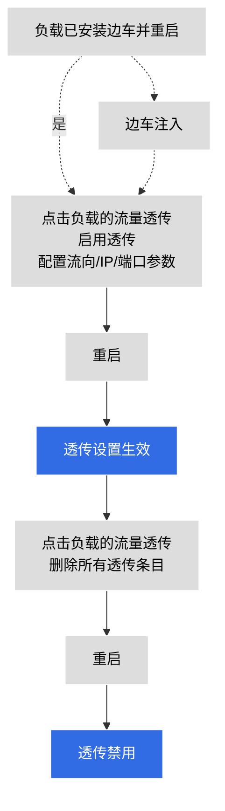

# 边车流量透传

流量透传 (traffic passthrough) 指的是工作负载的全部或部分上游、下游流量不经边车转发，直接发送至工作负载本身。

DCE 5.0 服务网格实现了对工作负载出站/入站流量的边车透传可控，可针对特定端口、IP 实现拦截设置。

- 功能设置对象：工作负载
- 设置参数：端口、IP
- 流向：入站、出站

Istio 适用字段：

```none
traffic.sidecar.istio.io/excludeOutboundPorts
traffic.sidecar.istio.io/excludeOutboundIPRanges
```

**启用/禁用流量透传的操作流程**



## 启用流量透传

1. 进入某个网格，点击`边车管理` -> `工作负载边车管理`。

    

1. 点击某个负载右侧的 `⋮`，在弹出菜单中选择`流量透传设置`。

    

1. 设置流量透传的参数后，点击`确定`。

    

1. 屏幕提示流量透传设置成功。

    
