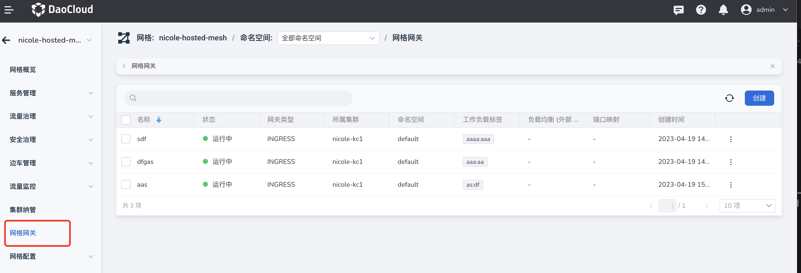
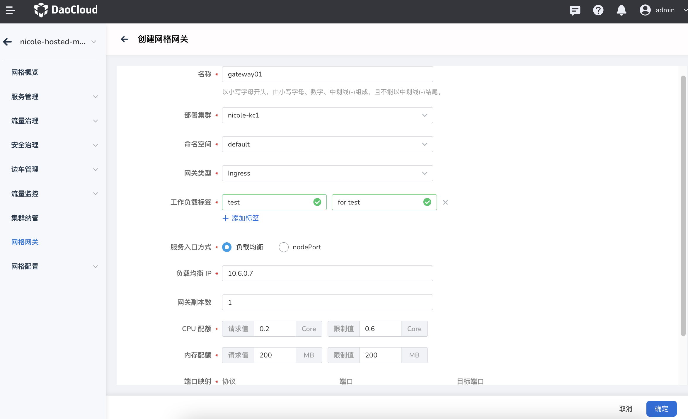
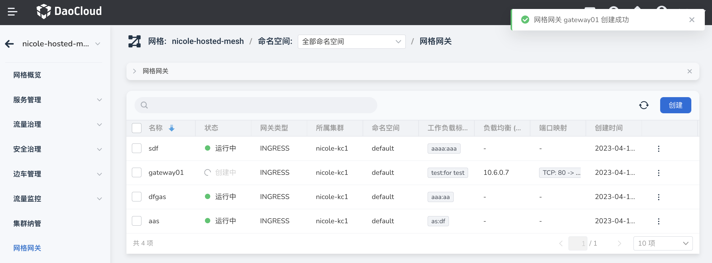
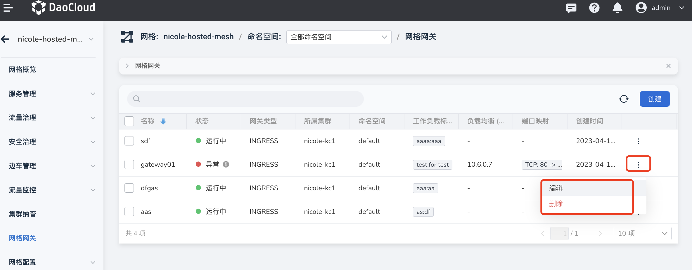

# 创建网格网关

网格网关功能提供了网格网关的创建、管理功能，用户可以在该页面增删改查当前网格内可以使用的网关服务。

Istio 网关分为 Ingress（入站）和 Egress（出站）两类。
Ingress Gateway 允许定义进入服务网格的流量入口，所有入站流量都通过该入口。
Egress Gateway 定义了网格的流量出口，允许将网格的流量治理功能（例如分流、路由规则）应用于 Egress 流量。
网关实例运行的也是 Envoy，但与边车不同，在 Pilot 上会注册为 router 类型，并实现更丰富的流量转发及监控功能。

创建网格网关的操作步骤如下。

1. 在左侧导航栏中点击`网格网关`，进入网关列表，点击右上角的`创建`按钮。

    

2. 在`创建网格网关`窗口中，按提示配置参数，基本都是必填项。检查配置信息无误后点击`确定`。

    

3. 返回网格网关列表，屏幕右上角提示创建成功。刚创建的网格网关状态为`创建中`。

    

4. 几秒后刷新页面，状态将变为`运行中`，表示网关成功配置。点击列表右侧的 `...`，可以执行编辑和删除操作。

    
