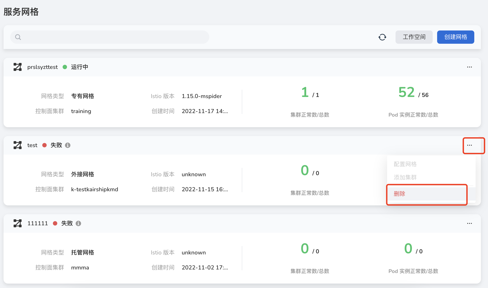
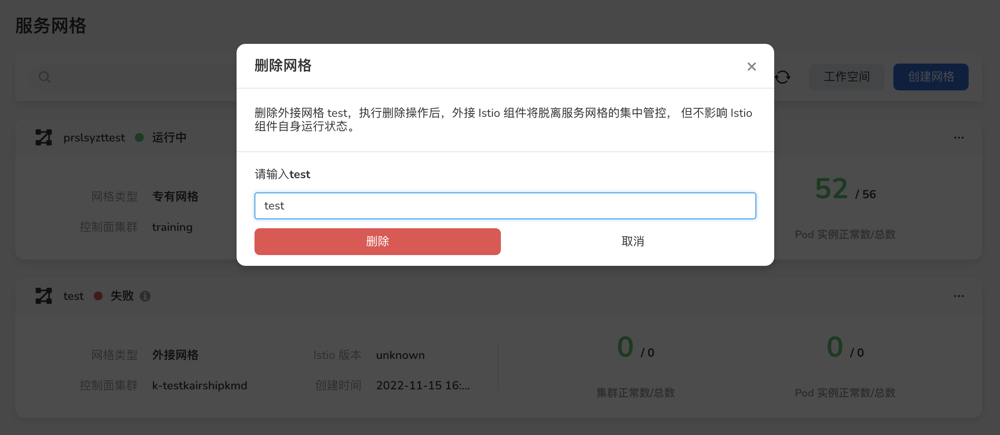
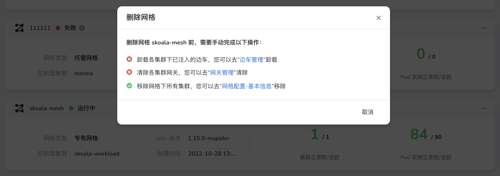
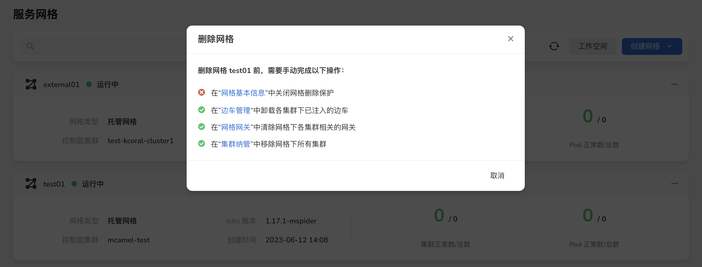

---
hide:
  - toc
---

# 删除网格

当用户不再使用网格治理服务时可以使用删除操作，删除网格需用户完成一系列前置操作，才可以激活对话框的`确定`按钮。

!!! danger

    执行删除操作后，网格不可恢复，如需再次纳管，需重新创建网格。

1. 在网格列表的右侧，点击 `...` 按钮，在弹出菜单中选择`删除`。

    

1. 按照网格类型，系统将自动检测是否满足删除条件。

    - 删除外接网格。

        

    - 删除专有网格。需要按提示移除边车、清除网关、移除集群。

        

    - 删除托管网格。需要按提示移除边车、清除网关、移除集群。

        

1. 清除所有依赖项之后，输入屏幕提示的确认码，`删除`按钮被激活，点击`删除`按钮删除网格。
