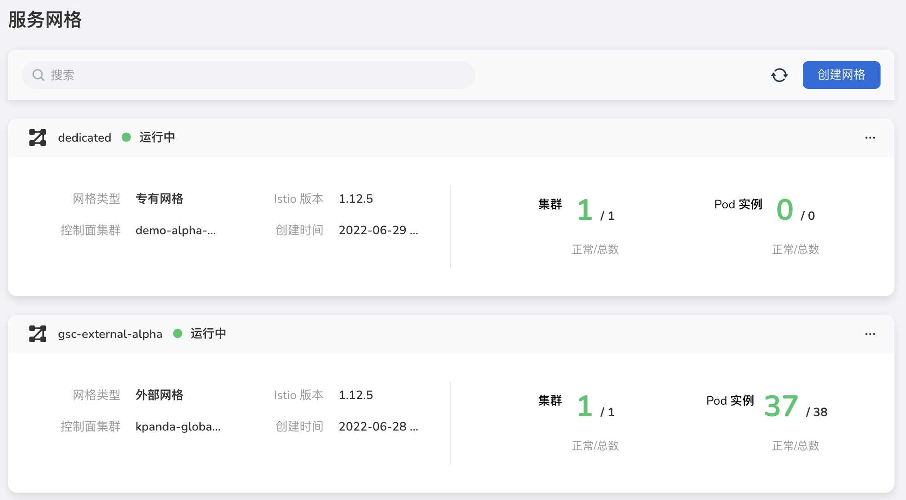
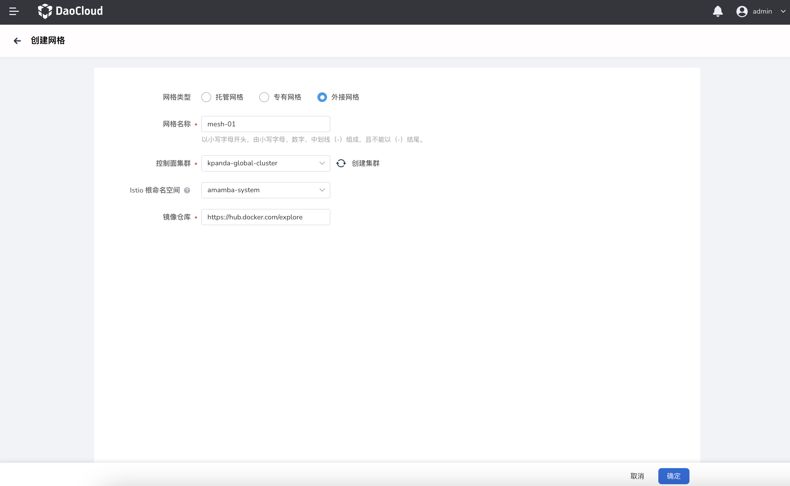

---
hide:
  - toc
---

# 创建外接网格

1. 在服务网格列表页面的右上角，点击`创建网格`。

    

2. 选择`外接网格`，填写网格配置信息。

    - 网格名称：以小写字母开头，由小写字母、数字、中划线(-)组成，且不能以中划线(-)结尾
    - 控制面集群：用于运行网格管理面的集群，列表包含当前网格平台可以访问且状态正常的集群。
      该项附带一个刷新图标和一个`创建集群`按钮。点击`创建集群`将跳转至`容器管理平台`创建新集群，创建完成后返回本页面，点击刷新图标更新列表。
    - Istio 根命名空间：网格所在的 Istio 根命名空间。
    - 镜像仓库：输入镜像仓库的 URL 地址。
  
        

3. 点击`确定`按钮，完成网格创建。系统自动返回网格列表，可以查看和管理新增的网格。
