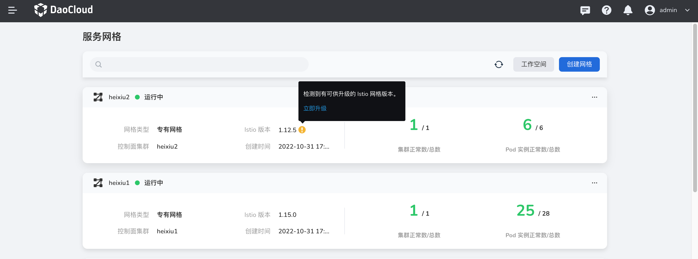
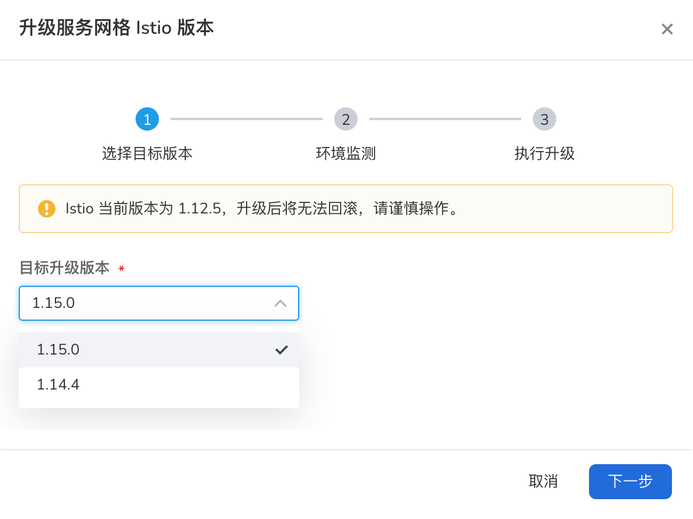
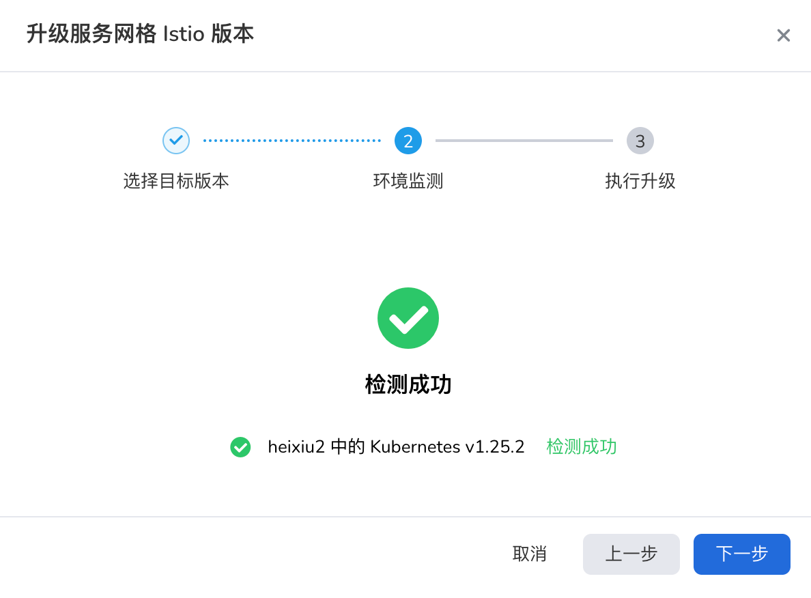
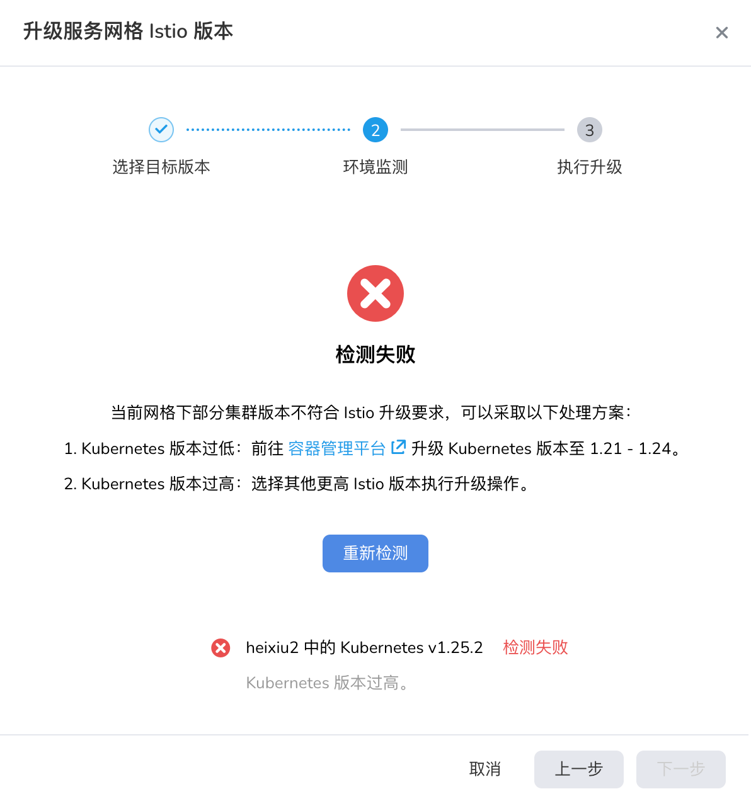
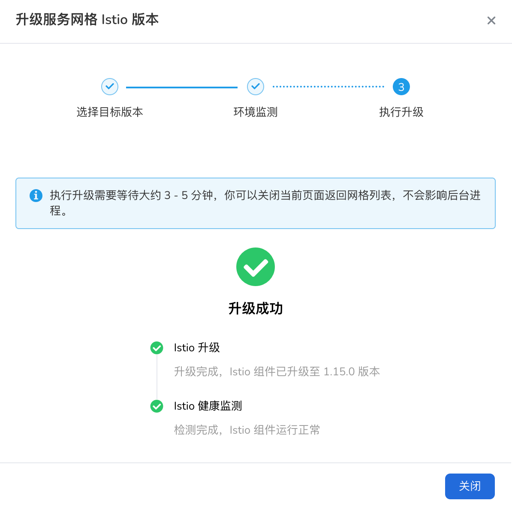
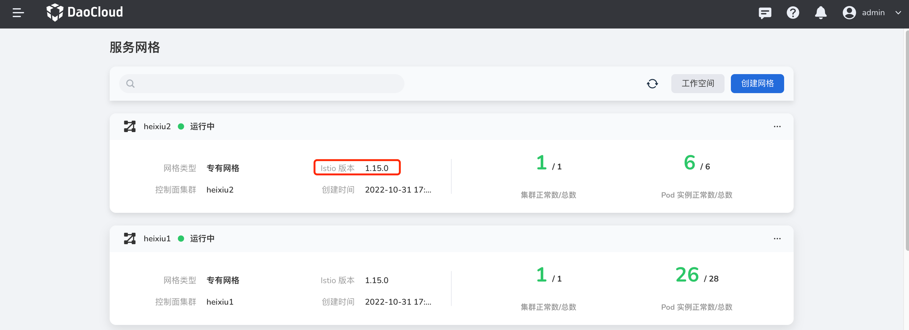

# 网格 Istio 版本升级

网格的 Istio 版本可持续升级，DaoCloud 提供了原生版本和定制版本两类升级版本。

- 原生版本：社区原生 Istio，无任何定制化修改；
- 定制版本：基于社区版本定制化（版本后缀：-mspider），在通信性能、治理能力、热升级能力等各方面做了功能增强及创新。

两类版本升级过程相同，但不支持不同类型的混合升级。

当系统镜像仓库存在更新的 Istio 版本时，`网格列表`中可升级的网格卡片会出现叹号提示图标，点击`立即升级`按钮即可进入升级向导；

## 操作步骤

Istio 升级向导包含`选择目标版本`、`环境检测`、`执行升级`三步，升级完成后网格即可立即上线运行：

1. **选择目标版本**：在列表中选择期望升级的版本，升级后将无法回滚至低版本，建议谨慎选择。

    

2. **环境监测**：系统将基于所选的目标版本，检测网格下各集群（k8s）版本是否符合升级要求，如果符合要求，将激活`下一步`按钮，否则，需要用户处理环境问题.

    

 	- 如果集群（k8s）版本过低，可以在容器管理平台先升级集群（k8s）版本后，点击`重新检测`按钮；

	- 如果集群（k8s）版本过高，建议回退至“选择目标版本”选择其他更高版本的 Istio。

    

3. **执行升级**：环境检测通过后，将进入升级阶段，该过程包含`升级`和`健康检测`两阶段。

	- Istio 升级：Istio镜像拉取和控制面组件升级

	- Istio 健康检测：Istio 控制面组件运行状态检查

    

升级完成后，回到网格列表页面，可以看到网格的 Istio 版本已变更。

    

!!! note

    升级过程一旦开始将无法终止，升级期间建议不要对网格执行任何设置操作。
