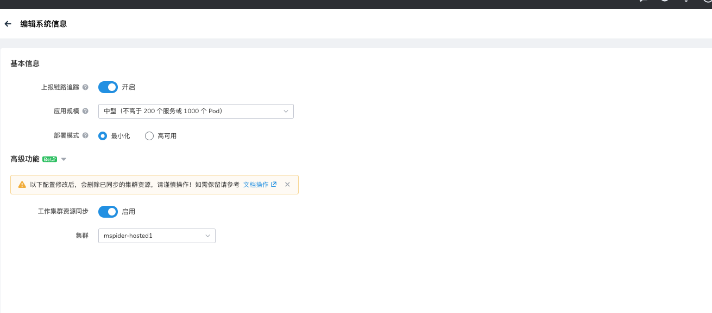
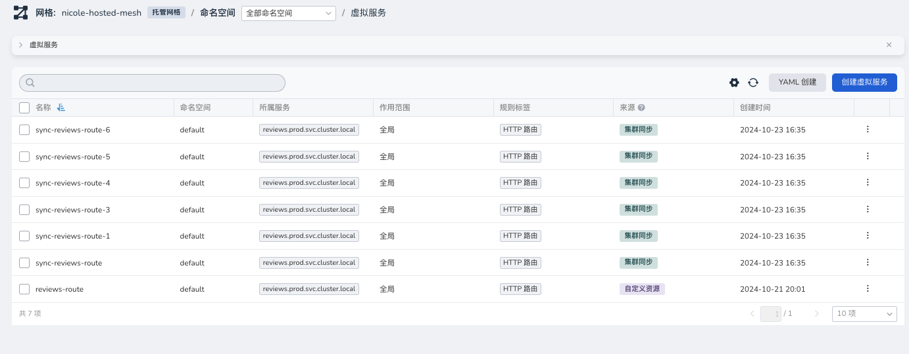
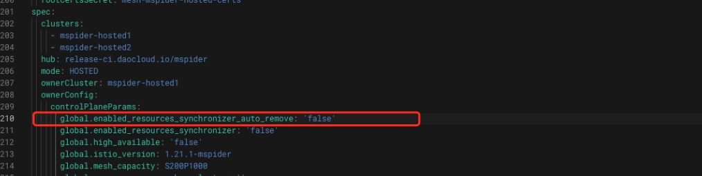
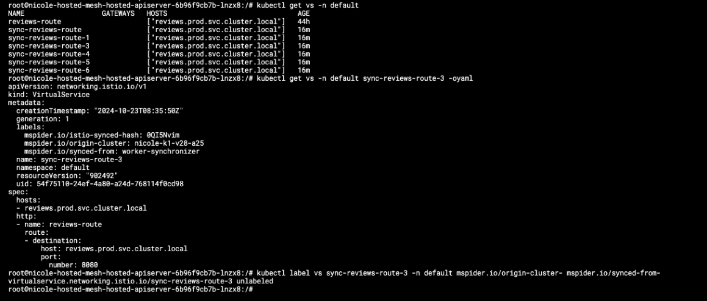

# 托管网格工作集群资源同步能力

托管网格会将其 Istio 相关资源存储在一个独立的虚拟集群中，避免对工作集群的资源进行污染以及保障资源的独立与安全性，
但是这里就会引发一个问题，工作集群的相关网格资源（Istio CRD）将也会失去作用。

用户需要采用开源的一些网格组件时，往往将 Istio 资源存储在工作集群中，
DCE 5.0 服务网格为此提供了一个可选的高级功能： **工作集群资源同步**

!!! note

    用户需要自行保证工作集群 Istio 资源的准确性，以及是否与当前网格托管资源冲突问题

    如果工作集群资源与托管资源命名冲突，工作资源将不会同步

## 开启/关闭

在网格实例列表，点击某个托管网格右侧的 **...** ，在弹出菜单中选择 **编辑基本信息** ，可以开启/关闭 **工作集群资源同步**



## 资源列表

在某个托管网格的详情页面，可以通过来源区分不同的资源：



## 自动移除未管理资源

!!! warning

    关闭 **工作集群资源同步** 功能或者 **更换工作集群** 时，将会 **自动删除** 集群同步的资源。

可以通过关闭自动删除能力，或者手动修改部分资源来源，在更改配置时不被移除。

## 关闭自动删除能力

如需关闭自动删除能力，可以在全局服务管理集群中修改自定义资源 **GlobalMesh** 找到对应的网格，在 YAML 中添加以下参数：

```yaml
global.enabled_resources_synchronizer_auto_remove: "false"
```



## 手动修改资源来源

如果用户想要修改资源来源，可以在托管网格的控制面集群，找到虚拟机集群的 API Server 实例：
`[meshName]-hosted-apiserver`，然后进入容器的 Shell 或控制台，执行如下操作：

```bash
kubectl label vs [resourceName] -n [ns] mspider.io/origin-cluster- mspider.io/synced-from-
```

示例效果如下：




