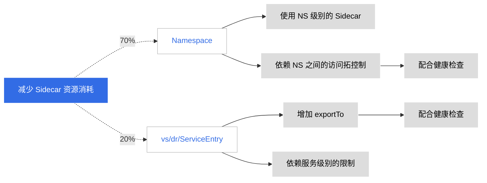

# 优化 Sidecar 资源占用问题

在 Istio 的设计理念中，Sidecar 默认缓存了全部集群服务的信息，这导致 Sidecar
占用的资源会很高，特别是当业务 Pod 成百上千时更为严重。



为了缓解资源占用问题，可以通过以下设置来缓解。

## 技术方案

1. Namespace 级别的 Sidecar 限制

    ```yaml
    apiVersion: networking.istio.io/v1beta1
    kind: Sidecar
    metadata:
      name: restrict-access-sidecar
      namespace: namespace1
    spec:
      egress:
      - hosts:
        - namespace2/*
        - namespace3/*
    ```

    以上 YAML 限制了 namespace1 下的服务，仅可以访问到 namespace2 和 namespace3 的服务。

    为此需要在集群管理的命名空间中，支持增加 NS 可访问的其他 NS 白名单。

    此时会有几个问题，需要考虑到：

    - 启用白名单机制，是否有全局开关
    - 修改白名单是否会导致 Sidecar 更新，配置更新是否需要重启
    - 如果在应用访问出现问题时，是否有对应的健康检查提示
    - 增加类似 NS-group 的方式（从工作空间读取）自动完成 Sidecar NS 的双向互访配置（全局开关）

1. 在 Istio 资源之上增加对应的 exportTo

    通过 NS 下 Sidecar 访问控制，实现还是 NS 级别的限制；
    如果需要缩减资源消耗，可以在 Istio 资源中增加对应的 __exportTo__ 的配置，声明该资源可以在哪些命名空间下访问。

    这样的方式会带来较高的配置成本；如果要做，一定要考虑对应的批量配置的功能：

    ```yaml
    apiVersion: networking.istio.io/v1alpha3
    kind: VirtualService
    metadata:
      name: my-virtual-service
      namespace: my-namespace
    spec:
      exportTo:
      - "namespace1"
      - "namespace2"
      hosts:
      - "*"
      http:
      - route:
        - destination:
          host: my-service
    ```

## 实际演示

- 准备好 2 个服务，在不同的命名空间： NS-a、NS-b
- 确保 2 个服务都成功注入 Sidecar
- 创建一个 Sidecar 资源，YAML 内容参考如下

    

    ```yaml
    apiVersion: networking.istio.io/v1beta1
    kind: Sidecar
    metadata:
      name: restrict-access-sidecar
      namespace: default # (1)!
    spec:
      egress:
        - hosts:
          - webstore-demo/* # (2)!
    ```

    1. current namespace
    2. allow current namespace request this namespace service

    

- 访问效果

    
