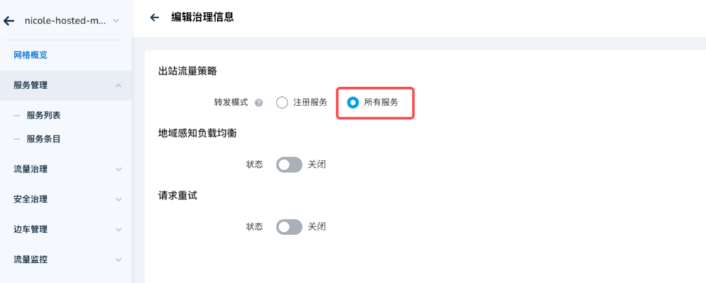
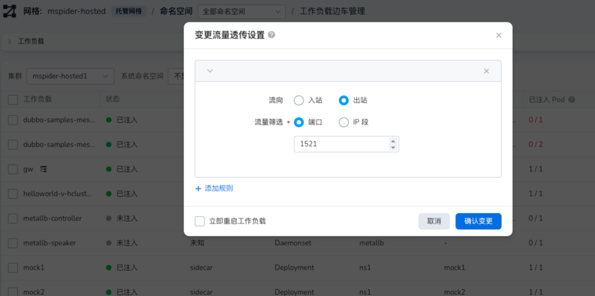

# 如何选择出口流量策略

随着服务网格（Service Mesh）在微服务架构中的广泛应用，如何有效管理和治理外部服务的访问成为了一个关键问题。
本指南将介绍如何在 Istio 环境中，如何管理网格内服务对外部服务的访问。

## 前言

在服务网格中，我们在出口流量策略支持了两种转发模式：

- 注册服务：边车仅转发目标为注册服务或服务条目中注册服务的出站流量 （默认）
- 所有服务：边车转发所有出站流量

当转发模式配置为 `注册服务` 时，可以配合 `Egress` 实现精细化的管理

## 接合 Egress 精细化管理

**Egress 流量**是指从服务网格内部发出的，前往外部服务的网络流量。在 Istio 中，通过配置 **Egress 策略**，可以对这些出站流量进行控制和管理，包括哪些服务可以访问外部资源，如何访问，以及访问哪些具体的外部服务。

通过精细化的 Egress 流量治理策略，运维人员可以有效地管理网格内服务对外部服务的访问情况，提升安全性，并减少不必要的网络开销。

### 使用示例

在 [使用网格完成定向服务访问限制](./use-egress-and-authorized-policy.md)

## 开放所有服务

在复杂的网络结构中，集群内的服务往往需要访问各种外部服务，如第三方 API、数据库、消息队列等。
倘若对出站网络策略设定过于严格，可能会增加排障和运维的成本。
服务在访问外部资源时，可能需要进行额外的配置，或者在网络受限时发生访问失败的问题。

### 出站流量策略的建议

为了解决上述问题，我们建议根据实际需求，合理设置出站流量策略。

#### 开放所有外部服务访问

如果您的应用对外部服务没有严格的访问限制，可以将网格的出站流量策略设置为**允许访问所有外部服务**。这样，网格内注入了边车（Sidecar）的服务在需要访问外部服务时，无需进行复杂的配置，减少了运维的复杂度。

- **边车（Sidecar）**：在服务网格中，边车是一种特殊的代理（通常是 Envoy 代理），与应用容器一起运行。它负责拦截和处理服务的入站和出站流量，实现服务网络的可观察性和控制能力。

#### 针对特定协议的优化

对于常见的 HTTP/HTTPS 外部服务，通常开放所有服务即可满足需求。然而，对于 **MySQL**、**Redis** 等需要保持长连接的数据库服务，通过边车代理可能会引入一定的性能损耗。原因是边车代理需要解析和处理每一个请求，而长连接的协议对延迟和连接稳定性较为敏感。

为此，建议在边车治理策略中，对这些需要长连接的出站流量启用**透传（Pass-Through）**模式，直接绕过边车代理，减少性能影响。

- **透传（Pass-Through）模式**：在 Istio 中，透传模式允许某些流量直接从应用程序发送到目标服务，而不经过边车代理的处理。这样可以降低延迟，提升性能。

## 总结

通过合理设置服务网格的出站流量策略，可以有效地满足服务对外部资源的访问需求，降低运维和配置的复杂度。对于没有严格外部访问限制的环境，开放所有外部服务的访问是简化运维的有效方式。而对于需要长连接的数据库服务，启用透传模式可以减少边车代理对性能的影响。
